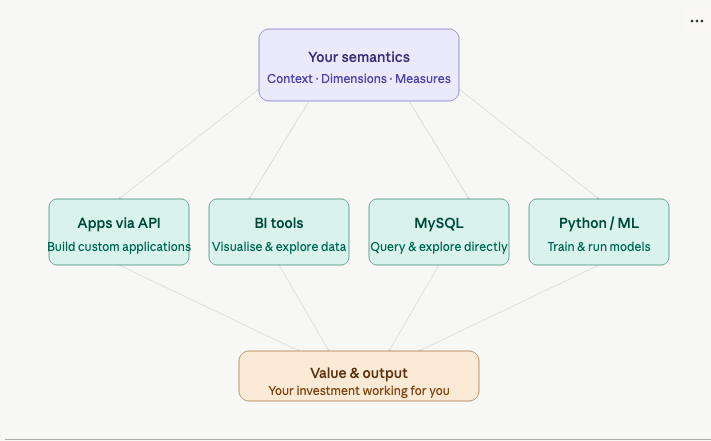

Once you've built data product with semantics(context layer) meaning it is ready to deliver value. 
Activation is the step where all that investment starts paying off. Think of it like putting money in a fund: the setup is the hard part, but once it's done, the returns come to you automatically. It is how you collect those returns, through whichever channel fits your workflow.

## What activation means

Your semantics serve as a consistent, governed layer that every downstream tool reads from. Instead of re-modeling or re-explaining your data to each system, you define it once and activate it everywhere.

## Activation channels

***1. Build applications*** — via API
If you're building internal tools, customer-facing products, or automated workflows, you can access your data product programmatically through our API. Your semantics are already defined, so your app gets clean, consistent data without additional transformation.

***2. Visualize*** — via BI tools
For dashboards, reports, and exploratory analysis, connect your favorite BI tool directly to the data product. The dimensions and measures you've defined become the building blocks of charts, filters, and drilldowns — no SQL writing required.

***3. Explore*** — via MySQL
For direct database access or ad-hoc querying, you can connect through MySQL. This is ideal for analysts who prefer writing queries or for powering data exports and integrations.

***4. Train models*** — via Python
If your goal is machine learning, you can pull data directly using Python. Your semantics ensure the features and labels your models train on are consistent and well-defined from the start.

## The payoff

Each channel is a different way to extract value from the same foundation. You invest the effort once — in building clean, well-structured semantics — and activation lets every team, tool, and use case benefit from it effortlessly.