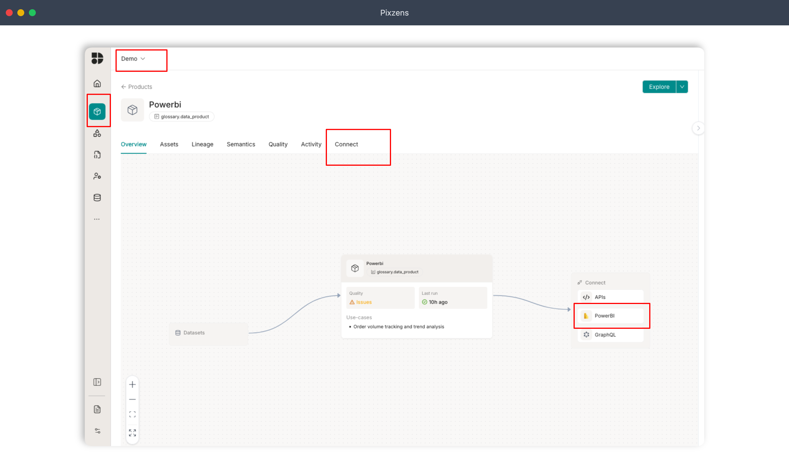
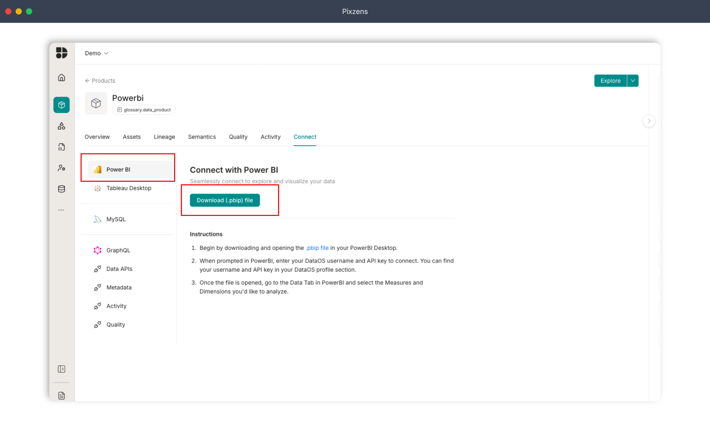
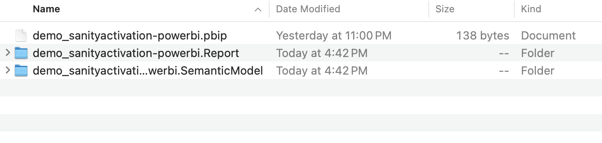
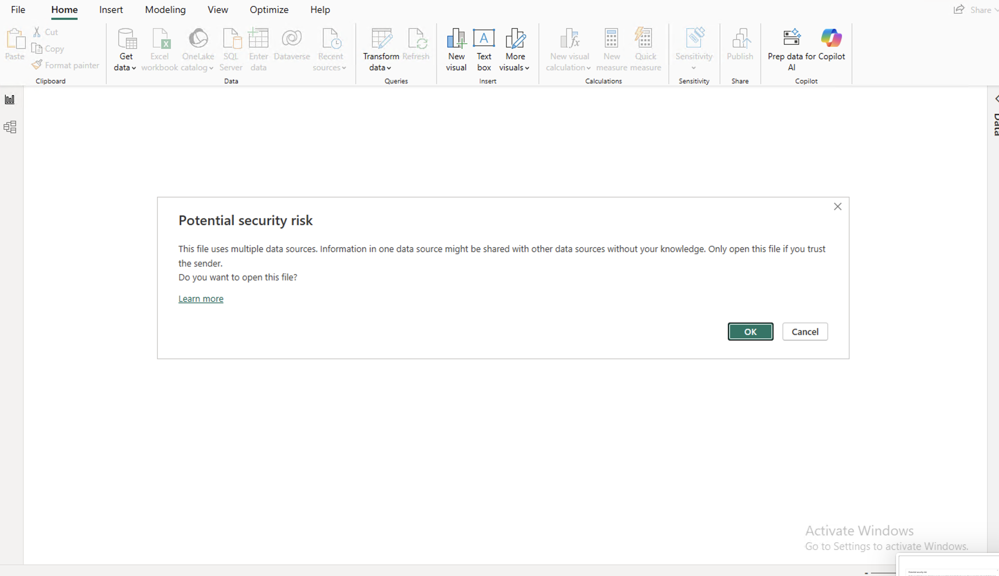
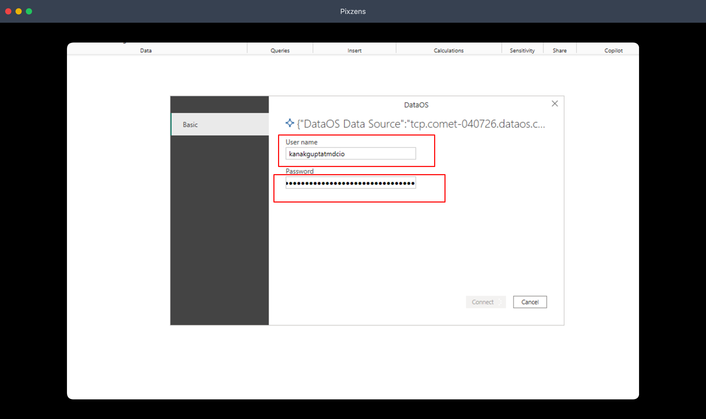
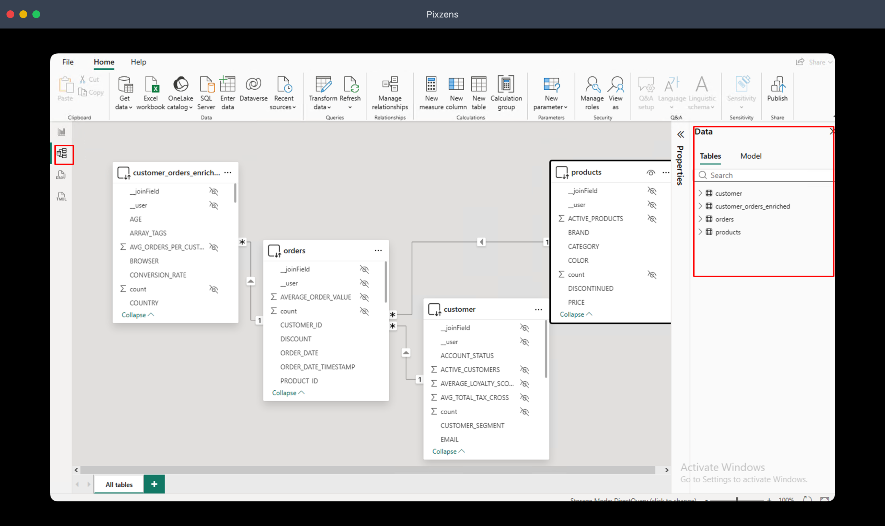

Power BI connects directly to your semantic layer, giving you access to all defined dimensions, measures, and context, ready to build reports and dashboards without any additional data modeling.

---

### Prerequisites

Before connecting, complete the following setup on your machine.

**1. Install MySQL Connector ODBC 8.0.23**

Download and install the MySQL ODBC connector. This is required for Power BI to communicate with your DataOS endpoint.

```
https://downloads.mysql.com/archives/get/p/10/file/mysql-connector-odbc-8.0.23-winx64.msi
```

> **Note** -If you have a newer version of MySQL Connector ODBC already installed, or if you see the error *"There weren't enough elements in the enumeration to complete the operation"*, uninstall the current version and reinstall 8.0.23 specifically.

**2. Allow third-party connectors in Power BI**

Open Power BI Desktop and go to **File → Options and settings → Options → Security**. Under Data Extensions, select *"Allow any extension to load without validation or warning"*. Click OK and restart Power BI Desktop.

**3. Install the DataOS Power BI Connector**

Download the connector file [`DataOS.mez`](../../assets/files/DataOS.mez) and place it in your Power BI custom connectors folder:

```
[My Documents]\Microsoft Power BI Desktop\Custom Connectors\
```

If the folder doesn't exist, create it manually.

**4. Add the environment variable**
`ENABLE_CLEARTEXT_PLUGIN=1`

---

### Connecting to Your Semantic Layer

**Step 1 -Click the product tab and navigate to Connect**

Select your tenant, go to the **Products** tab, and click either **Connect** or **Power BI** to initiate the connection.



**Step 2 -Download the `.pbip` file**

Click Download to save the `.pbip` package to your machine. This file is pre-configured with your tenant's endpoint and semantic model references.



**Step 3 -Extract the downloaded archive**

The downloaded file is a ZIP archive. Extract it to a folder of your choice -you'll find three files inside. The one to open is the `.pbip` file.



**Step 4 -Open the `.pbip` file in Power BI Desktop**

Double-click the `.pbip` file. Power BI Desktop will open it automatically. If prompted with a connectivity or security dialog, click OK to proceed.



**Step 5 -Enter your credentials**

When prompted, enter your tenant **username** and **API key**. These are the same credentials you use to log in to the product.



**Step 6 -Your semantic models are now loaded**

Once authenticated, all available semantic models -including their dimensions and measures -will appear in the Fields pane on the right.



---

You're all set. You can now build reports, dashboards, and visualizations directly on top of your semantic models in Power BI Desktop.