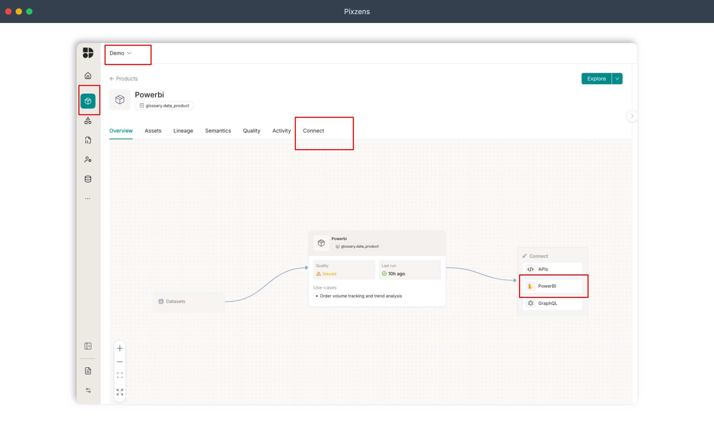
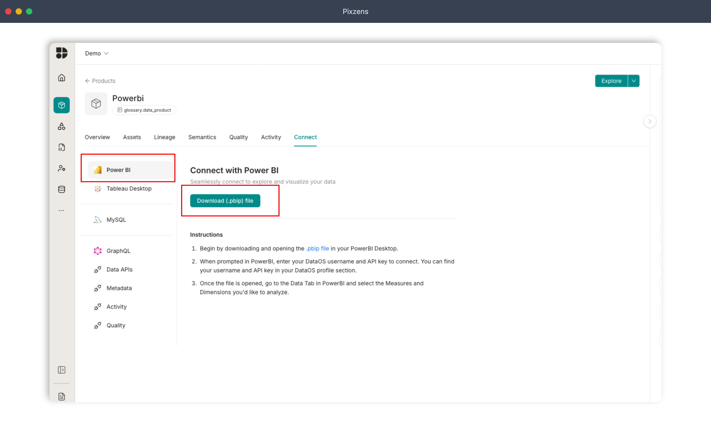
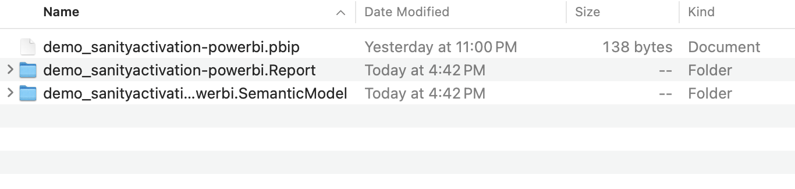
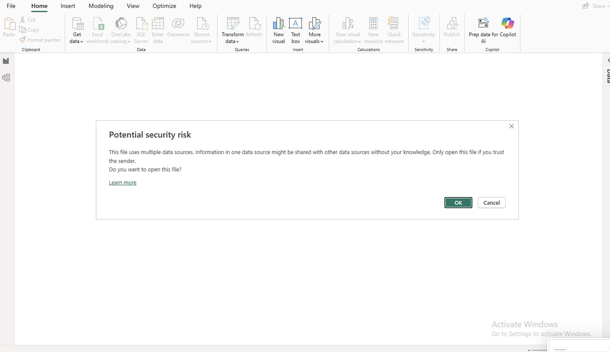
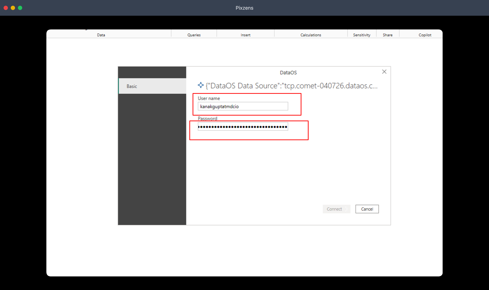
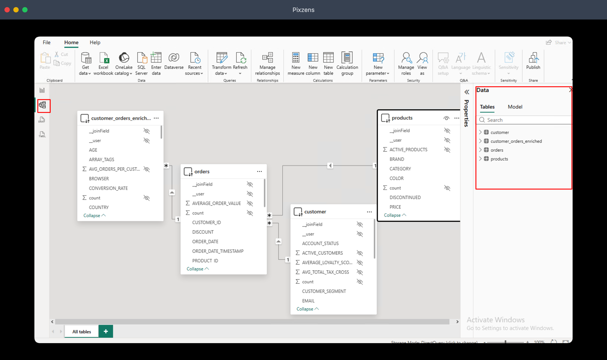

# PowerBI

Power BI connects to your semantic layer over the MySQL wire protocol. Every dimension, measure, and join already defined in `semantics/` shows up in the Fields pane, ready for visuals. You don't write Power Query, you don't redefine metrics per report.

---

## Prerequisites

Set these up once on the machine running Power BI Desktop.

### 1. Install MySQL Connector ODBC 8.0.23

Download and install the connector. Power BI talks to your DataOS endpoint through this driver.

```
https://downloads.mysql.com/archives/get/p/10/file/mysql-connector-odbc-8.0.23-winx64.msi
```

> **Note:** Version 8.0.23 specifically. If a newer ODBC connector is already installed, or if you see *"There weren't enough elements in the enumeration to complete the operation"*, uninstall it and reinstall 8.0.23.

### 2. Allow third-party connectors in Power BI

Open Power BI Desktop and go to **File → Options and settings → Options → Security**. Under **Data Extensions**, select *"Allow any extension to load without validation or warning"*. Click OK and restart Power BI Desktop.

### 3. Install the DataOS Power BI connector

Download [`DataOS.mez`](../../assets/files/DataOS.mez) and place it in your Power BI custom connectors folder:

```
[My Documents]\Microsoft Power BI Desktop\Custom Connectors\
```

If the folder doesn't exist, create it.

### 4. Set the cleartext environment variable

```
ENABLE_CLEARTEXT_PLUGIN=1
```

The MySQL wire protocol uses cleartext authentication (over TLS); this variable tells the ODBC driver to allow it.

---

## Connecting to your semantic layer

### Step 1: Open Connect from the product tab

Select your tenant, go to the **Products** tab, and click **Connect** or **Power BI**.



### Step 2: Download the `.pbip` file

Click Download. The `.pbip` package is pre-configured with your tenant's endpoint and semantic model references.



### Step 3: Extract the archive

The download is a ZIP. Extract it; you'll see three files. The one you open is the `.pbip` file.



### Step 4: Open the `.pbip` file

Double-click it. Power BI Desktop opens it automatically. If you get a connectivity or security dialog, click OK.



### Step 5: Enter credentials

When prompted, enter your tenant **username** and **API key**. Same credentials you use to log in to the product.



### Step 6: Your semantic models are loaded

Once authenticated, every available semantic model, with its dimensions and measures, shows up in the Fields pane on the right.



---

You're connected. Build reports, dashboards, and visuals directly on top of the semantic layer.

## Troubleshooting

??? note "Common issues"

    **"There weren't enough elements in the enumeration to complete the operation"**

    The wrong ODBC connector version is loaded. Uninstall any other MySQL ODBC version and reinstall 8.0.23 (link in Prerequisites).

    **The DataOS connector doesn't appear in Power BI**

    Two things to check: the `.mez` file is in `[My Documents]\Microsoft Power BI Desktop\Custom Connectors\`, and **Allow any extension to load** is enabled under **File → Options → Security → Data Extensions**. Restart Power BI after either change.

    **Authentication fails with "cleartext password not allowed"**

    `ENABLE_CLEARTEXT_PLUGIN=1` isn't set in the system environment. Add it, then restart Power BI Desktop so the new variable is picked up.

    **Connection times out**

    Check that the tenant URL in the `.pbip` file is reachable from your machine (corporate VPN or firewall rules can block it). Re-download the `.pbip` if you switched tenants.
