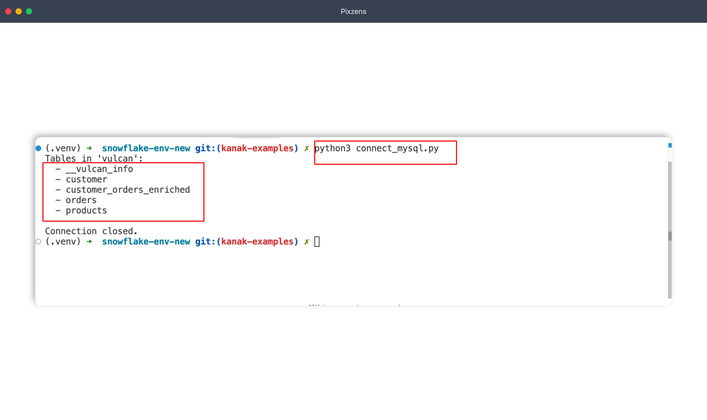

**Prerequisite** - Python 3 must be installed on your machine.

---

### Step 1 - Create a virtual environment

```bash
python3 -m venv venv
```

### Step 2 - Activate the virtual environment

```bash
source venv/bin/activate
```

> **Windows:** use `venv\Scripts\activate` instead.

### Step 3 - Install the MySQL connector

```bash
pip install mysql-connector-python
```

### Step 4 - Connect to your semantic layer

Create a Python file and add the following. Replace `host`, `user`, `password`, and `database` with your tenant's credentials.

```python
import mysql.connector

config = {
    "host": "tcp.{instance_name}", #tcp.comet-040726.dataos.cloud
    "port": 3306,
    "user": "your_username", #userid
    "password": "your_apikey",
    "database": "{tenant_name}.{dataproduct_name}", #demo.sanityactivation-powerbi
    "ssl_disabled": False,
    "auth_plugin": "mysql_clear_password",
    "allow_local_infile": True,
}

try:
    conn = mysql.connector.connect(**config)
    cursor = conn.cursor()

    cursor.execute("SHOW TABLES")
    print("Tables:")
    for (table,) in cursor:
        print(f"  - {table}")

    cursor.close()
    conn.close()
    print("\nConnection closed.")

except mysql.connector.Error as e:
    print(f"MySQL error: {e}")
```

Run the file:

```bash
python3 your_file.py
```

If the connection is successful, you'll see a list of all available semantic models below.

