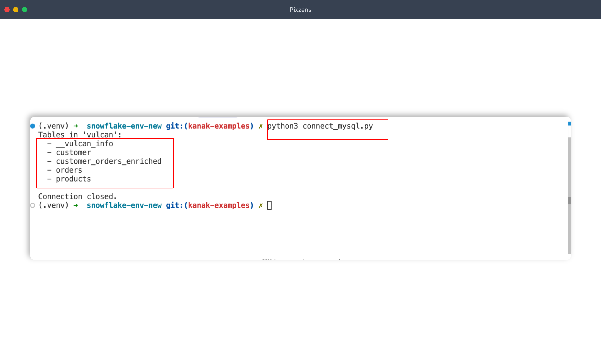

# Python

Pull semantic data into a Python script or notebook the same way you'd query any MySQL database. The wire protocol exposes your semantic models as tables, so the features and labels you train on come from the same definitions powering your dashboards and APIs.

> **Prerequisite:** Python 3 installed.

---

## Step 1: Create a virtual environment

```bash
python3 -m venv venv
```

## Step 2: Activate it

```bash
source venv/bin/activate
```

> **Windows:** use `venv\Scripts\activate` instead.

## Step 3: Install the MySQL connector

```bash
pip install mysql-connector-python
```

## Step 4: Connect to your semantic layer

Create a Python file with the snippet below. Replace `host`, `user`, `password`, and `database` with your tenant's values.

```python
import mysql.connector

config = {
    "host": "tcp.{instance_name}",          # e.g., tcp.comet-040726.dataos.cloud
    "port": 3306,
    "user": "your_username",                 # your DataOS user ID
    "password": "your_apikey",               # your DataOS API key
    "database": "{tenant_name}.{dataproduct_name}",  # e.g., demo.sanityactivation-powerbi
    "ssl_disabled": False,                   # TLS stays on
    "auth_plugin": "mysql_clear_password",   # required by the wire protocol
    "allow_local_infile": True,
}

try:
    conn = mysql.connector.connect(**config)
    cursor = conn.cursor()

    cursor.execute("SHOW TABLES")
    print("Tables:")
    for (table,) in cursor:
        print(f"  - {table}")

    cursor.close()
    conn.close()
    print("\nConnection closed.")

except mysql.connector.Error as e:
    print(f"MySQL error: {e}")
```

A note on two settings worth understanding:

- `auth_plugin: "mysql_clear_password"` is required because the API key is sent as the password. TLS keeps it encrypted in transit (`ssl_disabled: False`).
- `database` follows the `{tenant}.{dataproduct}` format. The semantic models inside that data product show up as tables on `SHOW TABLES`.

Run the file:

```bash
python3 your_file.py
```

If the connection works, you'll see every available semantic model listed.



---

## Querying a semantic model

Once connected, query a model the way you'd query any table:

```python
cursor.execute("SELECT * FROM your_semantic_model LIMIT 10")
for row in cursor.fetchall():
    print(row)
```

For ML training, pull straight into a DataFrame:

```python
import pandas as pd

df = pd.read_sql("SELECT * FROM your_semantic_model", conn)
```

## Troubleshooting

??? note "Common issues"

    **`Authentication plugin 'mysql_clear_password' cannot be loaded`**

    Confirm `auth_plugin: "mysql_clear_password"` is set in the config dict. Some older `mysql-connector-python` versions don't ship the plugin; upgrade with `pip install --upgrade mysql-connector-python`.

    **`Access denied for user`**

    Check the `database` value: it must be `{tenant_name}.{dataproduct_name}`, not just the data product name. Also confirm the API key is current.

    **Connection hangs or times out**

    The `tcp.{instance_name}` host needs to be reachable from your network. If you're on a corporate VPN, make sure traffic to port 3306 isn't blocked.

    **`SHOW TABLES` returns nothing**

    Your data product has no semantic models yet, or the plan hasn't been applied. Run `vulcan plan` and confirm at least one model exists in `semantics/`.
