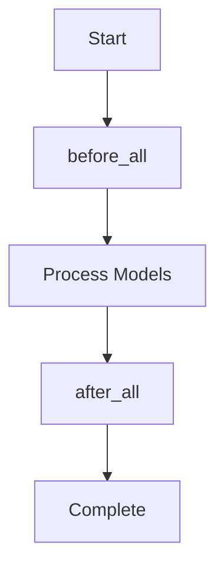

# Execution Hooks

Execution hooks let you run SQL statements or macros automatically at the start and end of `vulcan plan` and `vulcan run` commands. Think of them as a way to automate all those setup and cleanup tasks you'd otherwise have to do manually. They're super powerful for things like setting up temporary tables, granting permissions, logging pipeline runs, or cleaning up after yourself.

## Overview

Here's the basic idea: you've got two hooks that run at different times:

| Hook | When it Runs | Common Use Cases |
|------|--------------|------------------|
| `before_all` | Before any model is processed | Setup tables, initialize logging, validate prerequisites |
| `after_all` | After all models are processed | Grant privileges, cleanup, send notifications, update metadata |

The `before_all` hook runs once at the very beginning, before Vulcan starts processing any models. Use it for setup tasks. The `after_all` hook runs once at the very end, after all models have been processed. Use it for cleanup or post-processing tasks.

## Basic Configuration

=== "YAML"

    ```yaml linenums="1"
    before_all:
      - CREATE TABLE IF NOT EXISTS audit_log (model VARCHAR, started_at TIMESTAMP)
      - INSERT INTO audit_log VALUES ('pipeline', CURRENT_TIMESTAMP)
    
    after_all:
      - "@grant_select_privileges()"
      - UPDATE audit_log SET completed_at = CURRENT_TIMESTAMP WHERE model = 'pipeline'
    ```

=== "Python"

    ```python linenums="1"
    from vulcan.core.config import Config

    config = Config(
        before_all=[
            "CREATE TABLE IF NOT EXISTS audit_log (model VARCHAR, started_at TIMESTAMP)",
            "INSERT INTO audit_log VALUES ('pipeline', CURRENT_TIMESTAMP)"
        ],
        after_all=[
            "@grant_select_privileges()",
            "UPDATE audit_log SET completed_at = CURRENT_TIMESTAMP WHERE model = 'pipeline'"
        ],
    )
    ```

## Using Macros in Hooks

Hooks can execute Vulcan macros using the `@macro_name()` syntax, which is super powerful because macros have access to runtime context. This means your hooks can be dynamic, they can see what views were created, what schemas are being used, and what environment you're running in. This makes it possible to write hooks that adapt to your actual pipeline state.

### Available Context Variables

Macros invoked in hooks have access to:

| Property | Type | Description |
|----------|------|-------------|
| `evaluator.views` | `list[str]` | All view names created in the virtual layer |
| `evaluator.schemas` | `list[str]` | All schema names used by models |
| `evaluator.this_env` | `str` | Current environment name (e.g., `prod`, `dev`) |
| `evaluator.gateway` | `str` | Current gateway name |

---

## Use Cases

### 1. Granting Privileges on Views

If you're creating lots of views and need to grant permissions on all of them, doing it model-by-model gets tedious fast. Instead, use `after_all` to grant access to all views in one go. This is much cleaner and easier to maintain:

```python linenums="1" title="macros/privileges.py"
from vulcan.core.macros import macro

@macro()
def grant_select_privileges(evaluator):
    """Grant SELECT on all views to the analytics role."""
    if not evaluator.views:
        return []
    
    return [
        f"GRANT SELECT ON VIEW {view_name} /* sqlglot.meta replace=false */ TO ROLE analytics_role;"
        for view_name in evaluator.views
    ]
```

```yaml title="config.yaml"
after_all:
  - "@grant_select_privileges()"
```

!!! tip "Preventing Name Replacement"
    That `/* sqlglot.meta replace=false */` comment is important! It tells Vulcan not to replace the view name with the physical table name during SQL rendering. Without it, Vulcan might try to be helpful and swap in the underlying table name, which would break your GRANT statement.

### 2. Environment-Specific Execution

Sometimes you want different behavior in different environments. Maybe you only want to grant certain permissions in production, or you want to run cleanup tasks only in development. The `@IF` macro lets you conditionally execute statements based on the current environment:

```yaml linenums="1" title="config.yaml"
after_all:
  # Only grant schema usage in production
  - "@IF(@this_env = 'prod', @grant_schema_usage())"
  
  # Only run cleanup in development
  - "@IF(@this_env != 'prod', @cleanup_dev_tables())"
```

```python linenums="1" title="macros/privileges.py"
from vulcan.core.macros import macro

@macro()
def grant_schema_usage(evaluator):
    """Grant USAGE on all schemas to admin role (production only)."""
    if evaluator.this_env != "prod" or not evaluator.schemas:
        return []
    
    return [
        f"GRANT USAGE ON SCHEMA {schema} TO ROLE admin_role;"
        for schema in evaluator.schemas
    ]

@macro()
def cleanup_dev_tables(evaluator):
    """Clean up temporary tables in development environments."""
    return [
        "DROP TABLE IF EXISTS temp_debug_output;",
        "DROP TABLE IF EXISTS temp_test_data;"
    ]
```

### 3. Audit Logging

Want to keep track of when your pipeline runs and how long it takes? Audit logging is a great use case for hooks. You can log the start time in `before_all` and the completion time in `after_all`:

```yaml linenums="1" title="config.yaml"
before_all:
  - |
    CREATE TABLE IF NOT EXISTS pipeline_audit (
      run_id VARCHAR,
      environment VARCHAR,
      started_at TIMESTAMP,
      completed_at TIMESTAMP,
      status VARCHAR
    )
  - "@log_pipeline_start()"

after_all:
  - "@log_pipeline_end()"
```

```python linenums="1" title="macros/audit.py"
from vulcan.core.macros import macro
import uuid

@macro()
def log_pipeline_start(evaluator):
    run_id = str(uuid.uuid4())[:8]
    return [
        f"""
        INSERT INTO pipeline_audit (run_id, environment, started_at, status)
        VALUES ('{run_id}', '{evaluator.this_env}', CURRENT_TIMESTAMP, 'running')
        """
    ]

@macro()
def log_pipeline_end(evaluator):
    return [
        f"""
        UPDATE pipeline_audit 
        SET completed_at = CURRENT_TIMESTAMP, status = 'completed'
        WHERE environment = '{evaluator.this_env}' 
          AND status = 'running'
        """
    ]
```

### 4. Schema and Database Setup

Before your models can run, you need to make sure all the schemas they depend on actually exist. Instead of creating them manually or remembering to create them in a specific order, let `before_all` handle it automatically:

```yaml linenums="1" title="config.yaml"
before_all:
  - CREATE SCHEMA IF NOT EXISTS staging
  - CREATE SCHEMA IF NOT EXISTS analytics
  - CREATE SCHEMA IF NOT EXISTS reporting
  - "@setup_external_tables()"
```

```python linenums="1" title="macros/setup.py"
from vulcan.core.macros import macro

@macro()
def setup_external_tables(evaluator):
    """Create external tables for data ingestion."""
    return [
        """
        CREATE EXTERNAL TABLE IF NOT EXISTS staging.raw_events (
            event_id VARCHAR,
            event_type VARCHAR,
            event_data VARCHAR,
            created_at TIMESTAMP
        )
        LOCATION 's3://data-lake/events/'
        FILE_FORMAT = (TYPE = 'PARQUET')
        """
    ]
```

### 5. Data Quality Gates

Want to make sure your source data is good before you start processing? You can use `before_all` to run validation checks. If the checks fail, the pipeline stops before wasting time processing bad data:

```yaml linenums="1" title="config.yaml"
before_all:
  - "@validate_source_data()"
```

```python linenums="1" title="macros/validation.py"
from vulcan.core.macros import macro

@macro()
def validate_source_data(evaluator):
    """Validate that source data meets quality requirements."""
    return [
        """
        DO $$
        DECLARE
            row_count INTEGER;
        BEGIN
            SELECT COUNT(*) INTO row_count FROM raw_data.events WHERE created_at >= CURRENT_DATE;
            IF row_count = 0 THEN
                RAISE EXCEPTION 'No data found for today in raw_data.events';
            END IF;
        END $$;
        """
    ]
```

### 6. Refresh Materialized Views

If you have materialized views that depend on your Vulcan models, you'll want to refresh them after your models update. Instead of remembering to do it manually, let `after_all` handle it automatically:

```yaml linenums="1" title="config.yaml"
after_all:
  - "@refresh_materialized_views()"
```

```python linenums="1" title="macros/refresh.py"
from vulcan.core.macros import macro

@macro()
def refresh_materialized_views(evaluator):
    """Refresh all materialized views that depend on our models."""
    materialized_views = [
        "reporting.daily_summary_mv",
        "reporting.weekly_trends_mv",
        "analytics.user_metrics_mv"
    ]
    
    return [
        f"REFRESH MATERIALIZED VIEW {mv};"
        for mv in materialized_views
    ]
```

### 7. Notification Integration

Want to notify your team when the pipeline finishes? You can use `after_all` to send notifications. This example logs to a table, but you could easily extend it to call an external API or send emails:

```yaml linenums="1" title="config.yaml"
after_all:
  - "@notify_completion()"
```

```python linenums="1" title="macros/notify.py"
from vulcan.core.macros import macro
import os

@macro()
def notify_completion(evaluator):
    """Log completion status (integrate with your notification system)."""
    # This example logs to a table; you could also call an external API
    view_count = len(evaluator.views) if evaluator.views else 0
    schema_count = len(evaluator.schemas) if evaluator.schemas else 0
    
    return [
        f"""
        INSERT INTO notifications_log (
            environment, 
            message, 
            view_count, 
            schema_count, 
            created_at
        )
        VALUES (
            '{evaluator.this_env}',
            'Pipeline completed successfully',
            {view_count},
            {schema_count},
            CURRENT_TIMESTAMP
        )
        """
    ]
```

---

## Execution Order



## Best Practices

Here are some tips to help you write hooks that are reliable and maintainable:

1. **Use macros for complex logic** - If your hook logic is getting complicated, move it to a Python macro. This keeps your YAML config clean and makes the logic easier to test and maintain.

2. **Make hooks idempotent** - Hooks might run multiple times (maybe a plan fails and gets retried), so make sure they're safe to run repeatedly. Use `IF NOT EXISTS`, `ON CONFLICT`, or similar patterns to handle this gracefully.

3. **Use environment checks** - Not everything should run in every environment. Use `@IF(@this_env = 'prod', ...)` to gate production-only operations so you don't accidentally run them in development.

4. **Handle failures gracefully** - Think about what happens if a hook fails. Will it break your entire pipeline? Use transactions where appropriate, and make sure failures are handled in a way that makes sense for your use case.

5. **Document your hooks** - Add comments explaining why each hook exists and what it does. Future you (and your teammates) will thank you.

6. **Test in development first** - Always test hooks in a development environment before running them in production. Hooks run automatically, so mistakes can be costly!

## Comparison with Model-Level Hooks

You might be wondering: when should I use execution hooks versus model-level hooks? Here's the difference:

| Feature | `before_all` / `after_all` | Model `pre_statements` / `post_statements` |
|---------|---------------------------|-------------------------------------------|
| Scope | Entire pipeline | Single model |
| Runs | Once per plan/run | Once per model execution |
| Access to | All views, schemas, environment | Model-specific context |
| Use for | Global setup, cleanup, privileges | Model-specific operations |

**Use execution hooks** (`before_all`/`after_all`) for operations that apply to your entire pipeline, things like setting up audit tables, granting permissions on all views, or sending completion notifications.

**Use model-level hooks** (`pre_statements`/`post_statements`) for operations that are specific to individual models, things like creating temporary tables that only one model needs, or running model-specific validations.
