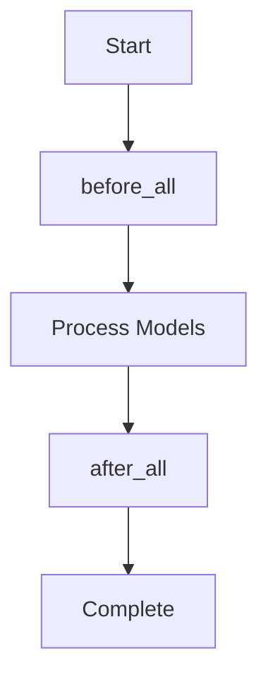

# Execution Hooks

Vulcan provides `before_all` and `after_all` hooks that execute SQL statements or macros at the start and end of `vulcan plan` and `vulcan run` commands. These hooks are powerful tools for automating setup, cleanup, and privilege management across your data pipeline.

## Overview

| Hook | When it Runs | Common Use Cases |
|------|--------------|------------------|
| `before_all` | Before any model is processed | Setup tables, initialize logging, validate prerequisites |
| `after_all` | After all models are processed | Grant privileges, cleanup, send notifications, update metadata |

## Basic Configuration

=== "YAML"

    ```yaml linenums="1"
    before_all:
      - CREATE TABLE IF NOT EXISTS audit_log (model VARCHAR, started_at TIMESTAMP)
      - INSERT INTO audit_log VALUES ('pipeline', CURRENT_TIMESTAMP)
    
    after_all:
      - "@grant_select_privileges()"
      - UPDATE audit_log SET completed_at = CURRENT_TIMESTAMP WHERE model = 'pipeline'
    ```

=== "Python"

    ```python linenums="1"
    from vulcan.core.config import Config

    config = Config(
        before_all=[
            "CREATE TABLE IF NOT EXISTS audit_log (model VARCHAR, started_at TIMESTAMP)",
            "INSERT INTO audit_log VALUES ('pipeline', CURRENT_TIMESTAMP)"
        ],
        after_all=[
            "@grant_select_privileges()",
            "UPDATE audit_log SET completed_at = CURRENT_TIMESTAMP WHERE model = 'pipeline'"
        ],
    )
    ```

## Using Macros in Hooks

Hooks can execute Vulcan macros using the `@macro_name()` syntax. Macros provide access to runtime context like view names, schemas, and the current environment.

### Available Context Variables

Macros invoked in hooks have access to:

| Property | Type | Description |
|----------|------|-------------|
| `evaluator.views` | `list[str]` | All view names created in the virtual layer |
| `evaluator.schemas` | `list[str]` | All schema names used by models |
| `evaluator.this_env` | `str` | Current environment name (e.g., `prod`, `dev`) |
| `evaluator.gateway` | `str` | Current gateway name |

---

## Use Cases

### 1. Granting Privileges on Views

Instead of adding privilege grants to each model individually, use `after_all` to grant access to all views at once:

```python linenums="1" title="macros/privileges.py"
from vulcan.core.macros import macro

@macro()
def grant_select_privileges(evaluator):
    """Grant SELECT on all views to the analytics role."""
    if not evaluator.views:
        return []
    
    return [
        f"GRANT SELECT ON VIEW {view_name} /* sqlglot.meta replace=false */ TO ROLE analytics_role;"
        for view_name in evaluator.views
    ]
```

```yaml title="config.yaml"
after_all:
  - "@grant_select_privileges()"
```

!!! tip "Preventing Name Replacement"
    The comment `/* sqlglot.meta replace=false */` ensures Vulcan doesn't replace the view name with the physical table name during SQL rendering.

### 2. Environment-Specific Execution

Use the `@IF` macro to conditionally execute statements based on the environment:

```yaml linenums="1" title="config.yaml"
after_all:
  # Only grant schema usage in production
  - "@IF(@this_env = 'prod', @grant_schema_usage())"
  
  # Only run cleanup in development
  - "@IF(@this_env != 'prod', @cleanup_dev_tables())"
```

```python linenums="1" title="macros/privileges.py"
from vulcan.core.macros import macro

@macro()
def grant_schema_usage(evaluator):
    """Grant USAGE on all schemas to admin role (production only)."""
    if evaluator.this_env != "prod" or not evaluator.schemas:
        return []
    
    return [
        f"GRANT USAGE ON SCHEMA {schema} TO ROLE admin_role;"
        for schema in evaluator.schemas
    ]

@macro()
def cleanup_dev_tables(evaluator):
    """Clean up temporary tables in development environments."""
    return [
        "DROP TABLE IF EXISTS temp_debug_output;",
        "DROP TABLE IF EXISTS temp_test_data;"
    ]
```

### 3. Audit Logging

Track pipeline execution with audit tables:

```yaml linenums="1" title="config.yaml"
before_all:
  - |
    CREATE TABLE IF NOT EXISTS pipeline_audit (
      run_id VARCHAR,
      environment VARCHAR,
      started_at TIMESTAMP,
      completed_at TIMESTAMP,
      status VARCHAR
    )
  - "@log_pipeline_start()"

after_all:
  - "@log_pipeline_end()"
```

```python linenums="1" title="macros/audit.py"
from vulcan.core.macros import macro
import uuid

@macro()
def log_pipeline_start(evaluator):
    run_id = str(uuid.uuid4())[:8]
    return [
        f"""
        INSERT INTO pipeline_audit (run_id, environment, started_at, status)
        VALUES ('{run_id}', '{evaluator.this_env}', CURRENT_TIMESTAMP, 'running')
        """
    ]

@macro()
def log_pipeline_end(evaluator):
    return [
        f"""
        UPDATE pipeline_audit 
        SET completed_at = CURRENT_TIMESTAMP, status = 'completed'
        WHERE environment = '{evaluator.this_env}' 
          AND status = 'running'
        """
    ]
```

### 4. Schema and Database Setup

Ensure required schemas exist before models run:

```yaml linenums="1" title="config.yaml"
before_all:
  - CREATE SCHEMA IF NOT EXISTS staging
  - CREATE SCHEMA IF NOT EXISTS analytics
  - CREATE SCHEMA IF NOT EXISTS reporting
  - "@setup_external_tables()"
```

```python linenums="1" title="macros/setup.py"
from vulcan.core.macros import macro

@macro()
def setup_external_tables(evaluator):
    """Create external tables for data ingestion."""
    return [
        """
        CREATE EXTERNAL TABLE IF NOT EXISTS staging.raw_events (
            event_id VARCHAR,
            event_type VARCHAR,
            event_data VARCHAR,
            created_at TIMESTAMP
        )
        LOCATION 's3://data-lake/events/'
        FILE_FORMAT = (TYPE = 'PARQUET')
        """
    ]
```

### 5. Data Quality Gates

Run data quality checks before processing:

```yaml linenums="1" title="config.yaml"
before_all:
  - "@validate_source_data()"
```

```python linenums="1" title="macros/validation.py"
from vulcan.core.macros import macro

@macro()
def validate_source_data(evaluator):
    """Validate that source data meets quality requirements."""
    return [
        """
        DO $$
        DECLARE
            row_count INTEGER;
        BEGIN
            SELECT COUNT(*) INTO row_count FROM raw_data.events WHERE created_at >= CURRENT_DATE;
            IF row_count = 0 THEN
                RAISE EXCEPTION 'No data found for today in raw_data.events';
            END IF;
        END $$;
        """
    ]
```

### 6. Refresh Materialized Views

Refresh dependent materialized views after models are updated:

```yaml linenums="1" title="config.yaml"
after_all:
  - "@refresh_materialized_views()"
```

```python linenums="1" title="macros/refresh.py"
from vulcan.core.macros import macro

@macro()
def refresh_materialized_views(evaluator):
    """Refresh all materialized views that depend on our models."""
    materialized_views = [
        "reporting.daily_summary_mv",
        "reporting.weekly_trends_mv",
        "analytics.user_metrics_mv"
    ]
    
    return [
        f"REFRESH MATERIALIZED VIEW {mv};"
        for mv in materialized_views
    ]
```

### 7. Notification Integration

Send notifications after pipeline completion:

```yaml linenums="1" title="config.yaml"
after_all:
  - "@notify_completion()"
```

```python linenums="1" title="macros/notify.py"
from vulcan.core.macros import macro
import os

@macro()
def notify_completion(evaluator):
    """Log completion status (integrate with your notification system)."""
    # This example logs to a table; you could also call an external API
    view_count = len(evaluator.views) if evaluator.views else 0
    schema_count = len(evaluator.schemas) if evaluator.schemas else 0
    
    return [
        f"""
        INSERT INTO notifications_log (
            environment, 
            message, 
            view_count, 
            schema_count, 
            created_at
        )
        VALUES (
            '{evaluator.this_env}',
            'Pipeline completed successfully',
            {view_count},
            {schema_count},
            CURRENT_TIMESTAMP
        )
        """
    ]
```

---

## Execution Order



## Best Practices

1. **Use macros for complex logic** - Keep YAML configuration clean by moving complex SQL generation to Python macros

2. **Make hooks idempotent** - Hooks may run multiple times; use `IF NOT EXISTS`, `ON CONFLICT`, or similar patterns

3. **Use environment checks** - Gate production-only operations with `@IF(@this_env = 'prod', ...)`

4. **Handle failures gracefully** - Consider what happens if a hook fails; use transactions where appropriate

5. **Document your hooks** - Add comments explaining why each hook exists and what it does

6. **Test in development first** - Always test hooks in a development environment before running in production

## Comparison with Model-Level Hooks

| Feature | `before_all` / `after_all` | Model `pre_statements` / `post_statements` |
|---------|---------------------------|-------------------------------------------|
| Scope | Entire pipeline | Single model |
| Runs | Once per plan/run | Once per model execution |
| Access to | All views, schemas, environment | Model-specific context |
| Use for | Global setup, cleanup, privileges | Model-specific operations |

Use `before_all`/`after_all` for operations that apply to the entire pipeline. Use model-level hooks for operations specific to individual models.
