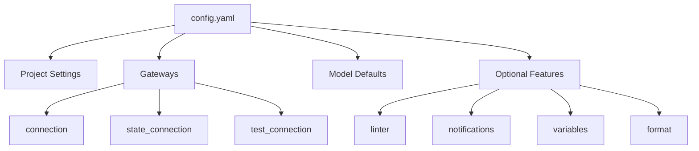

# Overview

Vulcan projects are configured through a central configuration file that defines how your data pipeline connects to databases, manages environments, and handles model execution.

## Configuration File

Every Vulcan project requires a configuration file in the project root directory:

- **`config.yaml`** - YAML format (recommended for most users)
- **`config.py`** - Python format (for advanced use cases requiring dynamic configuration)

## Quick Start Example

Here's a practical example of a Vulcan configuration file:

```yaml linenums="1"
# Project metadata
name: orders360
tenant: sales
description: Daily sales analytics pipeline

# Gateway Connection
gateways:
  default:
    connection:
      type: postgres
      host: warehouse
      port: 5432
      database: warehouse
      user: vulcan
      password: "{{ env_var('DB_PASSWORD') }}"
    state_connection:
      type: postgres
      host: statestore
      port: 5432
      database: statestore
      user: vulcan
      password: "{{ env_var('STATE_DB_PASSWORD') }}"

default_gateway: default

# Model Defaults (required)
model_defaults:
  dialect: postgres
  start: 2024-01-01
  cron: '@daily'

# Linting Rules
linter:
  enabled: true
  rules:
    - ambiguousorinvalidcolumn
    - invalidselectstarexpansion
```

## Configuration Structure



## Configuration Sections

### Project Settings

Basic project metadata for identification.

| Option | Description | Type |
|--------|-------------|:----:|
| `name` | Project name | string |
| `tenant` | Tenant or organization name | string |
| `description` | Human-readable project description | string |

### Gateways

Gateways define connections to your data warehouse, state backend, and other services.

| Component | Description | Default |
|-----------|-------------|---------|
| `connection` | Primary data warehouse connection | Required |
| `state_connection` | Where Vulcan stores internal state | Uses `connection` |
| `test_connection` | Connection for running tests | Uses `connection` |
| `scheduler` | Scheduler configuration | `builtin` |
| `state_schema` | Schema name for state tables | `vulcan` |

→ See [Configuration Reference](../../references/configuration.md#gateways) for detailed gateway options.

### Model Defaults (Required)

The `model_defaults` section is **required** and must include at least the `dialect` key.

```yaml
model_defaults:
  dialect: postgres     # Required
  owner: data-team
  start: 2024-01-01
  cron: '@daily'
```

→ See [Model Defaults](./options/model_defaults.md) for all available options.

### Variables

Configure environment variables, `.env` files, and configuration overrides.

→ See [Variables](./options/variables.md) for details.

### Execution Hooks

Execute SQL statements at the start and end of `vulcan plan` and `vulcan run` commands using `before_all` and `after_all`.

→ See [Execution Hooks](./options/execution_hooks.md) for detailed examples and use cases.

### Linter

Enable automatic code quality checks for your models.

→ See [Linter](./options/linter.md) for rules and custom linter configuration.

### Notifications

Configure alerts via Slack or email for pipeline events.

→ See [Notifications](./options/notifications.md) for Slack webhooks, API, and email setup.

## Supported Engines

Vulcan supports connecting to various data warehouses:

- **[PostgreSQL](../../references/integrations/engines/postgres.md)** - Open-source relational database
- **[Snowflake](../../references/integrations/engines/snowflake.md)** - Cloud data warehouse

## Configuration Reference

| Topic | Description |
|-------|-------------|
| [Configuration Reference](../../references/configuration.md) | Complete list of all configuration parameters |
| [Variables](./options/variables.md) | Environment variables and `.env` files |
| [Model Defaults](./options/model_defaults.md) | Default settings for all models |
| [Execution Hooks](./options/execution_hooks.md) | `before_all` and `after_all` statements |
| [Linter](./options/linter.md) | Code quality rules and custom linters |
| [Notifications](./options/notifications.md) | Slack and email notification setup |

## Best Practices

1. **Use environment variables** for sensitive data like passwords and API keys
2. **Set meaningful defaults** in `model_defaults` to reduce boilerplate
3. **Enable linting** to catch common errors early in development
4. **Separate state connection** from data warehouse for better isolation
5. **Use multiple gateways** for different environments (dev, staging, prod)
