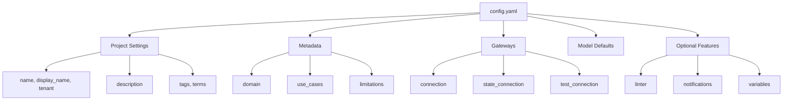

# Overview

Your Vulcan project needs a configuration file. It tells Vulcan how to connect to your data warehouse, where to store state, and what defaults to use for your models. Without it, Vulcan doesn't know where your data lives or how to run your transformations.

## Configuration File

Create a configuration file in your project root. Choose one:

- `config.yaml`: YAML format. Use this for most projects. Simple and readable.

- `config.py`: Python format. Use this if you need dynamic configuration or want to generate settings programmatically.

## Example Configuration

Here's what a typical configuration file looks like:

```yaml linenums="1"
# Project identity
name: orders-analytics
display_name: Orders Analytics Platform
tenant: engineering
description: Orders Analytics is a centralized data product delivering clean, trusted insights across the full order lifecycle.

# Classification
tags:
  - e-commerce
  - retail
  - sales_analytics
  - customer_analytics
  - postgres

terms:
  - glossary.data_product
  - glossary.analytics_platform
  - glossary.sales_operations

# Metadata
metadata:
  domain: sales_operations
  use_cases:
    - Daily and weekly sales reporting
    - Customer segmentation and RFM analysis
    - Sales funnel conversion tracking
    - Product performance analytics
  limitations:
    - Demo dataset with synthetic data (100 customers, 1000 orders)
    - Historical data from November 2025 onwards

# Gateway Connection
gateways:
  default:
    connection:
      type: postgres
      host: warehouse
      port: 5432
      database: warehouse
      user: vulcan
      password: "{{ env_var('DB_PASSWORD') }}"
    state_connection:
      type: postgres
      host: statestore
      port: 5432
      database: statestore
      user: vulcan
      password: "{{ env_var('STATE_DB_PASSWORD') }}"

default_gateway: default

# Model Defaults (required)
model_defaults:
  dialect: postgres
  start: 2024-01-01
  cron: '@daily'

# Linting Rules
linter:
  enabled: true
  rules:
    - ambiguousorinvalidcolumn
    - invalidselectstarexpansion
```

## Configuration Structure



## Configuration Sections

### Project Settings

Metadata fields that identify your project. They don't affect how Vulcan runs, but they're useful for organization and discovery.

| Option | Description | Type | Required |
|--------|-------------|:----:|:--------:|
| `name` | Project identifier (used internally) | string | Yes |
| `tenant` | Tenant or organization name | string | Yes |
| `description` | Project description | string | Yes |
| `display_name` | Human-readable project name for UI/docs | string | No |
| `tags` | Labels for categorization and filtering | array of string | No |
| `terms` | Business glossary terms using dot notation (e.g., `glossary.data_product`) | array of string | No |
| `metadata` | Project metadata object (domain, use_cases, limitations) | object | No |

```yaml
# Project identity
name: orders-analytics
display_name: Orders Analytics Platform
tenant: engineering
description: Orders Analytics delivers insights across the full order lifecycle.

# Classification
tags:
  - e-commerce
  - retail
  - sales_analytics

terms:
  - glossary.data_product
  - glossary.analytics_platform
  - glossary.sales_operations
```

### Metadata

Metadata fields provide additional context about your project's purpose and scope. Use these to document what your project does, where it applies, and any known constraints.

| Option | Description | Type | Required |
|--------|-------------|:----:|:--------:|
| `domain` | Business domain or data area (e.g., sales_operations, marketing, finance) | string | No |
| `use_cases` | List of primary use cases or business problems this project addresses | array of string | No |
| `limitations` | List of known constraints, caveats, or edge cases to be aware of | array of string | No |

```yaml
# Metadata
metadata:
  domain: sales_operations
  use_cases:
    - Daily and weekly sales reporting
    - Customer segmentation and RFM analysis
    - Sales funnel conversion tracking
  limitations:
    - Demo dataset with synthetic data (100 customers, 1000 orders)
    - Historical data from November 2025 onwards
```

### Gateways

Gateways define how Vulcan connects to your data warehouse and state backend. Define multiple gateways for different environments: dev, staging, prod. Each gateway has its own connection settings.

| Component | Description | Type | Required |
|-----------|-------------|:----:|:--------:|
| `connection` | Primary data warehouse connection | object | Yes |
| `state_connection` | Where Vulcan stores internal state | object | No |
| `test_connection` | Connection for running tests | object | No |
| `scheduler` | Scheduler configuration | object | No |
| `state_schema` | Schema name for state tables | string | No |


```yaml
# Gateway Connection
gateways:
  default:
    connection:
      type: postgres
      host: warehouse
      port: 5432
      database: warehouse
      user: vulcan
      password: "{{ env_var('DB_PASSWORD') }}"
    state_connection:
      type: postgres
      host: statestore
      port: 5432
      database: statestore
      user: vulcan
      password: "{{ env_var('STATE_DB_PASSWORD') }}"

default_gateway: default
```

<!-- See [Configuration Reference](./overview.md#gateways) for detailed gateway options. -->

### Model Defaults

The `model_defaults` section is required. At minimum, specify `dialect` to tell Vulcan what SQL dialect your models use. Other defaults are optional but apply to all models automatically, so you don't repeat the same settings in every model file.

```yaml
model_defaults:
  dialect: postgres     # Required
  owner: data-team
  start: 2024-01-01
  cron: '@daily'
```

See [Model Defaults](./options/model_defaults.md) for all available options.

### Variables

Store sensitive information like passwords and API keys without hardcoding them. Use environment variables, `.env` files, or configuration overrides. Variables also let you override configuration values dynamically.

See [Variables](./options/variables.md) for details.

### Execution Hooks

Run SQL statements automatically at the start and end of `vulcan plan` and `vulcan run` commands. Use `before_all` for setup tasks like creating temporary tables or granting permissions. Use `after_all` for cleanup or post-processing.

See [Execution Hooks](./options/execution_hooks.md) for detailed examples and use cases.

### Linter

Automatic code quality checks that run when you create a plan or run the lint command. Catches common mistakes and enforces coding standards. Use built-in rules or create custom ones.

See [Linter](./options/linter.md) for rules and custom linter configuration.

### Notifications

Set up alerts via Slack or email. Get notified when plans start or finish, when runs complete, or when audits fail.

See [Notifications](./options/notifications.md) for Slack webhooks, API, and email setup.

## Supported Engines

Vulcan works with these data warehouses and compute engines:

| Engine | Status |
|--------|:------:|
| [PostgreSQL](./engines/postgres/postgres.md) | Available |
| [Snowflake](./engines/snowflake/snowflake.md) | Available |
| [BigQuery](./engines/bigquery/bigquery.md) | Available |
| [Databricks](./engines/databricks/databricks.md) | WIP |
| [Redshift](./engines/redshift/redshift.md) | WIP |
| [Spark](./engines/spark/spark.md) | WIP |
| [Trino](./engines/trino/trino.md) | WIP |
| [Microsoft Fabric](./engines/fabric/fabric.md) | WIP |
| [SQL Server](./engines/mssql/mssql.md) | WIP |
| [MySQL](./engines/mysql/mysql.md) | WIP |

## Complete Configuration Reference

This table lists all available configuration keys in `config.yaml`. Click the links for detailed documentation.

### Project Identity & Metadata

| Configuration Key | Description | Type | Required | Default | Documentation |
|-------------------|-------------|:----:|:--------:|---------|---------------|
| `name` | Project identifier (used for resource naming) | string | **Yes** | - | - |
| `tenant` | Tenant or organization name (used for isolation) | string | **Yes** | - | - |
| `description` | Project description and purpose | string | **Yes** | - | - |
| `display_name` | Human-readable name for UI/docs | string | No | `null` | - |
| `tags` | Labels for categorization and filtering | array | No | `[]` | - |
| `terms` | Business glossary terms (e.g., `glossary.data_product`) | array | No | `[]` | - |
| `metadata` | Project metadata (domain, use_cases, limitations) | object | No | `null` | [See above](#metadata) |
| `metadata.domain` | Business domain (sales, marketing, finance, etc.) | string | No | `null` | - |
| `metadata.use_cases` | List of primary use cases this project addresses | array | No | `[]` | - |
| `metadata.limitations` | Known constraints or caveats | array | No | `[]` | - |

### Gateway & Connection Configuration

| Configuration Key | Description | Type | Required | Default | Documentation |
|-------------------|-------------|:----:|:--------:|---------|---------------|
| `gateways` | Gateway configurations for different environments | object | **Yes*** | `{"": {}}` | [See above](#gateways) |
| `gateways.<name>.connection` | Primary data warehouse connection | object | **Yes** | - | [Engines](./engines/postgres/postgres.md) |
| `gateways.<name>.state_connection` | Where Vulcan stores internal state | object | No | Uses `connection` | - |
| `gateways.<name>.test_connection` | Connection for running unit tests | object | No | DuckDB | - |
| `gateways.<name>.scheduler` | Scheduler configuration | object | No | `builtin` | - |
| `gateways.<name>.state_schema` | Schema name for state tables | string | No | `vulcan`** | - |
| `gateways.<name>.variables` | Gateway-specific variables | object | No | `{}` | [Variables](./options/variables.md) |
| `default_gateway` | Name of the default gateway | string | No | `""` | - |
| `default_connection` | Root-level default connection | object | No | `null` | - |
| `default_test_connection` | Root-level default test connection | object | No | DuckDB | - |
| `default_scheduler` | Root-level default scheduler | object | No | `builtin` | - |

\* At least one gateway with a `connection` is required.  
\** With root-level `state` connection, defaults to `{tenant}_{name}` (normalized).

### Model Configuration

| Configuration Key | Description | Type | Required | Default | Documentation |
|-------------------|-------------|:----:|:--------:|---------|---------------|
| `model_defaults` | Default values applied to all models | object | **Yes*** | `{}` | [Model Defaults](./options/model_defaults.md) |
| `model_defaults.dialect` | SQL dialect (postgres, snowflake, bigquery, etc.) | string | **Yes** | - | [Model Defaults](./options/model_defaults.md) |
| `model_defaults.owner` | Default owner for all models | string | No | `null` | - |
| `model_defaults.start` | Default start date for backfilling | string | No | Inferred | - |
| `model_defaults.cron` | Default cron schedule (e.g., `@daily`) | string | No | `null` | - |
| `model_defaults.kind` | Default model kind (FULL, INCREMENTAL, etc.) | string/object | No | `VIEW` | - |
| `model_defaults.interval_unit` | Temporal granularity of data intervals | string | No | From cron | - |
| `model_defaults.batch_concurrency` | Max concurrent batches for incremental models | integer | No | `1` | - |
| `model_defaults.table_format` | Table format (iceberg, delta, hudi) | string | No | `null` | - |
| `model_defaults.storage_format` | Storage format (parquet, orc) | string | No | `null` | - |
| `model_defaults.on_destructive_change` | Action on destructive schema changes | string | No | `error` | - |
| `model_defaults.on_additive_change` | Action on additive schema changes | string | No | `apply` | - |
| `model_defaults.physical_properties` | Properties for physical tables/views | object | No | `{}` | - |
| `model_defaults.virtual_properties` | Properties for virtual layer views | object | No | `{}` | - |
| `model_defaults.session_properties` | Engine-specific session properties | object | No | `{}` | - |
| `model_defaults.audits` | Audit/assertion functions for all models | array | No | `[]` | - |
| `model_defaults.optimize_query` | Whether to optimize SQL queries | boolean | No | `true` | - |
| `model_defaults.allow_partials` | Whether models can process incomplete intervals | boolean | No | `false` | - |
| `model_defaults.enabled` | Whether models are enabled by default | boolean | No | `true` | - |
| `model_defaults.pre_statements` | SQL statements executed before model runs | array | No | `null` | - |
| `model_defaults.post_statements` | SQL statements executed after model runs | array | No | `null` | - |

\* The `model_defaults.dialect` field is required.

### Variables & Environment

| Configuration Key | Description | Type | Required | Default | Documentation |
|-------------------|-------------|:----:|:--------:|---------|---------------|
| `variables` | Root-level variables for models/macros | object | No | `{}` | [Variables](./options/variables.md) |
| `env_vars` | Environment variable overrides | object | No | `{}` | [Variables](./options/variables.md) |

### Execution Hooks

| Configuration Key | Description | Type | Required | Default | Documentation |
|-------------------|-------------|:----:|:--------:|---------|---------------|
| `before_all` | SQL statements executed at start of plan/run | array | No | `null` | [Execution Hooks](./options/execution_hooks.md) |
| `after_all` | SQL statements executed at end of plan/run | array | No | `null` | [Execution Hooks](./options/execution_hooks.md) |

### Code Quality & Linting

| Configuration Key | Description | Type | Required | Default | Documentation |
|-------------------|-------------|:----:|:--------:|---------|---------------|
| `linter` | Linting configuration | object | No | `{enabled: false}` | [Linter](./options/linter.md) |
| `linter.enabled` | Enable or disable linting | boolean | No | `false` | [Linter](./options/linter.md) |
| `linter.rules` | List of rules to enforce (error level) | array | No | `[]` | [Linter](./options/linter.md) |
| `linter.warn_rules` | List of rules to warn about | array | No | `[]` | [Linter](./options/linter.md) |

### Notifications & Users

| Configuration Key | Description | Type | Required | Default | Documentation |
|-------------------|-------------|:----:|:--------:|---------|---------------|
| `notification_targets` | List of notification targets (Slack, email, console) | array | No | `[]` | [Notifications](./options/notifications.md) |
| `users` | List of users for approvals/notifications | array | No | `[]` | - |
| `username` | Single user to receive notifications | string | No | `""` | - |

### Environment & Schema Management

| Configuration Key | Description | Type | Required | Default | Documentation |
|-------------------|-------------|:----:|:--------:|---------|---------------|
| `default_target_environment` | Default environment for plan/run commands | string | No | `prod` | - |
| `snapshot_ttl` | Time before unused snapshots are deleted | string | No | `in 1 week` | - |
| `environment_ttl` | Time before dev environments are deleted | string | No | `in 1 week` | - |
| `pinned_environments` | Environments not deleted by janitor | array | No | `[]` | - |
| `physical_schema_mapping` | Map model patterns to physical schema names | object | No | `{}` | - |
| `environment_suffix_target` | Where to append environment name | string | No | `schema` | - |
| `environment_catalog_mapping` | Map environments to catalog names | object | No | `{}` | - |
| `physical_table_naming_convention` | How to name tables at physical layer | string | No | `full` | - |
| `virtual_environment_mode` | How to handle environments | string | No | `full` | - |
| `gateway_managed_virtual_layer` | Whether gateways manage virtual layer | boolean | No | `false` | - |

### Project Management

| Configuration Key | Description | Type | Required | Default | Documentation |
|-------------------|-------------|:----:|:--------:|---------|---------------|
| `ignore_patterns` | Glob patterns for files to ignore | array | No | Standard list | - |
| `time_column_format` | Default format for model time columns | string | No | `%Y-%m-%d` | - |
| `infer_python_dependencies` | Auto-detect Python package requirements | boolean | No | `true` | - |
| `log_limit` | Default number of logs to keep | integer | No | `20` | - |
| `cache_dir` | Directory to store SQLMesh cache | string | No | `.cache` | - |
| `loader` | Loader class for loading project files | class | No | `SqlMeshLoader` | - |
| `loader_kwargs` | Arguments to pass to loader instance | object | No | `{}` | - |

### Command Configuration

| Configuration Key | Description | Type | Required | Default | Documentation |
|-------------------|-------------|:----:|:--------:|---------|---------------|
| `format` | SQL formatting options | object | No | Default | - |
| `ui` | UI server configuration | object | No | Default | - |
| `plan` | Plan command configuration | object | No | Default | - |
| `migration` | Migration configuration | object | No | Default | - |
| `run` | Run command configuration | object | No | Default | - |
| `janitor` | Cleanup task configuration | object | No | Default | - |
| `cicd_bot` | CI/CD bot configuration | object | No | `null` | - |

### Integrations & External Services

| Configuration Key | Description | Type | Required | Default | Documentation |
|-------------------|-------------|:----:|:--------:|---------|---------------|
| `dbt` | DBT-specific configuration | object | No | `null` | - |
| `object_store` | Object storage for query results | object | No | `null` | - |
| `transpiler` | External transpiler service | object | No | Default | - |
| `graphql` | GraphQL API configuration | object | No | Default | - |
| `state` | Root-level state connection (production) | object | No | `null` | - |
| `pgq` | PostgreSQL Queue for async jobs | object | No | Default | - |
| `analytics` | CloudEvents telemetry configuration | object | No | `{enabled: false}` | - |
| `openlineage` | OpenLineage data lineage integration | object | No | `null` | - |
| `heimdall` | Authentication service configuration | object | No | `{enabled: false}` | - |

### Minimal Valid Configuration

The absolute minimum configuration required to start:

```yaml
name: my-project
tenant: my-org
description: My project description

gateways:
  default:
    connection:
      type: postgres
      host: localhost
      port: 5432
      database: mydb
      user: myuser
      password: mypass

model_defaults:
  dialect: postgres
```

## Best Practices

Use environment variables for sensitive data like passwords and API keys. Keeps secrets out of your config files and makes it easier to manage different environments.

Set meaningful defaults in `model_defaults` to reduce boilerplate. If most of your models use the same dialect, start date, or cron schedule, set it once here instead of repeating it everywhere.

Enable linting to catch common errors early in development. Fix issues before they make it to production.

Separate state connection from your data warehouse for better isolation. Prevents state operations from interfering with your data processing.

Use multiple gateways for different environments: dev, staging, prod. Test changes safely before deploying to production. Use different database configurations for each environment.
