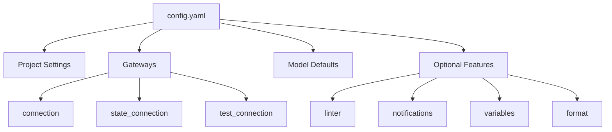

# Overview

Every Vulcan project needs a configuration file that tells Vulcan how to connect to your data warehouse, manage environments, and handle model execution. Think of it as the control center for your entire data pipeline, it's where you define connections, set defaults, and configure optional features like linting and notifications.

## Configuration File

You'll need a configuration file in your project root directory. You've got two options:

- **`config.yaml`** - YAML format (recommended for most users). It's simple, readable, and perfect for most use cases.
- **`config.py`** - Python format (for advanced use cases). Use this if you need dynamic configuration or want to programmatically generate settings.

## Quick Start Example

Here's a practical example of a Vulcan configuration file:

```yaml linenums="1"
# Project metadata
name: orders360
tenant: sales
description: Daily sales analytics pipeline

# Gateway Connection
gateways:
  default:
    connection:
      type: postgres
      host: warehouse
      port: 5432
      database: warehouse
      user: vulcan
      password: "{{ env_var('DB_PASSWORD') }}"
    state_connection:
      type: postgres
      host: statestore
      port: 5432
      database: statestore
      user: vulcan
      password: "{{ env_var('STATE_DB_PASSWORD') }}"

default_gateway: default

# Model Defaults (required)
model_defaults:
  dialect: postgres
  start: 2024-01-01
  cron: '@daily'

# Linting Rules
linter:
  enabled: true
  rules:
    - ambiguousorinvalidcolumn
    - invalidselectstarexpansion
```

## Configuration Structure



## Configuration Sections

### Project Settings

These are basic metadata fields that help identify your project. They're useful for organization and documentation, but they don't affect how Vulcan runs.

| Option | Description | Type |
|--------|-------------|:----:|
| `name` | Project name | string |
| `tenant` | Tenant or organization name | string |
| `description` | Human-readable project description | string |

### Gateways

Gateways are how Vulcan connects to your data warehouse, state backend, and other services. You can define multiple gateways for different environments (like dev, staging, and prod), each with its own connection settings. This gives you flexibility to use different databases or configurations per environment.

| Component | Description | Default |
|-----------|-------------|---------|
| `connection` | Primary data warehouse connection | Required |
| `state_connection` | Where Vulcan stores internal state | Uses `connection` |
| `test_connection` | Connection for running tests | Uses `connection` |
| `scheduler` | Scheduler configuration | `builtin` |
| `state_schema` | Schema name for state tables | `vulcan` |

→ See [Configuration Reference](../../references/configuration.md#gateways) for detailed gateway options.

### Model Defaults (Required)

The `model_defaults` section is **required**, you can't skip it! At minimum, you need to specify the `dialect` key, which tells Vulcan what SQL dialect your models use. The other defaults are optional but super helpful because they apply to all your models automatically, saving you from repeating the same settings in every model file.

```yaml
model_defaults:
  dialect: postgres     # Required
  owner: data-team
  start: 2024-01-01
  cron: '@daily'
```

→ See [Model Defaults](./options/model_defaults.md) for all available options.

### Variables

Manage environment variables, `.env` files, and configuration overrides. This is where you'll store sensitive information like passwords and API keys securely, without hardcoding them in your config files. You can also use variables to override configuration values dynamically.

→ See [Variables](./options/variables.md) for details.

### Execution Hooks

Run SQL statements automatically at the start and end of `vulcan plan` and `vulcan run` commands. This is super useful for things like setting up temporary tables, granting permissions, or cleaning up after runs. You can use `before_all` for setup tasks and `after_all` for cleanup or post-processing.

→ See [Execution Hooks](./options/execution_hooks.md) for detailed examples and use cases.

### Linter

Enable automatic code quality checks that run whenever you create a plan or run the lint command. This helps catch common mistakes and enforce coding standards across your team. You can use built-in rules or create custom ones that match your team's preferences.

→ See [Linter](./options/linter.md) for rules and custom linter configuration.

### Notifications

Set up alerts via Slack or email so you know when important things happen in your pipeline. You can get notified when plans start or finish, when runs complete, or when audits fail. This keeps your team in the loop without having to constantly check the pipeline status.

→ See [Notifications](./options/notifications.md) for Slack webhooks, API, and email setup.

## Supported Engines

Vulcan works with a variety of data warehouses, so you can use it with whatever infrastructure you already have:

<<<<<<< Updated upstream
- **[PostgreSQL](../../references/integrations/engines/postgres.md)** - Open-source relational database
- **[Snowflake](../../references/integrations/engines/snowflake.md)** - Cloud data warehouse
=======
- **[PostgreSQL](./configurations-old/configurations-old/configurations-old/integrations/engines/postgres.md)** - The popular open-source relational database. Great for smaller projects or when you want full control over your infrastructure.
- **[Snowflake](./configurations-old/configurations-old/configurations-old/integrations/engines/snowflake.md)** - The cloud data warehouse that scales automatically. Perfect for larger teams and projects that need elastic compute.
>>>>>>> Stashed changes

## Configuration Reference

| Topic | Description |
|-------|-------------|
| [Configuration Reference](../../references/configuration.md) | Complete list of all configuration parameters |
| [Variables](./options/variables.md) | Environment variables and `.env` files |
| [Model Defaults](./options/model_defaults.md) | Default settings for all models |
| [Execution Hooks](./options/execution_hooks.md) | `before_all` and `after_all` statements |
| [Linter](./options/linter.md) | Code quality rules and custom linters |
| [Notifications](./options/notifications.md) | Slack and email notification setup |

## Best Practices

Here are some tips to help you get the most out of your Vulcan configuration:

1. **Use environment variables** for sensitive data like passwords and API keys. This keeps secrets out of your config files and makes it easier to manage different environments.

2. **Set meaningful defaults** in `model_defaults` to reduce boilerplate. If most of your models use the same dialect, start date, or cron schedule, set it once here instead of repeating it everywhere.

3. **Enable linting** to catch common errors early in development. It's much easier to fix issues before they make it to production.

4. **Separate state connection** from your data warehouse for better isolation. This prevents state operations from interfering with your data processing and gives you more flexibility.

5. **Use multiple gateways** for different environments (dev, staging, prod). This lets you test changes safely before deploying to production, and you can use different database configurations for each environment.
