# Data Quality

This guide explains how to use **Audits**, **Checks**, and **Tests** together to ensure data quality in your Orders360 project. You'll learn when to use each tool and see complex examples where they work together.

These three tools work as layers of protection for your data. Each serves a different purpose. Together they provide comprehensive coverage.

---

## The Three-Layer Quality Strategy

```mermaid
flowchart TB
    subgraph "Layer 1: Audits - Critical Blocking"
        AUDIT[Audits<br/>Block invalid data<br/>Run with model]
        EXAMPLES1["• Primary keys unique<br/>• Revenue non-negative<br/>• Foreign keys valid"]
    end
    
    subgraph "Layer 2: Checks - Monitoring"
        CHECK[Checks<br/>Track quality trends<br/>Non-blocking]
        EXAMPLES2["• Row count anomalies<br/>• Completeness trends<br/>• Cross-model validation"]
    end
    
    subgraph "Layer 3: Tests - Logic Validation"
        TEST[Tests<br/>Validate transformations<br/>Unit testing]
        EXAMPLES3["• SQL logic correct<br/>• Expected outputs<br/>• Edge cases"]
    end
    
    AUDIT --> EXAMPLES1
    CHECK --> EXAMPLES2
    TEST --> EXAMPLES3
    
    style AUDIT fill:#ffebee,stroke:#d32f2f,stroke-width:3px,color:#000
    style CHECK fill:#fff9c4,stroke:#fbc02d,stroke-width:2px,color:#000
    style TEST fill:#e3f2fd,stroke:#1976d2,stroke-width:2px,color:#000
```



**When to Use Each:**

Here's a quick guide to help you choose:

| Tool | Purpose | Blocks Pipeline? | Best For |
|------|---------|------------------|----------|
| **Audits** | Critical validation | Yes (always) | Business rules, data integrity |
| **Checks** | Quality monitoring | No | Trends, anomalies, monitoring |
| **Tests** | Logic validation | No | SQL correctness, edge cases |

The key difference: Audits stop everything if they fail. Checks and tests warn you, so you can investigate without blocking production.

*[Screenshot: Visual comparison of the three quality tools]*

---

## Quick Reference

### Audits: Critical Blocking Validation

**Use audits when:** Data must be correct or the pipeline should stop. These are your "must never fail" rules, if an audit fails, something is seriously wrong and you don't want that bad data flowing downstream.

```sql
MODEL (
  name sales.daily_sales,
  assertions (
    -- Primary key validation
    not_null(columns := (order_date)),
    unique_values(columns := (order_date)),
    
    -- Business rules
    positive_values(column := total_revenue),
    accepted_range(column := total_orders, min_v := 0, max_v := 10000)
  )
);
```

**Why audits are useful:**

- Always blocking - if they fail, execution stops immediately. No bad data gets through

- Run automatically with model execution - you don't have to remember to run them

- Fast feedback during development - catch issues before they hit production

- Use for critical business rules like "revenue must be positive" or "primary keys must be unique"

Think of audits as your bouncer, they check IDs at the door and don't let anyone sketchy in.

*[Screenshot: Audit failure blocking plan execution]*

### Checks: Quality Monitoring

**Use checks when:** You want to monitor trends and detect anomalies over time. Unlike audits, checks don't block your pipeline, they just keep an eye on things and warn you if something looks off.

```yaml
# checks/daily_sales.yml
checks:
  sales.daily_sales:
    completeness:
      - row_count > 0:
          name: daily_records_exist
          attributes:
            description: "At least one record per day"
    
    accuracy:
      - anomaly detection for total_revenue:
          name: revenue_anomaly
          attributes:
            description: "Detect unusual revenue patterns"
```

**Why checks are useful:**

- Non-blocking - warnings, not failures. Your pipeline keeps running even if a check flags something

- Historical tracking - see trends over time. You can spot patterns like "revenue always drops on weekends" or "row counts are trending down"

- Anomaly detection - statistical analysis. Checks can detect when something is statistically unusual, even if it's not technically wrong

- Use for monitoring and alerting. Set up alerts for when checks fail, so you know to investigate.

Checks monitor everything and alert you if something suspicious happens, but they don't stop execution.

*[Screenshot: Check results showing trends over time]*

### Tests: Logic Validation

**Use tests when:** You need to validate SQL transformations and edge cases. These are your unit tests for SQL, they make sure your logic is correct before you deploy it.

```yaml
# tests/test_daily_sales.yaml
tests:
  - name: test_daily_sales_aggregation
    model: sales.daily_sales
    inputs:
      raw.raw_orders:
        - order_id: ORD-001
          order_date: 2025-01-15
          total_amount: 100.50
    outputs:
      - order_date: 2025-01-15
        total_orders: 1
        total_revenue: 100.50
```

**Why tests are useful:**

- Unit testing for SQL logic - test your transformations in isolation

- Validates expected outputs - make sure you're getting the results you expect

- Tests edge cases - what happens with empty data? Null values? Boundary conditions?

- Use for development. Catch bugs before they make it to production.

Tests run in a controlled environment before production.

*[Screenshot: Test execution showing pass/fail results]*

---

## Complex Example: Orders360 Daily Sales

Let's see how all three tools work together for the `sales.daily_sales` model. This is a real-world example that shows you how to layer these tools for maximum protection.

### The Model

```sql
MODEL (
  name sales.daily_sales,
  kind FULL,
  cron '@daily',
  grain order_date,
  assertions (
    -- Audit: Critical validations
    not_null(columns := (order_date, total_orders, total_revenue)),
    unique_values(columns := (order_date)),
    positive_values(column := total_orders),
    positive_values(column := total_revenue),
    accepted_range(column := total_revenue, min_v := 0, max_v := 1000000)
  )
);

SELECT
  CAST(order_date AS TIMESTAMP)::TIMESTAMP AS order_date,
  COUNT(order_id)::INTEGER AS total_orders,
  SUM(total_amount)::FLOAT AS total_revenue,
  MAX(order_id)::VARCHAR AS last_order_id
FROM raw.raw_orders
GROUP BY order_date
ORDER BY order_date
```

### Layer 1: Audits (Critical Blocking)

**Why:** These rules must never fail. Invalid data should not flow downstream. If revenue is negative or primary keys aren't unique, that's a critical problem that needs to stop everything immediately.

```sql
-- audits/revenue_consistency.sql
AUDIT (name assert_revenue_consistency);
-- Ensure revenue matches sum of individual orders
SELECT 
  ds.order_date,
  ds.total_revenue,
  SUM(o.total_amount) as calculated_revenue
FROM @this_model ds
JOIN raw.raw_orders o ON DATE(o.order_date) = ds.order_date
GROUP BY ds.order_date, ds.total_revenue
HAVING ABS(ds.total_revenue - SUM(o.total_amount)) > 0.01;
```

**Attach to model:**
```sql
MODEL (
  name sales.daily_sales,
  assertions (
    -- ... other audits ...
    assert_revenue_consistency  -- Custom audit
  )
);
```

*[Screenshot: Audit failure showing revenue mismatch]*

### Layer 2: Checks (Monitoring)

**Why:** Monitor trends and detect anomalies without blocking the pipeline. You want to know if revenue spikes unexpectedly or if row counts drop, but these might be legitimate business events, so you investigate rather than blocking.

```yaml
# checks/daily_sales.yml
checks:
  sales.daily_sales:
    # Completeness: Ensure data exists
    completeness:
      - row_count > 0:
          name: daily_records_exist
          attributes:
            description: "At least one record per day"
            severity: error
    
      - missing_count(order_date) = 0:
          name: no_missing_dates
          attributes:
            description: "All dates must be present"
    
    # Validity: Check data ranges
    validity:
      - failed rows:
          name: revenue_outliers
          fail query: |
            SELECT order_date, total_revenue
            FROM sales.daily_sales
            WHERE total_revenue > 500000 OR total_revenue < 0
          samples limit: 10
          attributes:
            description: "Revenue outside expected range"
            severity: warning
    
    # Accuracy: Anomaly detection
    accuracy:
      - anomaly detection for total_revenue:
          name: revenue_anomaly
          attributes:
            description: "Detect unusual revenue patterns"
            severity: warning
      
      - anomaly detection for total_orders:
          name: order_count_anomaly
          attributes:
            description: "Detect unusual order volume"
    
    # Consistency: Cross-model validation
    consistency:
      - failed rows:
          name: revenue_mismatch_with_raw
          fail query: |
            SELECT 
              ds.order_date,
              ds.total_revenue as daily_revenue,
              SUM(o.total_amount) as raw_revenue
            FROM sales.daily_sales ds
            LEFT JOIN raw.raw_orders o 
              ON DATE(o.order_date) = ds.order_date
            GROUP BY ds.order_date, ds.total_revenue
            HAVING ABS(ds.total_revenue - SUM(o.total_amount)) > 1.0
          samples limit: 5
          attributes:
            description: "Daily revenue should match sum of raw orders"
            severity: error
    
    # Timeliness: Check data freshness
    timeliness:
      - change for row_count >= -20%:
          name: row_count_drop_alert
          attributes:
            description: "Alert if daily records drop more than 20%"
            severity: warning
```

*[Screenshot: Check dashboard showing trends and anomalies]*

### Layer 3: Tests (Logic Validation)

**Why:** Validate SQL logic and edge cases during development. Before you even deploy, you want to make sure your SQL is doing what you think it's doing. Tests catch logic errors early.

```yaml
# tests/test_daily_sales.yaml
tests:
  - name: test_daily_sales_single_order
    model: sales.daily_sales
    inputs:
      raw.raw_orders:
        - order_id: ORD-001
          order_date: 2025-01-15
          customer_id: CUST-001
          product_id: PROD-001
          total_amount: 100.50
    outputs:
      - order_date: 2025-01-15
        total_orders: 1
        total_revenue: 100.50
        last_order_id: ORD-001
  
  - name: test_daily_sales_multiple_orders
    model: sales.daily_sales
    inputs:
      raw.raw_orders:
        - order_id: ORD-001
          order_date: 2025-01-15
          total_amount: 100.00
        - order_id: ORD-002
          order_date: 2025-01-15
          total_amount: 200.00
        - order_id: ORD-003
          order_date: 2025-01-15
          total_amount: 50.00
    outputs:
      - order_date: 2025-01-15
        total_orders: 3
        total_revenue: 350.00
        last_order_id: ORD-003
  
  - name: test_daily_sales_empty_day
    model: sales.daily_sales
    inputs:
      raw.raw_orders: []
    outputs: []
  
  - name: test_daily_sales_date_grouping
    model: sales.daily_sales
    inputs:
      raw.raw_orders:
        - order_id: ORD-001
          order_date: 2025-01-15 10:00:00
          total_amount: 100.00
        - order_id: ORD-002
          order_date: 2025-01-15 15:30:00
          total_amount: 200.00
        - order_id: ORD-003
          order_date: 2025-01-16 09:00:00
          total_amount: 150.00
    outputs:
      - order_date: 2025-01-15
        total_orders: 2
        total_revenue: 300.00
      - order_date: 2025-01-16
        total_orders: 1
        total_revenue: 150.00
```

*[Screenshot: Test execution showing all tests passing]*

---

## How They Work Together


**Execution Order:**
1. **Tests** run during development (validate logic) - catch bugs before deployment
2. **Plan** applies changes to environment - your changes go live
3. **Model** executes transformation - data gets processed
4. **Audits** run immediately (block if fail) - critical validation happens right away
5. **Checks** run (track trends, don't block) - monitoring happens in the background

Tests happen first, then audits catch critical issues, and checks monitor everything. This layered approach provides comprehensive coverage.

*[Screenshot: Complete workflow showing all three layers]*

---

## Complex Scenario: Revenue Validation

Here's a complex example where audits and checks work together to validate revenue data. This shows you how to use both tools for the same concern, critical blocking vs. monitoring.

### The Problem

We need to ensure:

1. **Critical:** Revenue is always positive (audit - blocks)
2. **Critical:** Daily totals match raw order sums (audit - blocks)
3. **Monitoring:** Revenue trends are normal (check - warns)
4. **Monitoring:** Detect unusual spikes/drops (check - warns)

### Solution: Combined Approach

**Audits (Critical - Blocking):**
```sql
MODEL (
  name sales.daily_sales,
  assertions (
    -- Basic validation
    positive_values(column := total_revenue),
    not_null(columns := (order_date, total_revenue)),
    
    -- Complex validation: Revenue consistency
    assert_revenue_matches_raw_orders
  )
);

-- audits/revenue_matches_raw.sql
AUDIT (name assert_revenue_matches_raw_orders);
SELECT 
  ds.order_date,
  ds.total_revenue as daily_total,
  COALESCE(SUM(o.total_amount), 0) as raw_total,
  ABS(ds.total_revenue - COALESCE(SUM(o.total_amount), 0)) as difference
FROM @this_model ds
LEFT JOIN raw.raw_orders o 
  ON DATE(o.order_date) = ds.order_date
GROUP BY ds.order_date, ds.total_revenue
HAVING ABS(ds.total_revenue - COALESCE(SUM(o.total_amount), 0)) > 0.01;
```

**Checks (Monitoring - Non-Blocking):**
```yaml
# checks/revenue_monitoring.yml
checks:
  sales.daily_sales:
    accuracy:
      # Anomaly detection for revenue
      - anomaly detection for total_revenue:
          name: revenue_anomaly_detection
          attributes:
            description: "Detect statistically unusual revenue"
            severity: warning
      
      # Trend monitoring
      - change for total_revenue >= 50%:
          name: revenue_spike_alert
          attributes:
            description: "Alert if revenue increases >50% day-over-day"
            severity: warning
      
      - change for total_revenue <= -30%:
          name: revenue_drop_alert
          attributes:
            description: "Alert if revenue drops >30% day-over-day"
            severity: error
    
    consistency:
      # Cross-model validation (non-blocking)
      - failed rows:
          name: revenue_vs_raw_check
          fail query: |
            SELECT 
              ds.order_date,
              ds.total_revenue,
              SUM(o.total_amount) as raw_sum,
              ABS(ds.total_revenue - SUM(o.total_amount)) as diff
            FROM sales.daily_sales ds
            LEFT JOIN raw.raw_orders o 
              ON DATE(o.order_date) = ds.order_date
            GROUP BY ds.order_date, ds.total_revenue
            HAVING ABS(ds.total_revenue - SUM(o.total_amount)) > 10.0
          samples limit: 5
          attributes:
            description: "Monitor revenue consistency (wider tolerance than audit)"
            severity: warning
```

**Why Both?**

You might wonder why you need both an audit and a check for revenue. Here's the thing:

- **Audit:** Stops pipeline if revenue is wrong (critical). If daily totals don't match raw orders, that's a data integrity issue and everything stops.

- **Check:** Warns about trends and anomalies (monitoring) - if revenue spikes 50% day-over-day, that might be legitimate (big sale!) or it might be a problem, but you want to investigate, not block

- **Together:** Critical issues blocked, trends monitored - you get both immediate protection and ongoing visibility

The audit has a tight tolerance (0.01) because it's checking for correctness. The check has a wider tolerance (10.0) because it's looking for trends, not exact matches. Pretty clever, right?

*[Screenshot: Dashboard showing audit blocks vs check warnings]*

---

## Running Quality Tools

### Run Tests
```bash
# Run all tests
vulcan test

# Run specific test
vulcan test tests/test_daily_sales.yaml::test_daily_sales_single_order

# Run tests matching pattern
vulcan test tests/test_daily*
```

*[Screenshot: Test execution output]*

### Run Audits
```bash
# Run all audits
vulcan audit

# Audits also run automatically with plan
vulcan plan dev
```

*[Screenshot: Audit execution output]*

### Run Checks
```bash
# Run all checks
vulcan check

# Run checks for specific model
vulcan check --select sales.daily_sales

# Checks also run automatically with plan/run
vulcan plan dev
```

*[Screenshot: Check execution output with trends]*

---

## Best Practices

### DO:

Here are some tips to help you use these tools effectively:

1. **Start with Audits** - Add critical blocking validations first. Get your safety net in place before worrying about trends.
2. **Add Checks Gradually** - Monitor trends, then add anomaly detection. Don't try to check everything at once, build up your monitoring over time.
3. **Test During Development** - Write tests before deploying. Catch logic errors before they hit production.
4. **Use Descriptive Names** - Makes debugging easier. Names like `revenue_mismatch_with_raw` are much better than `check_1`.
5. **Order Audits Efficiently** - Fast checks first, slow checks last. If you have multiple audits, put the quick ones first so you fail fast.

### DON'T:

And here's what to avoid:

1. **Don't use Checks for Critical Rules** - Use audits instead. If it's critical, it should block. Checks are for monitoring, not blocking.
2. **Don't Skip Audit Failures** - Fix the root cause. If an audit fails, something is wrong. Don't just disable it, fix the problem.
3. **Don't Over-Audit** - Focus on critical business rules. Too many audits can slow things down. Only audit what really matters.
4. **Don't Ignore Check Trends** - They indicate data quality issues. If checks are consistently failing, there's probably a real problem you need to address.

---

## Summary

**Three-Layer Strategy:**

- **Audits** = Critical blocking validation (must pass)

- **Checks** = Quality monitoring (trends, anomalies)

- **Tests** = Logic validation (development)

**Use Together:**

- Audits block invalid data

- Checks monitor quality trends

- Tests validate SQL logic

**Orders360 Example:**

- Audits ensure revenue is positive and matches raw data

- Checks detect anomalies and trends

- Tests validate aggregation logic

---

## Next Steps

- Learn about [Built-in Audits](../components/audits/audits.md#built-in-audits)

- Explore [Check Dimensions](../components/checks/checks.md#data-quality-dimensions)

- Read about [Testing](../components/tests/tests.md)

