# Incremental by Time

This guide explains how incremental by time models work in Vulcan using the Orders360 example project. You'll learn why they're efficient, how they process data, and how to create them.

See the [models guide](./models.md) for general model information or the [model kinds page](../concepts/models/model_kinds.md) for all model types.

---

## Why Use Incremental Models?

### The Problem: Full Refreshes Are Expensive

Imagine you have a table with sales data from the last year (365 days). Every time you run a `FULL` model, it processes **all 365 days**:

```mermaid
flowchart LR
    subgraph "🔄 FULL Model - Every Run"
        FULL[FULL Model Run]
        PROCESS[Process ALL 365 Days]
        DAY1[Day 1 ✅]
        DAY2[Day 2 ✅]
        DAY3[Day 3 ✅]
        DOTS[...]
        DAY365[Day 365 ✅]
    end
    
    subgraph "📊 Results"
        TIME1[⏱️ Time: 10 minutes]
        COST1[💰 Cost: $10]
        DATA1[📦 All 365 days]
    end
    
    FULL --> PROCESS
    PROCESS --> DAY1
    PROCESS --> DAY2
    PROCESS --> DAY3
    PROCESS --> DOTS
    PROCESS --> DAY365
    
    DAY365 --> TIME1
    DAY365 --> COST1
    DAY365 --> DATA1
    
    style FULL fill:#ffebee,stroke:#d32f2f,stroke-width:3px,color:#000
    style PROCESS fill:#fff3e0,stroke:#f57c00,stroke-width:2px,color:#000
    style TIME1 fill:#e8f5e9,stroke:#388e3c,stroke-width:2px,color:#000
    style COST1 fill:#e8f5e9,stroke:#388e3c,stroke-width:2px,color:#000
    style DATA1 fill:#e8f5e9,stroke:#388e3c,stroke-width:2px,color:#000
```



*[Screenshot: Visual showing FULL model processing all 365 days]*

### The Solution: Only Process What's New

With incremental models, Vulcan only processes **new or missing** days:

```mermaid
flowchart LR
    subgraph "⚡ INCREMENTAL Model - Every Run"
        INCR[INCREMENTAL Model Run]
        CHECK[Check State Database]
        SKIP[Skip Days 1-364 ✅]
        PROCESS_NEW[Process Day 365 Only 🔄]
    end
    
    subgraph "📊 Results"
        TIME2[⏱️ Time: 30 seconds]
        COST2[💰 Cost: $0.20]
        DATA2[📦 Only Day 365]
    end
    
    INCR --> CHECK
    CHECK --> SKIP
    CHECK --> PROCESS_NEW
    
    PROCESS_NEW --> TIME2
    PROCESS_NEW --> COST2
    PROCESS_NEW --> DATA2
    
    style INCR fill:#e8f5e9,stroke:#388e3c,stroke-width:3px,color:#000
    style CHECK fill:#e3f2fd,stroke:#1976d2,stroke-width:2px,color:#000
    style SKIP fill:#fff9c4,stroke:#fbc02d,stroke-width:2px,color:#000
    style PROCESS_NEW fill:#c8e6c9,stroke:#2e7d32,stroke-width:2px,color:#000
    style TIME2 fill:#e8f5e9,stroke:#388e3c,stroke-width:2px,color:#000
    style COST2 fill:#e8f5e9,stroke:#388e3c,stroke-width:2px,color:#000
    style DATA2 fill:#e8f5e9,stroke:#388e3c,stroke-width:2px,color:#000
```



*[Screenshot: Visual showing incremental model processing only Day 365]*

**Result:** 50x faster and 50x cheaper! 🎉

---

## How Incremental Models Work

Incremental models use **time intervals** to track what's been processed. Think of it like a calendar where Vulcan checks off each day.


### Step 1: Vulcan Checks What's Already Done

When you run `vulcan run`, Vulcan looks at your state database and asks:

- "What dates have I already processed?"
- "What dates are missing?"

```
State Database Check:
✅ Jan 1-7:   Already processed
✅ Jan 8-14:  Already processed  
❌ Jan 15-21: Missing - needs processing
```

*[Screenshot: Visual diagram showing state database check with processed vs missing intervals]*

### Step 2: Vulcan Processes Only Missing Intervals

Vulcan then processes only the missing dates:

```
Processing Jan 15-21:
@start_ds = '2025-01-15'
@end_ds   = '2025-01-21'

Query runs:
SELECT ... FROM daily_sales
WHERE order_date BETWEEN '2025-01-15' AND '2025-01-21'
```

*[Screenshot: Visual showing how @start_ds and @end_ds are used in the query]*

### Step 3: Results Are Inserted

The processed data is inserted into your table, and Vulcan records that these dates are now complete:

```
✅ Jan 15-21: Now processed and recorded
```

*[Screenshot: Visual showing data insertion and state update]*

---

## Understanding Time Intervals

Vulcan divides time into **intervals** based on your model's schedule.

### Daily Intervals Example

For a daily model (`cron '@daily'`), each day is one interval:


```
Model Start: Jan 1, 2025
Today: Jan 3, 2025 at 2pm

Intervals:
- Jan 1: ✅ Complete (full day passed)
- Jan 2: ✅ Complete (full day passed)
- Jan 3: ⏳ In progress (day not finished yet)
```

*[Screenshot: Calendar view showing daily intervals with Jan 1-2 complete, Jan 3 in progress]*

### Weekly Intervals Example

For a weekly model (`cron '@weekly'`), each week is one interval:


```
Model Start: Jan 1, 2025
Today: Jan 15, 2025

Intervals:
- Week 1 (Jan 1-7):   ✅ Complete
- Week 2 (Jan 8-14):  ✅ Complete
- Week 3 (Jan 15-21): ⏳ In progress
```

*[Screenshot: Calendar view showing weekly intervals]*

### How Vulcan Tracks Intervals

When you first run `vulcan plan` on an incremental model, Vulcan:

```mermaid
flowchart TB
    subgraph "📅 First Plan - Jan 15, 2025"
        PLAN1[vulcan plan dev]
        CALC1[📊 Calculate Intervals<br/>From start to now<br/>3 weeks total]
        PROCESS1[🔄 Process All Intervals<br/>Backfill everything]
        RECORD1[💾 Record in State DB<br/>Weeks 1-3 processed]
        
        subgraph "💾 State Database After Plan"
            W1[✅ Week 1: Jan 1-7]
            W2[✅ Week 2: Jan 8-14]
            W3[✅ Week 3: Jan 15-21]
        end
    end
    
    PLAN1 --> CALC1
    CALC1 --> PROCESS1
    PROCESS1 --> RECORD1
    RECORD1 --> W1
    RECORD1 --> W2
    RECORD1 --> W3
    
    style PLAN1 fill:#fff3e0,stroke:#f57c00,stroke-width:3px,color:#000
    style CALC1 fill:#e3f2fd,stroke:#1976d2,stroke-width:2px,color:#000
    style PROCESS1 fill:#fff9c4,stroke:#fbc02d,stroke-width:2px,color:#000
    style RECORD1 fill:#c8e6c9,stroke:#2e7d32,stroke-width:2px,color:#000
    style W1 fill:#c8e6c9,stroke:#2e7d32,stroke-width:2px,color:#000
    style W2 fill:#c8e6c9,stroke:#2e7d32,stroke-width:2px,color:#000
    style W3 fill:#c8e6c9,stroke:#2e7d32,stroke-width:2px,color:#000
```



1. **Calculates all intervals** from the start date to now
2. **Processes all missing intervals** (backfill)
3. **Records what was processed** in the state database

```
First Plan (Jan 15, 2025):
- Calculates: 3 weeks of intervals
- Processes: All 3 weeks
- Records: "Weeks 1-3 processed"

State Database:
✅ Week 1 (Jan 1-7)
✅ Week 2 (Jan 8-14)
✅ Week 3 (Jan 15-21)
```

*[Screenshot: Visual showing first plan calculating and processing all intervals]*

When you run `vulcan run` later, Vulcan:

```mermaid
flowchart TB
    subgraph "⚡ Second Run - Jan 22, 2025"
        RUN2[vulcan run]
        CALC2[📊 Calculate Intervals<br/>From start to now<br/>4 weeks total]
        CHECK[🔍 Check State DB<br/>What's already processed?]
        
        subgraph "💾 Current State"
            W1_EXIST[✅ Week 1: Jan 1-7]
            W2_EXIST[✅ Week 2: Jan 8-14]
            W3_EXIST[✅ Week 3: Jan 15-21]
            W4_MISS[❌ Week 4: Jan 22-28]
        end
        
        PROCESS2[🔄 Process Only Week 4<br/>Skip Weeks 1-3]
        RECORD2[💾 Update State DB<br/>Week 4 now processed]
        
        subgraph "💾 Updated State"
            W1_NEW[✅ Week 1: Jan 1-7]
            W2_NEW[✅ Week 2: Jan 8-14]
            W3_NEW[✅ Week 3: Jan 15-21]
            W4_NEW[✅ Week 4: Jan 22-28]
        end
    end
    
    RUN2 --> CALC2
    CALC2 --> CHECK
    CHECK --> W1_EXIST
    CHECK --> W2_EXIST
    CHECK --> W3_EXIST
    CHECK --> W4_MISS
    
    W4_MISS --> PROCESS2
    PROCESS2 --> RECORD2
    
    RECORD2 --> W1_NEW
    RECORD2 --> W2_NEW
    RECORD2 --> W3_NEW
    RECORD2 --> W4_NEW
    
    style RUN2 fill:#e8f5e9,stroke:#388e3c,stroke-width:3px,color:#000
    style CALC2 fill:#e3f2fd,stroke:#1976d2,stroke-width:2px,color:#000
    style CHECK fill:#fff9c4,stroke:#fbc02d,stroke-width:2px,color:#000
    style W4_MISS fill:#ffebee,stroke:#d32f2f,stroke-width:2px,color:#000
    style PROCESS2 fill:#c8e6c9,stroke:#2e7d32,stroke-width:2px,color:#000
    style RECORD2 fill:#c8e6c9,stroke:#2e7d32,stroke-width:2px,color:#000
```



1. **Calculates intervals** from start to now
2. **Compares** with what's already processed
3. **Processes only new intervals**

```
Second Run (Jan 22, 2025):
- Calculates: 4 weeks total
- Already processed: Weeks 1-3
- Missing: Week 4 (Jan 22-28)
- Processes: Only Week 4

State Database:
✅ Week 1 (Jan 1-7)
✅ Week 2 (Jan 8-14)
✅ Week 3 (Jan 15-21)
✅ Week 4 (Jan 22-28) ← NEW
```

*[Screenshot: Visual showing second run processing only new Week 4]*

---

## Creating an Incremental Model

Let's create a weekly sales aggregation model for Orders360.

### Step 1: Create the Model File

```bash
touch models/sales/weekly_sales.sql
```

*[Screenshot: File explorer showing new weekly_sales.sql file]*

### Step 2: Define the Model

Edit `models/sales/weekly_sales.sql`:

```sql
MODEL (
  name sales.weekly_sales,
  kind INCREMENTAL_BY_TIME_RANGE (
    time_column order_date,  -- ⏰ This column contains the date
    batch_size 1             -- Process 1 week at a time
  ),
  start '2025-01-01',       -- Start processing from this date
  cron '@weekly',            -- Run weekly
  grain [order_date],        -- One row per week
  description 'Weekly aggregated sales metrics'
);

SELECT
  DATE_TRUNC('week', order_date) AS order_date,
  COUNT(DISTINCT order_id)::INTEGER AS total_orders,
  SUM(total_amount)::FLOAT AS total_revenue,
  AVG(total_amount)::FLOAT AS avg_order_value
FROM sales.daily_sales
WHERE order_date BETWEEN @start_ds AND @end_ds  -- 🔍 Filter by time range
GROUP BY DATE_TRUNC('week', order_date)
ORDER BY order_date
```

*[Screenshot: Code editor showing complete weekly_sales.sql model]*

### Key Components Explained

#### 1. Time Column Declaration

```sql
kind INCREMENTAL_BY_TIME_RANGE (
  time_column order_date  -- Tell Vulcan which column has dates
)
```

**What it does:** Tells Vulcan which column contains the timestamp/date for each row.

*[Screenshot: Code highlighting time_column declaration]*

#### 2. WHERE Clause with Macros

```sql
WHERE order_date BETWEEN @start_ds AND @end_ds
```

**What it does:** Filters data to only the time range being processed.

- `@start_ds` = Start date of the interval (e.g., '2025-01-15')
- `@end_ds` = End date of the interval (e.g., '2025-01-21')

Vulcan automatically replaces these with the correct dates!

*[Screenshot: Code highlighting WHERE clause with macros, showing how they're replaced]*

#### 3. Start Date

```sql
start '2025-01-01'
```

**What it does:** Tells Vulcan when your data begins. Vulcan will backfill from this date.

*[Screenshot: Code highlighting start date]*

### Step 3: Apply the Model

Run `vulcan plan` to apply your new model:

```bash
vulcan plan dev
```

**Expected Output:**
```
======================================================================
Successfully Ran 2 tests against postgres
----------------------------------------------------------------------

Differences from the `prod` environment:

Models:
└── Added:
    └── sales.weekly_sales

Models needing backfill (missing dates):
└── sales.weekly_sales: 2025-01-01 - 2025-01-15

Apply - Backfill Tables [y/n]: y
```

*[Screenshot: Plan output showing weekly_sales model to be added]*

Vulcan will process each week incrementally:

```
[1/3] sales.weekly_sales  [insert 2025-01-01 - 2025-01-07]  1.2s
[2/3] sales.weekly_sales  [insert 2025-01-08 - 2025-01-14]  1.1s
[3/3] sales.weekly_sales  [insert 2025-01-15 - 2025-01-21]  1.3s

Executing model batches ━━━━━━━━━━━━━━━━━━━━━━━━━━━━━━━━━━━━━━━━ 100.0% • 3/3 • 0:00:03

✔ Model batches executed
✔ Plan applied successfully
```

*[Screenshot: Backfill progress showing each week being processed]*

---

## Real Example: Daily Sales from Orders360

Here's the actual `daily_sales` model from Orders360 (currently FULL, but could be incremental):

```sql
MODEL (
  name sales.daily_sales,
  kind FULL,  -- Could be INCREMENTAL_BY_TIME_RANGE
  cron '@daily',
  grain order_date,
  description 'Daily sales summary with order counts and revenue',
  column_descriptions (
    order_date = 'Date of the sales',
    total_orders = 'Total number of orders for the day',
    total_revenue = 'Total revenue for the day',
    last_order_id = 'Last order ID processed for the day'
  ),
  assertions (
    unique_values(columns := (order_date)),
    not_null(columns := (order_date, total_orders, total_revenue)),
    positive_values(column := total_orders),
    positive_values(column := total_revenue)
  )
);

SELECT
  CAST(order_date AS TIMESTAMP)::TIMESTAMP AS order_date,
  COUNT(order_id)::INTEGER AS total_orders,
  SUM(total_amount)::FLOAT AS total_revenue,
  MAX(order_id)::VARCHAR AS last_order_id
FROM raw.raw_orders
GROUP BY order_date
ORDER BY order_date
```

*[Screenshot: daily_sales.sql file showing complete model]*

**To make this incremental**, you would:

1. Change `kind FULL` to `kind INCREMENTAL_BY_TIME_RANGE`
2. Add `time_column order_date`
3. Add `WHERE order_date BETWEEN @start_ds AND @end_ds`

```sql
MODEL (
  name sales.daily_sales,
    kind INCREMENTAL_BY_TIME_RANGE (
    time_column order_date
  ),
  start '2025-01-01',
  cron '@daily',
  -- ... rest stays the same
);

SELECT
  CAST(order_date AS TIMESTAMP)::TIMESTAMP AS order_date,
  COUNT(order_id)::INTEGER AS total_orders,
  SUM(total_amount)::FLOAT AS total_revenue,
  MAX(order_id)::VARCHAR AS last_order_id
FROM raw.raw_orders
WHERE order_date BETWEEN @start_ds AND @end_ds  -- ADD THIS
GROUP BY order_date
ORDER BY order_date
```

*[Screenshot: Comparison showing FULL vs INCREMENTAL changes]*

---

## Understanding the WHERE Clause

You might wonder: "Why do I need a WHERE clause if Vulcan adds one automatically?"

### Two WHERE Clauses, Two Purposes

Vulcan actually uses **two** WHERE clauses:

#### 1. Your Model's WHERE Clause

```sql
WHERE order_date BETWEEN @start_ds AND @end_ds
```

**Purpose:** Filters data **read into** the model
- Only reads necessary data from upstream tables
- Saves processing time and resources
- You control this in your SQL

*[Screenshot: Visual showing model WHERE clause filtering input data]*

#### 2. Vulcan's Automatic WHERE Clause

Vulcan automatically adds another filter on the output:

```sql
-- Vulcan adds this automatically:
WHERE order_date BETWEEN @start_ds AND @end_ds
```

**Purpose:** Filters data **output by** the model
- Prevents data leakage (ensures no rows outside the time range)
- Safety mechanism
- Vulcan controls this automatically

*[Screenshot: Visual showing Vulcan's automatic WHERE clause filtering output]*

### Why Both Are Needed

- **Your WHERE clause:** Optimizes performance by reading less data
- **Vulcan's WHERE clause:** Ensures correctness by preventing data leakage

**Always include the WHERE clause in your model SQL!**

*[Screenshot: Side-by-side comparison showing both WHERE clauses and their purposes]*

---

## Running Incremental Models

Vulcan has two commands for processing models:

### `vulcan plan` - For Model Changes

Use when you've **changed a model**:

```bash
vulcan plan dev
```

**What it does:**
- Detects model changes
- Shows what will be affected
- Backfills missing intervals
- Applies changes to the environment

*[Screenshot: Plan command output showing model changes]*

### `vulcan run` - For Scheduled Execution

Use when **no models have changed**:

```bash
vulcan run
```

**What it does:**
- Checks each model's `cron` schedule
- Processes only models that are due
- Processes only missing intervals
- Fast and efficient

*[Screenshot: Run command output showing scheduled execution]*

### How Cron Schedules Work

Each model has a `cron` parameter that determines how often it should run:

```mermaid
flowchart LR
    subgraph "⏰ Cron Schedules"
        DAILY[@daily<br/>Every 24 hours]
        WEEKLY[@weekly<br/>Every 7 days]
        HOURLY[@hourly<br/>Every 1 hour]
    end
    
    subgraph "📊 Example Models"
        M1[sales.daily_sales<br/>cron: @daily]
        M2[sales.weekly_sales<br/>cron: @weekly]
    end
    
    DAILY --> M1
    WEEKLY --> M2
    
    style DAILY fill:#e3f2fd,stroke:#1976d2,stroke-width:2px,color:#000
    style WEEKLY fill:#e3f2fd,stroke:#1976d2,stroke-width:2px,color:#000
    style HOURLY fill:#e3f2fd,stroke:#1976d2,stroke-width:2px,color:#000
    style M1 fill:#c8e6c9,stroke:#2e7d32,stroke-width:2px,color:#000
    style M2 fill:#c8e6c9,stroke:#2e7d32,stroke-width:2px,color:#000
```

```sql
cron '@daily'   -- Run once per day
cron '@weekly'  -- Run once per week
cron '@hourly'  -- Run once per hour
```

**Example from Orders360:**

```sql
-- Daily model
MODEL (
  name sales.daily_sales,
  cron '@daily'  -- Runs every day
);

-- Weekly model
MODEL (
  name sales.weekly_sales,
  cron '@weekly'  -- Runs once per week
);
```

*[Screenshot: Visual showing cron schedules for daily vs weekly models]*

When you run `vulcan run`:

```mermaid
flowchart TB
    subgraph "🔄 vulcan run Execution"
        RUN[vulcan run<br/>at 2pm on Jan 15]
        
        subgraph "📋 Model Evaluation"
            CHECK1[Check daily_sales<br/>cron: @daily<br/>Last run: 24h ago]
            CHECK2[Check weekly_sales<br/>cron: @weekly<br/>Last run: 2 days ago]
        end
        
        subgraph "✅ Decision"
            DUE1[✅ Due!<br/>Process daily_sales]
            SKIP[⏭️ Not due<br/>Skip weekly_sales]
        end
        
        EXEC1[🔄 Execute daily_sales<br/>Process missing intervals]
    end
    
    RUN --> CHECK1
    RUN --> CHECK2
    
    CHECK1 --> DUE1
    CHECK2 --> SKIP
    
    DUE1 --> EXEC1
    
    style RUN fill:#fff3e0,stroke:#f57c00,stroke-width:3px,color:#000
    style CHECK1 fill:#e3f2fd,stroke:#1976d2,stroke-width:2px,color:#000
    style CHECK2 fill:#e3f2fd,stroke:#1976d2,stroke-width:2px,color:#000
    style DUE1 fill:#c8e6c9,stroke:#2e7d32,stroke-width:2px,color:#000
    style SKIP fill:#fff9c4,stroke:#fbc02d,stroke-width:2px,color:#000
    style EXEC1 fill:#c8e6c9,stroke:#2e7d32,stroke-width:2px,color:#000
```



1. Vulcan checks each model's `cron`
2. Determines if enough time has passed since last run
3. Processes only models that are due

```
vulcan run at 2pm on Jan 15:

✅ daily_sales (@daily):   Last run 24h ago → Due, process!
⏭️ weekly_sales (@weekly): Last run 2 days ago → Not due, skip
```

*[Screenshot: Visual showing cron evaluation logic]*

---

## Batch Processing

For large datasets, you can process intervals in batches using `batch_size`:


```sql
MODEL (
  name sales.weekly_sales,
    kind INCREMENTAL_BY_TIME_RANGE (
    time_column order_date,
    batch_size 4  -- Process 4 weeks at a time
  )
);
```

**Without batch_size (default):**
- Processes all missing intervals in one job
- Example: 12 weeks = 1 job

**With batch_size:**
- Divides intervals into batches
- Example: 12 weeks ÷ 4 = 3 jobs

*[Screenshot: Visual comparison showing batch processing vs single job]*

**When to use batches:**
- ✅ Large datasets that might timeout
- ✅ Need better progress tracking
- ✅ Want to parallelize processing

**When not to use batches:**
- ✅ Small datasets (< 1GB)
- ✅ Fast queries (< 1 minute)
- ✅ Simple transformations

---

## Forward-Only Models

Sometimes you have models so large that rebuilding them is impossible. Forward-only models solve this.

### What Are Forward-Only Models?

Forward-only models **never rebuild historical data**. Changes are only applied going forward in time.


**Regular Model Change:**
```
Breaking change → Rebuild entire table (all dates)
```

**Forward-Only Model Change:**
```
Breaking change → Only apply to new dates going forward
```

*[Screenshot: Visual comparison showing regular rebuild vs forward-only]*

### When to Use Forward-Only

✅ **Use forward-only when:**
- Tables are too large to rebuild
- Historical data can't be reprocessed
- You only care about future data

❌ **Don't use forward-only when:**
- You need to fix historical data
- Schema changes affect past data
- You want full data consistency

### Making a Model Forward-Only

Add `forward_only true` to your model:

```sql
MODEL (
  name sales.weekly_sales,
    kind INCREMENTAL_BY_TIME_RANGE (
    time_column order_date,
    forward_only true  -- All changes are forward-only
  )
);
```

*[Screenshot: Code showing forward_only configuration]*

### Forward-Only Plans

You can also make a specific plan forward-only:

```bash
vulcan plan dev --forward-only
```

This treats **all changes in the plan** as forward-only, even if models aren't configured that way.

*[Screenshot: Plan command with --forward-only flag]*

---

## Schema Changes in Forward-Only Models

When you change a forward-only model, Vulcan checks for schema changes that could cause problems.

### Types of Schema Changes

#### Destructive Changes

Changes that **remove or modify** existing data:


- ❌ Dropping a column
- ❌ Renaming a column  
- ❌ Changing data type (could cause data loss)

**Example:**
```sql
-- Before
SELECT order_id, total_amount FROM orders

-- After (destructive - drops total_amount)
SELECT order_id FROM orders
```

*[Screenshot: Visual showing destructive change example]*

#### Additive Changes

Changes that **add** new data without removing existing:


- ✅ Adding a new column
- ✅ Changing data type (compatible, e.g., INT → STRING)

**Example:**
```sql
-- Before
SELECT order_id, total_amount FROM orders

-- After (additive - adds customer_name)
SELECT order_id, total_amount, customer_name FROM orders
```

*[Screenshot: Visual showing additive change example]*

### Controlling Schema Change Behavior

You can control how Vulcan handles schema changes:

```sql
MODEL (
  name sales.weekly_sales,
    kind INCREMENTAL_BY_TIME_RANGE (
    time_column order_date,
        forward_only true,
        on_destructive_change error,  -- Block destructive changes
    on_additive_change allow      -- Allow new columns
  )
);
```

**Options:**
- `error` - Stop and raise an error (default for destructive)
- `warn` - Log a warning but continue
- `allow` - Silently proceed (default for additive)
- `ignore` - Skip the check entirely (dangerous!)

*[Screenshot: Code showing schema change configuration options]*

### Common Patterns

#### Strict Schema Control

Prevent any schema changes:

```sql
MODEL (
  name sales.production_model,
    kind INCREMENTAL_BY_TIME_RANGE (
    time_column order_date,
        forward_only true,
    on_destructive_change error,  -- Block destructive
    on_additive_change error       -- Block even new columns
  )
);
```

*[Screenshot: Strict schema control example]*

#### Development Model

Allow all changes for rapid iteration:

```sql
MODEL (
  name sales.dev_model,
    kind INCREMENTAL_BY_TIME_RANGE (
    time_column order_date,
        forward_only true,
        on_destructive_change allow,  -- Allow dropping columns
    on_additive_change allow      -- Allow new columns
  )
);
```

*[Screenshot: Development model example]*

#### Production Safety

Allow safe changes, warn about risky ones:

```sql
MODEL (
  name sales.production_model,
    kind INCREMENTAL_BY_TIME_RANGE (
    time_column order_date,
        forward_only true,
    on_destructive_change warn,   -- Warn but allow
    on_additive_change allow      -- Allow new columns
  )
);
```

*[Screenshot: Production safety example]*

---

## Important Notes

### ⚠️ Time Column Must Be UTC

Always use UTC timezone for your `time_column`:

```sql
-- ✅ Good: UTC timezone
time_column order_date_utc

-- ❌ Bad: Local timezone
time_column order_date_local
```

**Why?** Ensures correct interval calculations and proper interaction with Vulcan's scheduler.

*[Screenshot: Visual warning about UTC requirement]*

### ✅ Always Include WHERE Clause

Your model SQL **must** include a WHERE clause with `@start_ds` and `@end_ds`:

```sql
-- ✅ Required
WHERE order_date BETWEEN @start_ds AND @end_ds

-- ❌ Missing WHERE clause
-- WHERE clause is required!
```

*[Screenshot: Code showing required WHERE clause]*

### ✅ Set a Start Date

Always specify when your data begins:

```sql
start '2025-01-01'  -- Start processing from this date
```

*[Screenshot: Code showing start date configuration]*

### ✅ Choose Appropriate batch_size

- Start with `batch_size 1` for small datasets
- Increase for larger datasets that might timeout
- Monitor performance to find the sweet spot

*[Screenshot: Visual guide for choosing batch_size]*

---

## Summary

**Incremental by time models:**
- ✅ Only process new or missing time intervals
- ✅ Much faster and cheaper than full refreshes
- ✅ Perfect for time-based data (orders, events, transactions)
- ✅ Require a time column and WHERE clause
- ✅ Use cron schedules to control execution frequency

**Key concepts:**
- **Intervals:** Time periods (days, weeks, hours) that Vulcan tracks
- **Backfill:** Processing historical intervals when first creating a model
- **Cron:** Schedule that determines how often a model runs
- **Forward-only:** Models that never rebuild historical data

---

## Next Steps

- Learn about [Model Kinds](../concepts/models/model_kinds.md) for all model types
- Read the [Models Guide](./models.md) for working with models
- Check the [Plan Guide](./plan.md) for applying changes
- See [Run Guide](./run.md) for scheduled execution
- Explore [Orders360 Example](../examples/overview.md) for complete project reference
