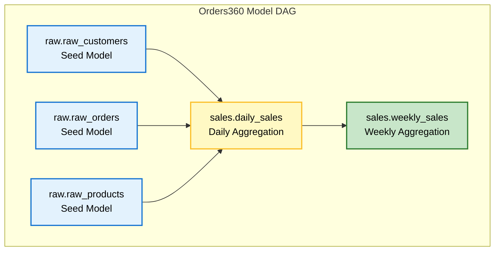
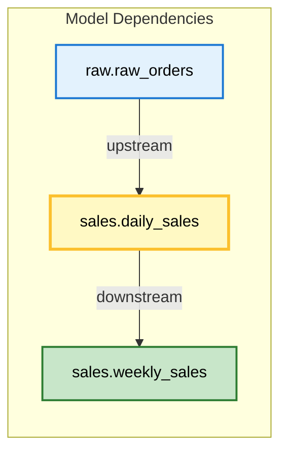
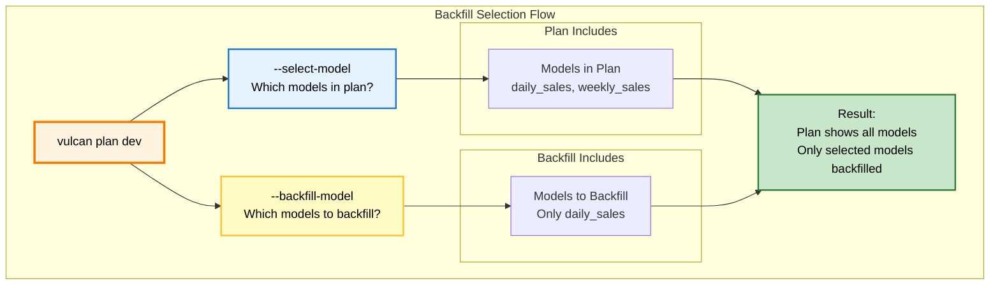
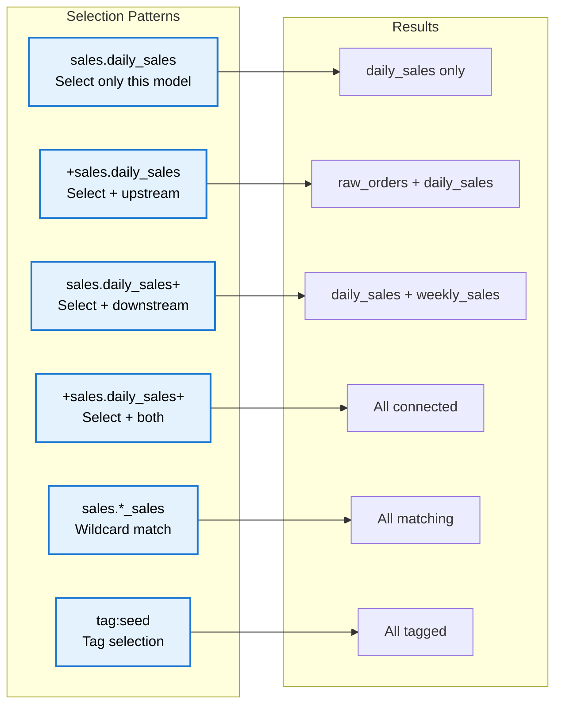

# Model Selection Guide

This guide explains how to select specific models to include in a Vulcan plan using the Orders360 example project. This is useful when you only want to test or apply changes to a subset of your models.

**Note:** The selector syntax described below is also used for the Vulcan `plan` [`--allow-destructive-model` and `--allow-additive-model` selectors](../concepts/plans.md#destructive-changes).

---

## Background

A Vulcan [plan](../concepts/plans.md) automatically detects changes between your local project and the deployed environment. When applied, it backfills directly modified models and their downstream dependencies.

In large projects, a single model change can impact many downstream models, making plans take a long time. Model selection lets you filter which changes to include, so you can test specific models without processing everything.

**Key Concept:**
- **Directly Modified**: Models you changed in your code
- **Indirectly Modified**: Downstream models affected by your changes

*[Screenshot: Visual showing directly vs indirectly modified models]*

---

## Understanding Model Dependencies

Before we dive into selection, let's understand how models relate to each other in Orders360:



**Dependency Flow:**
- `raw.raw_orders` → `sales.daily_sales` → `sales.weekly_sales`
- Changing `raw.raw_orders` affects `daily_sales` (indirectly modified)
- Changing `daily_sales` affects `weekly_sales` (indirectly modified)

*[Screenshot: Orders360 project structure showing model files]*

---

## Syntax

Model selections use the `--select-model` argument in `vulcan plan`. You can select models in several ways:

### Basic Selection

Select a single model by name:

```bash
vulcan plan dev --select-model "sales.daily_sales"
```

*[Screenshot: Plan output showing only daily_sales selected]*

Select multiple models:

```bash
vulcan plan dev --select-model "sales.daily_sales" --select-model "raw.raw_orders"
```

*[Screenshot: Plan output showing multiple models selected]*

### Wildcard Selection

Use `*` to match multiple models:

```bash
# Select all models starting with "raw."
vulcan plan dev --select-model "raw.*"

# Select all models ending with "_sales"
vulcan plan dev --select-model "sales.*_sales"

# Select all models containing "daily"
vulcan plan dev --select-model "*daily*"
```

**Examples:**
- `"raw.*"` matches `raw.raw_customers`, `raw.raw_orders`, `raw.raw_products`
- `"sales.*_sales"` matches `sales.daily_sales`, `sales.weekly_sales`
- `"*.daily_sales"` matches `sales.daily_sales`

*[Screenshot: Plan output showing wildcard selection results]*

### Tag Selection

Select models by tags using `tag:tag_name`:

```bash
# Select all models with "seed" tag
vulcan plan dev --select-model "tag:seed"

# Select all models with tags starting with "reporting"
vulcan plan dev --select-model "tag:reporting*"
```

**Example:** If `raw.raw_orders` and `raw.raw_customers` have the `seed` tag:

```bash
vulcan plan dev --select-model "tag:seed"
# Selects: raw.raw_orders, raw.raw_customers
```

*[Screenshot: Plan output showing tag-based selection]*

### Upstream/Downstream Selection

Use `+` to include upstream or downstream models:

- `+model_name` = Include upstream models (dependencies)
- `model_name+` = Include downstream models (dependents)



**Examples:**

```bash
# Select daily_sales only
vulcan plan dev --select-model "sales.daily_sales"
# Result: daily_sales (directly modified)

# Select daily_sales + upstream (raw.raw_orders)
vulcan plan dev --select-model "+sales.daily_sales"
# Result: raw.raw_orders, daily_sales

# Select daily_sales + downstream (weekly_sales)
vulcan plan dev --select-model "sales.daily_sales+"
# Result: daily_sales, weekly_sales

# Select daily_sales + both upstream and downstream
vulcan plan dev --select-model "+sales.daily_sales+"
# Result: raw.raw_orders, daily_sales, weekly_sales
```

*[Screenshot: Plan outputs showing different selection results]*

### Git-Based Selection

Select models changed in a git branch:

```bash
# Select models changed in feature branch
vulcan plan dev --select-model "git:feature"

# Select changed models + downstream
vulcan plan dev --select-model "git:feature+"

# Select changed models + upstream
vulcan plan dev --select-model "+git:feature"
```

**What it includes:**
- Untracked files (new models)
- Uncommitted changes
- Committed changes different from target branch

*[Screenshot: Plan output showing git-based selection]*

### Complex Selections

Combine conditions with logical operators:

- `&` (AND): Both conditions must be true
- `|` (OR): Either condition must be true
- `^` (NOT): Negates a condition

```bash
# Models with finance tag that don't have deprecated tag
vulcan plan dev --select-model "(tag:finance & ^tag:deprecated)"

# daily_sales + upstream OR weekly_sales + downstream
vulcan plan dev --select-model "(+sales.daily_sales | sales.weekly_sales+)"

# Changed models that also have finance tag
vulcan plan dev --select-model "(tag:finance & git:main)"

# Models in sales schema without test tag
vulcan plan dev --select-model "^(tag:test) & sales.*"
```

*[Screenshot: Plan output showing complex selection results]*

---

## Examples with Orders360

Let's see how model selection works with the Orders360 project. We'll modify `raw.raw_orders` and `sales.daily_sales` to demonstrate different selection scenarios.

### Example Setup

We've modified two models:
- `raw.raw_orders` (directly modified)
- `sales.daily_sales` (directly modified)

The dependency chain:
```
raw.raw_orders → sales.daily_sales → sales.weekly_sales
```

*[Screenshot: Orders360 project showing modified files]*

### No Selection (Default)

Without selection, Vulcan includes all directly modified models and their downstream dependencies:

```bash
vulcan plan dev
```

**Expected Output:**
```
======================================================================
Successfully Ran 2 tests against postgres
----------------------------------------------------------------------

Differences from the `prod` environment:

Models:
├── Directly Modified:
│   ├── sales.daily_sales
│   └── raw.raw_orders
└── Indirectly Modified:
    └── sales.weekly_sales
```

*[Screenshot: Plan output showing all modified models]*

**What Happened:**
- Both directly modified models are included
- `weekly_sales` is indirectly modified (depends on `daily_sales`)

### Select Single Model

Select only `sales.daily_sales`:

```bash
vulcan plan dev --select-model "sales.daily_sales"
```

**Expected Output:**
```
Differences from the `prod` environment:

Models:
├── Directly Modified:
│   └── sales.daily_sales
└── Indirectly Modified:
    └── sales.weekly_sales
```

*[Screenshot: Plan output showing only daily_sales selected]*

**What Happened:**
- `raw.raw_orders` is excluded (not selected)
- `daily_sales` is included (directly modified)
- `weekly_sales` is included (indirectly modified, downstream of `daily_sales`)

### Select with Upstream Indicator

Select `daily_sales` and include its upstream dependencies:

```bash
vulcan plan dev --select-model "+sales.daily_sales"
```

**Expected Output:**
```
Differences from the `prod` environment:

Models:
├── Directly Modified:
│   ├── raw.raw_orders
│   └── sales.daily_sales
└── Indirectly Modified:
    └── sales.weekly_sales
```

*[Screenshot: Plan output showing upstream selection]*

**What Happened:**
- `raw.raw_orders` is included (upstream of `daily_sales`)
- `daily_sales` is included (selected)
- `weekly_sales` is included (downstream of `daily_sales`)

### Select with Downstream Indicator

Select `daily_sales` and include its downstream dependencies:

```bash
vulcan plan dev --select-model "sales.daily_sales+"
```

**Expected Output:**
```
Differences from the `prod` environment:

Models:
├── Directly Modified:
│   ├── sales.daily_sales
│   └── sales.weekly_sales
└── Indirectly Modified:
    (none)
```

*[Screenshot: Plan output showing downstream selection]*

**What Happened:**
- `daily_sales` is included (selected)
- `weekly_sales` is included (downstream, now directly modified)
- `raw.raw_orders` is excluded (not selected)

### Select with Wildcard

Select all models matching a pattern:

```bash
vulcan plan dev --select-model "sales.*_sales"
```

**Expected Output:**
```
Differences from the `prod` environment:

Models:
├── Directly Modified:
│   └── sales.daily_sales
└── Indirectly Modified:
    └── sales.weekly_sales
```

*[Screenshot: Plan output showing wildcard selection]*

**What Happened:**
- `sales.daily_sales` matches the pattern (selected)
- `sales.weekly_sales` matches the pattern but is indirectly modified
- `raw.raw_orders` doesn't match (excluded)

### Select with Tags

If models have tags, select by tag:

```bash
vulcan plan dev --select-model "tag:seed"
```

**Expected Output:**
```
Differences from the `prod` environment:

Models:
├── Directly Modified:
│   └── raw.raw_orders
└── Indirectly Modified:
    ├── sales.daily_sales
    └── sales.weekly_sales
```

*[Screenshot: Plan output showing tag-based selection]*

**What Happened:**
- `raw.raw_orders` has `seed` tag (selected)
- Downstream models are indirectly modified

### Select with Git Changes

Select models changed in a git branch:

```bash
vulcan plan dev --select-model "git:feature"
```

**Expected Output:**
```
Differences from the `prod` environment:

Models:
├── Directly Modified:
│   └── sales.daily_sales  # Changed in feature branch
└── Indirectly Modified:
    └── sales.weekly_sales
```

*[Screenshot: Plan output showing git-based selection]*

**What Happened:**
- Only models changed in `feature` branch are selected
- Downstream models are included automatically

---

## Backfill Selection

By default, Vulcan backfills all models in a plan. You can limit which models are backfilled using `--backfill-model`.

**Important:** `--backfill-model` only works in development environments (not `prod`).

### How Backfill Selection Works



**Key Points:**
- `--select-model` determines which models appear in the plan
- `--backfill-model` determines which models are actually backfilled
- Upstream models are always backfilled (required for downstream models)

*[Screenshot: Visual diagram explaining backfill selection]*

### Backfill Examples

#### No Backfill Selection (Default)

All models in the plan are backfilled:

```bash
vulcan plan dev
```

**Expected Output:**
```
Models needing backfill (missing dates):
├── sales__dev.daily_sales: 2025-01-01 - 2025-01-15
└── sales__dev.weekly_sales: 2025-01-01 - 2025-01-15
```

*[Screenshot: Plan output showing all models needing backfill]*

#### Backfill Specific Model

Only backfill `daily_sales`:

```bash
vulcan plan dev --backfill-model "sales.daily_sales"
```

**Expected Output:**
```
Models needing backfill (missing dates):
└── sales__dev.daily_sales: 2025-01-01 - 2025-01-15
```

*[Screenshot: Plan output showing only daily_sales needs backfill]*

**What Happened:**
- `weekly_sales` is excluded from backfill
- Only `daily_sales` will be processed

#### Backfill with Upstream

When you backfill a model, its upstream dependencies are automatically included:

```bash
vulcan plan dev --backfill-model "sales.weekly_sales"
```

**Expected Output:**
```
Models needing backfill (missing dates):
├── raw__dev.raw_orders: 2025-01-01 - 2025-01-15
└── sales__dev.weekly_sales: 2025-01-01 - 2025-01-15
```

*[Screenshot: Plan output showing upstream models included in backfill]*

**What Happened:**
- `weekly_sales` is selected for backfill
- `raw.raw_orders` is automatically included (upstream dependency)
- `daily_sales` is excluded (not upstream of `weekly_sales`)

---

## Visual Selection Guide

Here's a quick reference for common selection patterns:



*[Screenshot: Visual cheat sheet for selection patterns]*

---

## Best Practices

1. **Start Small**: Select only the models you're testing
   ```bash
   vulcan plan dev --select-model "sales.daily_sales"
   ```

2. **Use Wildcards**: When selecting multiple related models
   ```bash
   vulcan plan dev --select-model "sales.*"
   ```

3. **Include Dependencies**: Use `+` when you need upstream/downstream models
   ```bash
   vulcan plan dev --select-model "+sales.daily_sales+"
   ```

4. **Limit Backfill**: Use `--backfill-model` to save time in development
   ```bash
   vulcan plan dev --backfill-model "sales.daily_sales"
   ```

5. **Use Tags**: Organize models with tags for easier selection
   ```bash
   vulcan plan dev --select-model "tag:reporting"
   ```

---

## Summary

**Model Selection:**
- ✅ Filter which models appear in a plan
- ✅ Use wildcards, tags, and git changes
- ✅ Include upstream/downstream with `+`
- ✅ Combine with logical operators

**Backfill Selection:**
- ✅ Limit which models are actually backfilled
- ✅ Upstream models are always included
- ✅ Only works in development environments
- ✅ Saves time when testing specific models

---

## Next Steps

- Learn about [Plans](../concepts/plans.md) for understanding plan behavior
- Read the [Plan Guide](./plan.md) for applying changes
- Check [Model Configuration](../reference/model_configuration.md) for model properties
- Explore [Orders360 Example](../examples/overview.md) for complete project reference
