# Plan

This guide walks you through Vulcan's plan functionality with practical scenarios using the Orders360 example project. You'll learn how plans work, how to interpret them, and how to apply changes to your data warehouse.

## Plan Architecture

The following diagram illustrates how Vulcan's plan system works, showing the relationship between local project state, plans, model variants, physical tables, and environments:

```mermaid
graph TB
    subgraph "📁 Local Project"
        LP[📝 Local Project Files<br/>Your SQL/Python Models]
        M1[📊 Model: daily_sales v1]
        M2[📊 Model: weekly_sales v1]
    end

    subgraph "🔍 Plan Creation"
        PC[⚡ vulcan plan]
        COMP[🔎 Compare Local vs Environment]
        CAT[🏷️ Categorize Changes<br/>🔴 Breaking / 🟢 Non-breaking]
        PLAN[📋 Plan Generated<br/>Ready for Review]
    end

    subgraph "🔀 Model Variants & Snapshots"
        MV1[🔷 Model Variant 1<br/>daily_sales__hash1]
        MV2[🔷 Model Variant 2<br/>daily_sales__hash2]
        MV3[🔷 Model Variant 3<br/>weekly_sales__hash1]
        SNAP1[📸 Snapshot 1<br/>🔑 Fingerprint: hash1]
        SNAP2[📸 Snapshot 2<br/>🔑 Fingerprint: hash2]
        SNAP3[📸 Snapshot 3<br/>🔑 Fingerprint: hash3]
    end

    subgraph "💾 Physical Layer"
        PT1[🗄️ Physical Table 1<br/>db.vulcan__sales.daily_sales__hash1]
        PT2[🗄️ Physical Table 2<br/>db.vulcan__sales.daily_sales__hash2]
        PT3[🗄️ Physical Table 3<br/>db.vulcan__sales.weekly_sales__hash1]
    end

    subgraph "👁️ Virtual Layer"
        VL1[🔍 View: sales.daily_sales]
        VL2[🔍 View: sales.weekly_sales]
    end

    subgraph "🌍 Environments"
        PROD[🚀 Production Environment<br/>References Variant 1 & 3]
        DEV[🧪 Dev Environment<br/>References Variant 2 & 3]
    end

    subgraph "⚙️ Backfill Process"
        BF[🔄 Backfill Execution]
        INC[📈 Incremental Backfill]
        FULL[🔄 Full Refresh]
    end

    LP -->|"📤"| M1
    LP -->|"📤"| M2
    M1 -->|"➡️"| PC
    M2 -->|"➡️"| PC
    PC -->|"🔍"| COMP
    COMP -->|"🏷️"| CAT
    CAT -->|"✅"| PLAN
    PLAN -->|"✨"| MV1
    PLAN -->|"✨"| MV2
    PLAN -->|"✨"| MV3
    
    MV1 -->|"🔗"| SNAP1
    MV2 -->|"🔗"| SNAP2
    MV3 -->|"🔗"| SNAP3
    
    SNAP1 -->|"💾"| PT1
    SNAP2 -->|"💾"| PT2
    SNAP3 -->|"💾"| PT3
    
    PT1 -->|"👁️"| VL1
    PT2 -->|"👁️"| VL1
    PT3 -->|"👁️"| VL2
    
    PROD -->|"🔗"| MV1
    PROD -->|"🔗"| MV3
    DEV -->|"🔗"| MV2
    DEV -->|"🔗"| MV3
    
    PLAN -->|"⚙️"| BF
    BF -->|"📈"| INC
    BF -->|"🔄"| FULL
    INC -->|"💾"| PT1
    INC -->|"💾"| PT2
    FULL -->|"💾"| PT3

    style LP fill:#e3f2fd,stroke:#1976d2,stroke-width:3px,color:#000
    style PC fill:#fff3e0,stroke:#f57c00,stroke-width:3px,color:#000
    style PLAN fill:#f3e5f5,stroke:#7b1fa2,stroke-width:3px,color:#000
    style PROD fill:#e8f5e9,stroke:#388e3c,stroke-width:3px,color:#000
    style DEV fill:#fff9c4,stroke:#fbc02d,stroke-width:3px,color:#000
    style BF fill:#ffebee,stroke:#d32f2f,stroke-width:3px,color:#000
    style MV1 fill:#e1f5fe,stroke:#0277bd,stroke-width:2px
    style MV2 fill:#e1f5fe,stroke:#0277bd,stroke-width:2px
    style MV3 fill:#e1f5fe,stroke:#0277bd,stroke-width:2px
    style PT1 fill:#f1f8e9,stroke:#558b2f,stroke-width:2px
    style PT2 fill:#f1f8e9,stroke:#558b2f,stroke-width:2px
    style PT3 fill:#f1f8e9,stroke:#558b2f,stroke-width:2px
```



### Key Concepts Illustrated

1. **Local Project**: Your model files define the desired state
2. **Plan Creation**: Vulcan compares local state to environment state and generates a plan
3. **Model Variants**: Each model change creates a new variant with a unique fingerprint
4. **Physical Tables**: Each variant gets its own physical table in the warehouse
5. **Virtual Layer**: Views point to the appropriate physical tables based on environment
6. **Environments**: Collections of references to model variants (not the data itself)
7. **Backfill**: Process of populating physical tables with data

## What is a Plan?

A **plan** is Vulcan's way of comparing your local project state with a target environment and determining what changes need to be applied. Before any model changes take effect, Vulcan creates a plan that shows:

- **Added models** - New models to be created
- **Removed models** - Models to be deleted
- **Modified models** - Changes to existing models (with diffs)
- **Indirectly affected models** - Downstream models that depend on changed models
- **Backfill requirements** - Date ranges that need data reprocessing

Plans allow you to review and verify all changes before they're applied to your data warehouse.

## Prerequisites

Before following this guide, ensure you have:

1. **Orders360 example project** set up (see [Examples Overview](examples/overview.md))
2. **Docker environment** running (see [Docker Quickstart](guides/get-started/docker.md))
3. **Vulcan CLI** accessible via `vulcan` command or `vulcan.bat` (Windows)

## Scenario 1: First Plan - Initializing Production

When you first create a project, you need to initialize the production environment. This scenario shows how Vulcan detects all models and creates the initial plan.

### Step 1: Check Project Status

First, verify your project setup:

```bash
vulcan info
```

**Expected Output:**
```
Connection: ✅ Connected
Models: 4
Macros: 0
Tests: 2
...
```

*[Screenshot: `vulcan info` output showing project status]*

### Step 2: Create Your First Plan

Run the plan command to see what Vulcan will create:

```bash
vulcan plan
```

**Expected Output:**
```
======================================================================
Successfully Ran 2 tests against postgres
----------------------------------------------------------------------

`prod` environment will be initialized

Models:
└── Added:
    ├── raw.raw_customers
    ├── raw.raw_orders
    ├── raw.raw_products
    └── sales.daily_sales

Models needing backfill (missing dates):
├── raw.raw_customers: 2025-01-01 - 2025-01-15
├── raw.raw_orders: 2025-01-01 - 2025-01-15
├── raw.raw_products: 2025-01-01 - 2025-01-15
└── sales.daily_sales: 2025-01-01 - 2025-01-15

Apply - Backfill Tables [y/n]:
```

*[Screenshot: First plan output showing all models to be added]*

### Understanding the Output

- **`prod` environment will be initialized**: This is your first plan, so Vulcan is creating the production environment
- **Added models**: All 4 models are new and will be created
- **Backfill dates**: Each model needs data from its start date (2025-01-01) to the current date

### Step 3: Apply the Plan

Type `y` and press Enter to apply the plan:

```
Apply - Backfill Tables [y/n]: y
```

**Expected Output:**
```
[1/4] raw.raw_customers          [full refresh]                   2.3s
[2/4] raw.raw_orders             [full refresh]                   1.8s
[3/4] raw.raw_products           [full refresh]                   0.5s
[4/4] sales.daily_sales          [insert 2025-01-01 - 2025-01-15] 4.2s

Executing model batches ━━━━━━━━━━━━━━━━━━━━━━━━━━━━━━━━━━━━━━━━ 100.0% • 4/4 • 0:00:09

✔ Model batches executed
✔ Plan applied successfully
```

*[Screenshot: Plan application progress showing all models being backfilled]*

### What Happened?

1. **Seed models** (`raw.*`) were fully refreshed - all data was reloaded
2. **Daily sales model** was incrementally backfilled - data was inserted for each day from start date to today
3. **Physical tables** were created in your warehouse
4. **Virtual layer** was updated to point to the new tables

---

## Scenario 2: Adding a New Model

After your initial setup, you'll add new models. This scenario shows how Vulcan detects new models and determines their dependencies.

### Step 1: Add a New Model

Create a new model file `models/sales/weekly_sales.sql`:

```sql
MODEL (
  name sales.weekly_sales,
  kind INCREMENTAL_BY_TIME_RANGE (
    time_column order_date,
    batch_size 1
  ),
  start '2025-01-01',
  cron '@weekly',
  grain [order_date]
);

SELECT
  DATE_TRUNC('week', order_date) AS order_date,
  COUNT(DISTINCT order_id) AS total_orders,
  SUM(order_amount) AS total_revenue
FROM sales.daily_sales
WHERE order_date BETWEEN @start_ds AND @end_ds
GROUP BY DATE_TRUNC('week', order_date)
```

### Step 2: Create Plan for New Model

Run the plan command:

```bash
vulcan plan
```

**Expected Output:**
```
======================================================================
Successfully Ran 2 tests against postgres
----------------------------------------------------------------------

Differences from the `prod` environment:

Models:
└── Added:
    └── sales.weekly_sales

Models needing backfill (missing dates):
└── sales.weekly_sales: 2025-01-01 - 2025-01-15

Apply - Backfill Tables [y/n]:
```

*[Screenshot: Plan showing new weekly_sales model]*

### Step 3: Review Dependencies

Notice that:
- Only the new model appears in the plan
- The upstream model (`sales.daily_sales`) is not affected because adding a downstream model doesn't change upstream data
- Backfill is needed from the model's start date

### Step 4: Apply the Plan

Type `y` to apply:

```
Apply - Backfill Tables [y/n]: y
```

**Expected Output:**
```
[1/1] sales.weekly_sales         [insert 2025-01-06 - 2025-01-13] 3.1s

Executing model batches ━━━━━━━━━━━━━━━━━━━━━━━━━━━━━━━━━━━━━━━━ 100.0% • 1/1 • 0:00:03

✔ Model batches executed
✔ Plan applied successfully
```

*[Screenshot: Weekly sales model being backfilled]*

---

## Scenario 3: Modifying a Model - Non-Breaking Change

Non-breaking changes don't affect existing data validity. Adding a new column is a common non-breaking change.

### Step 1: Modify the Model

Edit `models/sales/daily_sales.sql` to add a new column:

```sql
MODEL (
  name sales.daily_sales,
  kind INCREMENTAL_BY_TIME_RANGE (
    time_column order_date,
    batch_size 1
  ),
  start '2025-01-01',
  cron '@daily',
  grain [order_date]
);

SELECT
  order_date,
  COUNT(DISTINCT order_id) AS total_orders,
  SUM(order_amount) AS total_revenue,
  AVG(order_amount) AS avg_order_value,  -- NEW COLUMN
  MAX(order_id) AS last_order_id
FROM raw.raw_orders
WHERE order_date BETWEEN @start_ds AND @end_ds
GROUP BY order_date
```

### Step 2: Create Plan

```bash
vulcan plan
```

**Expected Output:**
```
======================================================================
Successfully Ran 2 tests against postgres
----------------------------------------------------------------------

Differences from the `prod` environment:

Models:
└── Directly Modified:
    └── sales.daily_sales

Directly Modified: sales.daily_sales (Non-breaking)
└── Diff:
    @@ -5,6 +5,7 @@
      SELECT
        order_date,
        COUNT(DISTINCT order_id) AS total_orders,
        SUM(order_amount) AS total_revenue,
    +   AVG(order_amount) AS avg_order_value,
        MAX(order_id) AS last_order_id
      FROM raw.raw_orders
      WHERE order_date BETWEEN @start_ds AND @end_ds

Models needing backfill (missing dates):
└── sales.daily_sales: 2025-01-01 - 2025-01-15

Apply - Backfill Tables [y/n]:
```

*[Screenshot: Plan showing non-breaking change with diff]*

### Understanding Non-Breaking Changes

- **Directly Modified**: The model you changed
- **Non-breaking**: Vulcan automatically detected this as non-breaking because:
  - You added a new column
  - Existing columns weren't modified
  - Downstream models aren't affected (they don't use this column yet)
- **Backfill required**: The modified model needs to be backfilled to populate the new column

### Step 3: Check Downstream Models

Notice that `sales.weekly_sales` (which depends on `daily_sales`) is **not** listed. This is because:
- The change is non-breaking
- Downstream models don't need to be reprocessed
- They'll automatically see the new column once `daily_sales` is backfilled

### Step 4: Apply the Plan

Type `y` to apply:

```
Apply - Backfill Tables [y/n]: y
```

**Expected Output:**
```
[1/1] sales.daily_sales          [insert 2025-01-01 - 2025-01-15] 5.2s

Executing model batches ━━━━━━━━━━━━━━━━━━━━━━━━━━━━━━━━━━━━━━━━ 100.0% • 1/1 • 0:00:05

✔ Model batches executed
✔ Plan applied successfully
```

*[Screenshot: Daily sales model being backfilled with new column]*

---

## Scenario 4: Modifying a Model - Breaking Change

Breaking changes invalidate existing data and require downstream models to be reprocessed. Adding a WHERE clause is a common breaking change.

### Step 1: Modify the Model with a Filter

Edit `models/sales/daily_sales.sql` to add a WHERE clause:

```sql
MODEL (
  name sales.daily_sales,
  kind INCREMENTAL_BY_TIME_RANGE (
    time_column order_date,
    batch_size 1
  ),
  start '2025-01-01',
  cron '@daily',
  grain [order_date]
);

SELECT
  order_date,
  COUNT(DISTINCT order_id) AS total_orders,
  SUM(order_amount) AS total_revenue,
  AVG(order_amount) AS avg_order_value,
  MAX(order_id) AS last_order_id
FROM raw.raw_orders
WHERE order_date BETWEEN @start_ds AND @end_ds
  AND order_amount > 10  -- NEW FILTER: Only orders > $10
GROUP BY order_date
```

### Step 2: Create Plan

```bash
vulcan plan
```

**Expected Output:**
```
======================================================================
Successfully Ran 2 tests against postgres
----------------------------------------------------------------------

Differences from the `prod` environment:

Models:
├── Directly Modified:
│   └── sales.daily_sales
└── Indirectly Modified:
    └── sales.weekly_sales

Directly Modified: sales.daily_sales (Breaking)
└── Diff:
    @@ -8,6 +8,7 @@
      FROM raw.raw_orders
      WHERE order_date BETWEEN @start_ds AND @end_ds
    +   AND order_amount > 10
      GROUP BY order_date

└── Indirectly Modified Children:
    └── sales.weekly_sales (Indirect Breaking)

Models needing backfill (missing dates):
├── sales.daily_sales: 2025-01-01 - 2025-01-15
└── sales.weekly_sales: 2025-01-01 - 2025-01-15

Apply - Backfill Tables [y/n]:
```

*[Screenshot: Plan showing breaking change with downstream impact]*

### Understanding Breaking Changes

- **Directly Modified**: `sales.daily_sales` - the model you changed
- **Breaking**: Vulcan detected this as breaking because:
  - You added a WHERE clause that filters data
  - Existing data may now be invalid (rows that should be filtered out)
- **Indirectly Modified**: `sales.weekly_sales` - downstream model affected
- **Cascading backfill**: Both models need to be reprocessed

### Step 3: Apply the Plan

Type `y` to apply:

```
Apply - Backfill Tables [y/n]: y
```

**Expected Output:**
```
[1/2] sales.daily_sales          [insert 2025-01-01 - 2025-01-15] 5.1s
[2/2] sales.weekly_sales         [insert 2025-01-06 - 2025-01-13] 3.8s

Executing model batches ━━━━━━━━━━━━━━━━━━━━━━━━━━━━━━━━━━━━━━━━ 100.0% • 2/2 • 0:00:09

✔ Model batches executed
✔ Plan applied successfully
```

*[Screenshot: Both models being backfilled due to breaking change]*

### What Happened?

1. **Daily sales** was backfilled first (upstream)
2. **Weekly sales** was backfilled second (downstream), using the updated daily sales data
3. Both models now reflect the filtered data (only orders > $10)

---

## Scenario 5: Creating a Development Environment

Development environments let you test changes without affecting production. This scenario shows how to create and use a dev environment.

### Step 1: Revert Your Changes

First, revert the breaking change from Scenario 4 to restore production:

```bash
# Revert daily_sales.sql to remove the WHERE clause filter
# (Edit the file to remove: AND order_amount > 10)
```

### Step 2: Apply Reverted Plan to Production

```bash
vulcan plan
# Type 'y' to apply
```

### Step 3: Create Development Environment

Now create a dev environment with your breaking change:

```bash
vulcan plan dev
```

**Expected Output:**
```
======================================================================
Successfully Ran 2 tests against postgres
----------------------------------------------------------------------

New environment `dev` will be created from `prod`

Differences from the `prod` environment:

Models:
├── Directly Modified:
│   └── sales__dev.daily_sales
└── Indirectly Modified:
    └── sales__dev.weekly_sales

Directly Modified: sales__dev.daily_sales (Breaking)
└── Diff:
    @@ -8,6 +8,7 @@
      FROM raw.raw_orders
      WHERE order_date BETWEEN @start_ds AND @end_ds
    +   AND order_amount > 10
      GROUP BY order_date

└── Indirectly Modified Children:
    └── sales__dev.weekly_sales (Indirect Breaking)

Enter the backfill start date (eg. '1 year', '2020-01-01') or blank to backfill from the beginning of history:
```

*[Screenshot: Creating dev environment with date prompt]*

### Step 4: Specify Date Range

For faster development, backfill only recent data:

```
Enter the backfill start date: 2025-01-10
```

**Expected Output:**
```
Enter the backfill end date (eg. '1 month ago', '2020-01-01') or blank to backfill up until '2025-01-15 00:00:00':
```

Press Enter to use the default end date (today).

**Expected Output:**
```
Models needing backfill (missing dates):
├── sales__dev.daily_sales: 2025-01-10 - 2025-01-15
└── sales__dev.weekly_sales: 2025-01-10 - 2025-01-15

Apply - Backfill Tables [y/n]:
```

*[Screenshot: Dev environment plan with limited date range]*

### Step 5: Apply Dev Plan

Type `y` to apply:

```
Apply - Backfill Tables [y/n]: y
```

**Expected Output:**
```
[1/2] sales__dev.daily_sales     [insert 2025-01-10 - 2025-01-15] 2.1s
[2/2] sales__dev.weekly_sales    [insert 2025-01-13 - 2025-01-13] 1.5s

Executing model batches ━━━━━━━━━━━━━━━━━━━━━━━━━━━━━━━━━━━━━━━━ 100.0% • 2/2 • 0:00:04

✔ Model batches executed
✔ Plan applied successfully
```

*[Screenshot: Dev environment models being backfilled]*

### Understanding Dev Environments

- **Isolated namespace**: Models are prefixed with `__dev` (e.g., `sales__dev.daily_sales`)
- **Separate tables**: Dev environment has its own physical tables
- **Limited backfill**: Only recent data was processed (2025-01-10 to 2025-01-15)
- **Production unaffected**: Production data remains unchanged

### Step 6: Query Dev Environment

You can query the dev environment to verify changes:

```bash
vulcan fetchdf "SELECT * FROM sales__dev.daily_sales LIMIT 5"
```

Compare with production:

```bash
vulcan fetchdf "SELECT * FROM sales.daily_sales LIMIT 5"
```

*[Screenshot: Comparing dev vs prod query results]*

---

## Scenario 6: Forward-Only Plans

Forward-only plans reuse existing tables instead of creating new ones, avoiding backfill costs. This is useful for expensive models.

### Step 1: Modify Model for Forward-Only

Edit `models/sales/daily_sales.sql` to add a comment (minimal change):

```sql
MODEL (
  name sales.daily_sales,
  kind INCREMENTAL_BY_TIME_RANGE (
    time_column order_date,
    batch_size 1
  ),
  start '2025-01-01',
  cron '@daily',
  grain [order_date]
);

-- Updated: Added comment for documentation
SELECT
  order_date,
  COUNT(DISTINCT order_id) AS total_orders,
  SUM(order_amount) AS total_revenue,
  AVG(order_amount) AS avg_order_value,
  MAX(order_id) AS last_order_id
FROM raw.raw_orders
WHERE order_date BETWEEN @start_ds AND @end_ds
GROUP BY order_date
```

### Step 2: Create Forward-Only Plan

```bash
vulcan plan --forward-only
```

**Expected Output:**
```
======================================================================
Successfully Ran 2 tests against postgres
----------------------------------------------------------------------

Differences from the `prod` environment:

Models:
└── Directly Modified:
    └── sales.daily_sales

Directly Modified: sales.daily_sales (Forward-only)
└── Diff:
    @@ -1,6 +1,7 @@
    MODEL (
      name sales.daily_sales,
    ...
    +-- Updated: Added comment for documentation
      SELECT
        order_date,

Models needing backfill (missing dates):
└── sales.daily_sales: 2025-01-15 - 2025-01-15 (preview)

Apply - Virtual Update [y/n]:
```

*[Screenshot: Forward-only plan showing preview backfill]*

### Understanding Forward-Only Plans

- **Forward-only category**: Automatically assigned
- **Preview backfill**: Only processes the latest interval for preview
- **Virtual Update**: No new physical table created
- **Reuses existing table**: Production will use the same physical table

### Step 3: Apply Forward-Only Plan

Type `y` to apply:

```
Apply - Virtual Update [y/n]: y
```

**Expected Output:**
```
[1/1] sales.daily_sales          [insert 2025-01-15 - 2025-01-15] 0.8s

Executing model batches ━━━━━━━━━━━━━━━━━━━━━━━━━━━━━━━━━━━━━━━━ 100.0% • 1/1 • 0:00:01

✔ Model batches executed
✔ Plan applied successfully
```

*[Screenshot: Forward-only plan applied with minimal backfill]*

### Benefits of Forward-Only

- **Fast**: Only processes latest interval
- **Cost-effective**: No full backfill required
- **Safe for production**: Reuses existing tables

---

## Scenario 7: Restatement Plans

Restatement plans reprocess existing data without changing model definitions. Useful for fixing data issues or reprocessing after upstream corrections.

### Step 1: Check Current State

First, verify what data exists:

```bash
vulcan fetchdf "SELECT MIN(order_date), MAX(order_date), COUNT(*) FROM sales.daily_sales"
```

*[Screenshot: Current data range in daily_sales]*

### Step 2: Create Restatement Plan

Restate the `daily_sales` model for a specific date range:

```bash
vulcan plan --restate-model "sales.daily_sales" --start "2025-01-10" --end "2025-01-12"
```

**Expected Output:**
```
======================================================================
Successfully Ran 2 tests against postgres
----------------------------------------------------------------------

Restatement plan for `prod` environment

Models to restate:
└── sales.daily_sales

Models needing backfill (missing dates):
├── sales.daily_sales: 2025-01-10 - 2025-01-12
└── sales.weekly_sales: 2025-01-06 - 2025-01-13

Apply - Backfill Tables [y/n]:
```

*[Screenshot: Restatement plan showing date range]*

### Understanding Restatement

- **No model changes**: Model definition unchanged
- **Cascading restatement**: Downstream models (`weekly_sales`) also need restatement
- **Date range**: Only specified dates will be reprocessed

### Step 3: Apply Restatement Plan

Type `y` to apply:

```
Apply - Backfill Tables [y/n]: y
```

**Expected Output:**
```
[1/2] sales.daily_sales          [insert 2025-01-10 - 2025-01-12] 1.2s
[2/2] sales.weekly_sales         [insert 2025-01-06 - 2025-01-13] 2.3s

Executing model batches ━━━━━━━━━━━━━━━━━━━━━━━━━━━━━━━━━━━━━━━━ 100.0% • 2/2 • 0:00:04

✔ Model batches executed
✔ Plan applied successfully
```

*[Screenshot: Restatement plan execution]*

### Use Cases for Restatement

- **Upstream data correction**: Raw data was fixed, need to reprocess
- **Bug fixes**: Found an issue in data processing logic (after fixing the model)
- **Data refresh**: Need to refresh specific date ranges

---

## Scenario 8: Plan with Explain Flag

The `--explain` flag provides detailed information about what a plan will do.

### Step 1: Create Plan with Explain

```bash
vulcan plan --explain
```

**Expected Output:**
```
======================================================================
Successfully Ran 2 tests against postgres
----------------------------------------------------------------------

Explained plan
├── Validate SQL and create physical layer tables and views if they do not exist
│   ├── raw.raw_customers -> db.vulcan__raw.vulcan__raw_customers__1234567890
│   │   ├── Dry run model query without inserting results
│   │   └── Create table if it doesn't exist
│   └── sales.daily_sales -> db.vulcan__sales.vulcan__sales__daily_sales__9876543210
│       ├── Dry run model query without inserting results
│       └── Create table if it doesn't exist
├── Backfill models by running their queries and run standalone audits
│   ├── raw.raw_customers -> db.vulcan__raw.vulcan__raw_customers__1234567890
│   │   └── Fully refresh table
│   └── sales.daily_sales -> db.vulcan__sales.vulcan__sales__daily_sales__9876543210
│       ├── Insert 2025-01-01 - 2025-01-15
│       └── Run 'assert_positive_order_ids' audit
└── Update the virtual layer for environment 'prod'
    └── Create or update views in the virtual layer to point at new physical tables
        ├── raw.raw_customers -> db.vulcan__raw.vulcan__raw_customers__1234567890
        └── sales.daily_sales -> db.vulcan__sales.vulcan__sales__daily_sales__9876543210
```

*[Screenshot: Explained plan output showing detailed actions]*

### Understanding Explained Plans

The explain output shows three main phases:

1. **Validation & Table Creation**: 
   - Dry runs each model query
   - Creates physical tables if needed
   - Shows mapping: `model_name -> physical_table_name`

2. **Backfill**:
   - Shows which models will be backfilled
   - Indicates backfill type (full refresh vs incremental)
   - Lists audits that will run

3. **Virtual Layer Update**:
   - Shows how views will be created/updated
   - Maps virtual layer names to physical tables

---

## Common Plan Scenarios Summary

| Scenario | Command | When to Use |
|----------|---------|-------------|
| **First Plan** | `vulcan plan` | Initializing production environment |
| **Add Model** | `vulcan plan` | Adding new models to existing project |
| **Non-Breaking Change** | `vulcan plan` | Adding columns, comments, or non-functional changes |
| **Breaking Change** | `vulcan plan` | Modifying logic that affects downstream models |
| **Dev Environment** | `vulcan plan dev` | Testing changes without affecting production |
| **Forward-Only** | `vulcan plan --forward-only` | Expensive models, avoiding backfill costs |
| **Restatement** | `vulcan plan --restate-model "model"` | Reprocessing existing data |
| **Explain** | `vulcan plan --explain` | Understanding detailed plan actions |

---

## Best Practices

1. **Always review plans** before applying them
2. **Use dev environments** for testing breaking changes
3. **Use forward-only** for expensive models when appropriate
4. **Check downstream impact** - breaking changes cascade
5. **Use `--explain`** when unsure about plan actions
6. **Restate carefully** - it reprocesses existing data

---

## Next Steps

- Learn about [Plans Concepts](guides/plan.md) for deeper understanding
- Explore [Environments](concepts-old/environments.md) for managing multiple environments
- Read about [Model Kinds](components/model/model_kinds.md) to understand different model types
- Check [Run Guide](guides/run_and_scheduling.md) for scheduled execution after applying plans
- Set up [Notifications](guides-old/notifications.md) to monitor plan execution

