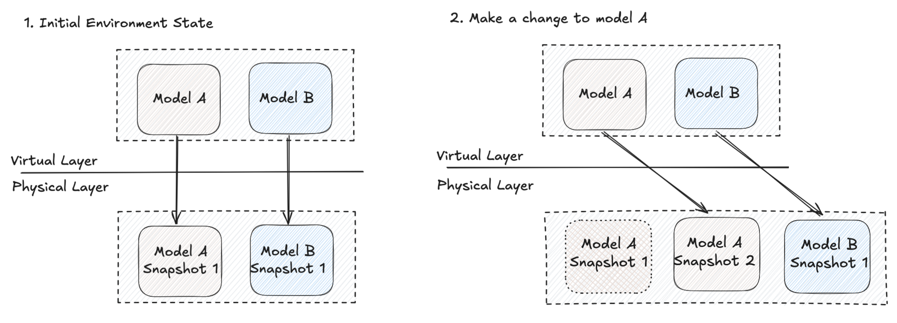

#  Plan 2.0

`vulcan plan` is the “pause and review” step before changes take effect in an environment. It shows you **what changed**, **what will be recomputed**, and **what will be promoted** into the environment’s virtual layer.

It’s not just about model SQL. Vulcan plan also tracks changes to:

- **Semantics and metrics** (so business definitions stay consistent)
- **Assertions, checks, and profiles** (so data quality stays visible and predictable)

## Quick start

Create a plan:

```bash
vulcan plan [environment name]
```

If you omit the environment name, Vulcan plans against `prod`.

## What you’ll see in a plan

A typical plan summary includes:

- **What changed**: added/removed/direct/indirect/metadata updates across models and related definitions
- **Impact classification**: breaking vs non-breaking (auto-identified)
- **Backfill window**: which models need intervals executed
- **Apply stages**: executing model batches → updating virtual layer → non-blocking quality signals

If you want a walkthrough with screenshots and CLI snippets, see [Plan](plan.md). For the deep dive (environments, snapshots, forward-only, restatements), see [Plans](../references/plans.md).

## How plan works (the lifecycle)

Here’s the end-to-end flow Vulcan follows:

1. **Diff scope**: compare local project state to the target environment (models, standalone assertions, semantics, metrics, checks, metadata).
2. **Plan type**: determine whether this is a backfill plan vs a virtual update (and whether forward-only / restatement options apply).
3. **Categorize impact**: auto-identify breaking vs non-breaking and propagate impact to indirectly impacted objects.
4. **Compute intervals**: compute the time ranges that must be executed.
5. **Apply**:
   - Create model variants (snapshots)
   - Execute model batches (backfill) if needed
   - Update the virtual layer (promote)
   - Run non-blocking quality signals (checks + profiles)

## Change types (how to read “what changed”)

Vulcan reports changes using a few consistent buckets. You’ll see these for models, and often for semantics/metrics/checks/assertions too.

- **Added**: exists locally, not in the environment (new object will be created/registered).
- **Removed**: exists in the environment, removed from local project (will be removed from the environment).
- **Directly modified**: you edited the object itself (model SQL/Python, semantics YAML, check YAML, assertion SQL).
- **Indirectly impacted**: you didn’t edit the object, but something it depends on changed (common for downstream models, and also for semantics/metrics/checks that reference a changed model/column).
- **Metadata-only**: description/tags/ownership/config changes that don’t require historical recomputation.

!!! example

    You rename a column in `sales.daily_sales`.

    - `sales.daily_sales` is **directly modified**
    - Downstream models are **indirectly impacted**
    - A metric or check referencing the renamed column is **indirectly impacted** (it may fail validation until you update it)

## Change categories (breaking vs non-breaking)

Vulcan identifies breaking vs non-breaking automatically during plan creation (and may prompt only in ambiguous cases).

### Breaking

Breaking means the change can alter results in a way that downstream models/consumers must reflect.

- **For models**: backfill cascades downstream (more expensive, safest).
- **For semantics/metrics/checks**: definitions may become invalid or meaningfully change for consumers.

!!! example

    Adding/modifying a filter changes the set of rows produced:

    ```sql
    WHERE order_date BETWEEN @start_ds AND @end_ds
      AND order_amount > 10
    ```

### Non-breaking

Non-breaking means the change is additive or non-functional in a way that doesn’t invalidate downstream dependencies.

- **For models**: only the directly modified model needs backfill.
- **For semantics/metrics/checks**: additive updates (new metric, new check, updated description) don’t break existing consumers.

!!! example

    Adding a new column is usually non-breaking:

    ```sql
    SELECT
      order_date,
      SUM(order_amount) AS total_revenue,
      AVG(order_amount) AS avg_order_value
    FROM raw.raw_orders
    GROUP BY order_date
    ```

## Snapshots (model variants) and fingerprinting

Whenever a **model definition** changes, Vulcan creates a **snapshot**: a record of that model at a point in time. A snapshot contains everything needed to evaluate and render the model query, including macro definitions and global variables at the time the snapshot was created, and it tracks which time intervals have data.

Snapshots have unique **fingerprints** derived from their models. Vulcan uses fingerprints to decide whether an existing physical table can be reused or whether the model must be backfilled. Because Vulcan understands SQL with SQLGlot, superficial edits (like formatting) won’t generate a new fingerprint.

## Physical tables, virtual layer, and environments

Here’s the mental model:

- **Physical layer**: versioned physical tables hold the data for a specific snapshot.
- **Virtual layer**: environment views point to the correct physical tables.
- **Environment**: essentially “a set of references” to model snapshots (and therefore to physical tables).




## Backfill vs virtual update

- **Backfill**: Vulcan executes intervals to populate the physical tables for new snapshots.
- **Virtual update**: Vulcan only swaps references in the virtual layer (no new execution needed).

## Start/end dates (non-prod) and limitations

In non-prod environments, you can control the backfill window:

```bash
vulcan plan dev --start "2024-01-01" --end "2024-01-10"
```

Some model kinds are inherently non-idempotent (for example `INCREMENTAL_BY_UNIQUE_KEY`, `INCREMENTAL_BY_PARTITION`, and SCD variants). In those cases, Vulcan may compute a **preview** for a limited range that can’t be reused when deploying to production.

If your specified window is smaller than a model’s interval size, the model may be skipped; use `--min-intervals` to force at least N intervals.

## Restatement plans (`--restate-model`)

Restatement is how you reprocess **existing data** for a time range even when the model definition hasn’t changed (for example, upstream data was corrected or you want to re-run a subset of history).

```bash
vulcan plan --restate-model "db.model_a"
```

!!! warning "No local changes allowed"

    Restatement plans ignore local file changes. They can only restate model versions already present in the target environment.

How it works:

- **Cascading backfill**: selected models and downstream models are reprocessed.
- **Selectors**: select by name, wildcard, or tag — see [Model selection](model_selection.md).
- **External models**: restating an external model triggers downstream backfills (the external model itself is metadata-only).
- **Disable restatement**: set `disable_restatement: true` to prevent restatement for a model.

Prod vs dev behavior differs: restating `prod` can clear affected intervals in other environments’ state to prevent stale data being promoted later. For details, see [Plans](../references/plans.md).

