# Run and Scheduling Guide

This guide covers Vulcan's run functionality and scheduling strategies. Learn how `vulcan run` processes new data intervals and how to automate it for production.

## Run and Scheduler Architecture

The following diagram illustrates how Vulcan's run system works with cron-based scheduling:

```mermaid
graph TB
    subgraph "⏰ Scheduler Triggers"
        CRON[🔄 Cron Job / CI/CD<br/>Runs periodically]
        MANUAL[👤 Manual Execution<br/>vulcan run]
    end

    subgraph "🔍 Run Process"
        START[⚡ vulcan run<br/>Command starts]
        CHECK[🔎 Check for missing intervals<br/>Compare with state]
        CRON_CHECK[📅 Check cron schedules<br/>Which models are due?]
        FILTER[🔽 Filter models<br/>Only process due intervals]
    end

    subgraph "📊 Model Execution"
        M1[📈 sales.daily_sales<br/>cron: @daily<br/>Due: ✅]
        M2[📊 sales.weekly_sales<br/>cron: @weekly<br/>Due: ❌]
        M3[📉 sales.monthly_sales<br/>cron: @monthly<br/>Due: ❌]
    end

    subgraph "💾 State Management"
        STATE[🗄️ State Database<br/>Tracks processed intervals]
        UPDATE[📝 Update State<br/>Mark intervals as processed]
    end

    subgraph "⚙️ Execution Flow"
        EXEC1[🔄 Execute daily_sales<br/>Process missing intervals]
        EXEC2[⏭️ Skip weekly_sales<br/>Not due yet]
        EXEC3[⏭️ Skip monthly_sales<br/>Not due yet]
    end

    subgraph "✅ Results"
        SUCCESS[✅ Run Complete<br/>Intervals processed]
        LOG[📋 Log Results<br/>Execution summary]
    end

    CRON -->|"⏰ Scheduled"| START
    MANUAL -->|"👤 Triggered"| START
    START -->|"🔍"| CHECK
    CHECK -->|"📊"| CRON_CHECK
    CRON_CHECK -->|"📅"| FILTER
    FILTER -->|"✅ Due"| M1
    FILTER -->|"❌ Not due"| M2
    FILTER -->|"❌ Not due"| M3
    
    M1 -->|"🔄"| EXEC1
    M2 -->|"⏭️"| EXEC2
    M3 -->|"⏭️"| EXEC3
    
    EXEC1 -->|"💾"| STATE
    EXEC2 -.->|"⏭️"| STATE
    EXEC3 -.->|"⏭️"| STATE
    
    STATE -->|"📝"| UPDATE
    UPDATE -->|"✅"| SUCCESS
    SUCCESS -->|"📋"| LOG

    style CRON fill:#e3f2fd,stroke:#1976d2,stroke-width:3px,color:#000
    style START fill:#fff3e0,stroke:#f57c00,stroke-width:3px,color:#000
    style CHECK fill:#f3e5f5,stroke:#7b1fa2,stroke-width:2px,color:#000
    style CRON_CHECK fill:#fff9c4,stroke:#fbc02d,stroke-width:2px,color:#000
    style M1 fill:#e8f5e9,stroke:#388e3c,stroke-width:2px,color:#000
    style M2 fill:#ffebee,stroke:#d32f2f,stroke-width:2px,color:#000
    style M3 fill:#ffebee,stroke:#d32f2f,stroke-width:2px,color:#000
    style EXEC1 fill:#c8e6c9,stroke:#2e7d32,stroke-width:2px,color:#000
    style SUCCESS fill:#c8e6c9,stroke:#2e7d32,stroke-width:3px,color:#000
```



### Key Concepts Illustrated

1. **Scheduler Triggers**: Run can be triggered by cron jobs, CI/CD pipelines, or manually
2. **Interval Detection**: Vulcan checks for missing intervals by comparing current state with model schedules
3. **Cron-Based Filtering**: Only models whose cron schedules indicate they're due are executed
4. **State Tracking**: Processed intervals are tracked in the state database
5. **Efficient Execution**: Models not due are skipped, saving computational resources

---

## Cron Schedule Flow

The following diagram shows how different cron schedules determine model execution:


**Visual Explanation**: 
- **Hourly models** run every hour when `vulcan run` executes
- **Daily models** run once per day (at the scheduled time)
- **Weekly models** run once per week (at the scheduled time)

---

## Understanding Run vs Plan

| Aspect | `vulcan plan` | `vulcan run` |
|--------|---------------|--------------|
| **Purpose** | Apply model changes to environment | Execute existing models on schedule |
| **When to Use** | When models are modified/added/removed | When no changes, just process new data |
| **Change Detection** | Compares local files vs environment | No file comparison needed |
| **Backfill** | Backfills based on changes | Processes missing intervals only |
| **Cron Schedule** | Not used (processes all affected dates) | Uses model's cron to determine what runs |
| **User Interaction** | Prompts for change categorization | Runs automatically |
| **Output** | Shows diffs and change summary | Shows execution progress |

**Key Insight**: Use `plan` when you've changed code. Use `run` for regular scheduled execution.

---

## How Run Works

The `vulcan run` command processes missing data intervals for models that haven't changed:

```mermaid
flowchart TD
    START[⚡ vulcan run<br/>Command starts] --> CHECK{🔍 Check model<br/>definitions}
    
    CHECK -->|"❌ Changed"| ERROR[🚫 Error: Use 'vulcan plan'<br/>to apply changes first]
    CHECK -->|"✅ No changes"| STATE[📊 Query state database<br/>Get processed intervals]
    
    STATE --> CRON[📅 Check cron schedules<br/>Which models are due?]
    
    CRON --> FILTER{🔽 Filter models<br/>by cron schedule}
    
    FILTER -->|"✅ Due"| EXEC1[🔄 Execute Model 1<br/>Process missing intervals]
    FILTER -->|"✅ Due"| EXEC2[🔄 Execute Model 2<br/>Process missing intervals]
    FILTER -->|"❌ Not due"| SKIP1[⏭️ Skip Model 3<br/>Not due yet]
    FILTER -->|"❌ Not due"| SKIP2[⏭️ Skip Model 4<br/>Not due yet]
    
    EXEC1 --> UPDATE[💾 Update state database<br/>Mark intervals as processed]
    EXEC2 --> UPDATE
    SKIP1 -.->|"⏭️"| UPDATE
    SKIP2 -.->|"⏭️"| UPDATE
    
    UPDATE --> SUCCESS[✅ Run complete<br/>Summary output]
    
    ERROR --> END[❌ Exit with error]
    SUCCESS --> END

    style START fill:#e3f2fd,stroke:#1976d2,stroke-width:3px,color:#000
    style CHECK fill:#fff9c4,stroke:#fbc02d,stroke-width:2px,color:#000
    style ERROR fill:#ffebee,stroke:#d32f2f,stroke-width:2px,color:#000
    style CRON fill:#fff3e0,stroke:#f57c00,stroke-width:2px,color:#000
    style FILTER fill:#fff9c4,stroke:#fbc02d,stroke-width:2px,color:#000
    style EXEC1 fill:#e8f5e9,stroke:#388e3c,stroke-width:2px,color:#000
    style EXEC2 fill:#e8f5e9,stroke:#388e3c,stroke-width:2px,color:#000
    style SKIP1 fill:#ffebee,stroke:#d32f2f,stroke-width:2px,color:#000
    style SKIP2 fill:#ffebee,stroke:#d32f2f,stroke-width:2px,color:#000
    style UPDATE fill:#e1f5fe,stroke:#0277bd,stroke-width:2px,color:#000
    style SUCCESS fill:#c8e6c9,stroke:#2e7d32,stroke-width:3px,color:#000
```



**Process Steps:**

1. **No Model Changes**: Assumes no model definitions have changed
2. **Cron-Based Execution**: Each model's `cron` parameter determines if it should run
3. **Missing Intervals**: Only processes intervals that haven't been processed yet
4. **Automatic**: No prompts or user interaction required

!!! tip "Interactive Diagrams"
    All diagrams in this guide are interactive! Double-click any diagram to zoom in and explore details. Use drag to pan, arrow keys to navigate, or the zoom controls.

---

## Scenario 1: First Run - Processing New Data

After applying your first plan, use `run` to process new data as it arrives.

```bash
vulcan run
```

**Expected Output:**
```
======================================================================
Checking for missing intervals...
----------------------------------------------------------------------

Models to execute:
└── sales.daily_sales: 2025-01-16 (1 interval)

Executing model batches ━━━━━━━━━━━━━━━━━━━━━━━━━━━━━━━━━━━━━━━━ 100.0% • 1/1 • 0:00:02

[1/1] sales.daily_sales          [insert 2025-01-16 - 2025-01-16]   2.1s

✔ All model batches executed successfully
```

*[Screenshot: First run output showing new interval processing]*

**What Happened?**
- `sales.daily_sales` has `cron: '@daily'`, so it runs daily
- Yesterday's plan processed up to 2025-01-15
- Today (2025-01-16) is a new interval that needs processing
- `run` automatically processes this missing interval

---

## Scenario 2: Cron-Based Execution

Different models can have different `cron` schedules. `run` respects each model's schedule.

### Daily Model Execution

```bash
vulcan run
```

**Expected Output (Day 2):**
```
Models to execute:
└── sales.daily_sales: 2025-01-17 (1 interval)
```

*[Screenshot: Daily run showing only daily model executed]*

### Weekly Model Execution

After 7 days, both daily and weekly models run:

```bash
vulcan run
```

**Expected Output:**
```
Models to execute:
├── sales.daily_sales: 2025-01-18 - 2025-01-24 (7 intervals)
└── sales.weekly_sales: 2025-01-20 - 2025-01-20 (1 interval)

Executing model batches ━━━━━━━━━━━━━━━━━━━━━━━━━━━━━━━━━━━━━━━━ 100.0% • 2/2 • 0:00:08

[1/2] sales.daily_sales          [insert 2025-01-18 - 2025-01-24]   5.2s
[2/2] sales.weekly_sales         [insert 2025-01-20 - 2025-01-20]   2.8s

✔ All model batches executed successfully
```

*[Screenshot: Weekly run showing both daily and weekly models]*

**Understanding Cron Schedules:**
- **Daily model (`@daily`)**: Processes missing daily intervals
- **Weekly model (`@weekly`)**: Only processes when 7 days have elapsed
- **Efficient**: Each model only processes what's due based on its schedule

---

## Scenario 3: Run with No Missing Intervals

When all intervals are up to date, `run` skips execution:

```bash
vulcan run
```

**Expected Output:**
```
======================================================================
Checking for missing intervals...
----------------------------------------------------------------------

No models to execute. All intervals are up to date.

✔ Run completed successfully
```

*[Screenshot: Run output showing no models to execute]*

This is normal when running frequently - nothing to process means everything is up to date.

---

## Scenario 4: Run After Model Changes (Error Case)

If models have changed, Vulcan detects this and requires a plan first:

```bash
vulcan run
```

**Expected Output:**
```
======================================================================
Error: Model definitions have changed. Use 'vulcan plan' to apply changes first.

Changed models:
└── sales.daily_sales

Please run 'vulcan plan' to apply these changes before using 'vulcan run'.
```

*[Screenshot: Error message when trying to run with model changes]*

**Workflow**: Always `plan` first to apply changes, then `run` for scheduled execution.

---

## Scheduling for Production

The `vulcan run` command doesn't run continuously - it executes once and exits. For production, you need to schedule it to run periodically.

### Built-in Scheduler Architecture

```mermaid
graph TB
    subgraph "🔄 Automation Layer - Triggers"
        CRON[⏰ Cron Job<br/>Schedule: Every hour<br/>Example: 0 * * * *]
        CI[🚀 CI/CD Pipeline<br/>GitHub Actions / GitLab CI<br/>Scheduled workflows]
        K8S[☸️ Kubernetes CronJob<br/>Container orchestration<br/>K8s native scheduling]
        MANUAL[👤 Manual Trigger<br/>Developer runs manually<br/>vulcan run]
    end

    subgraph "⚡ Vulcan Run Command"
        RUN[vulcan run<br/>Command starts]
        VALIDATE[✅ Validate Models<br/>Check for changes<br/>Error if modified]
        QUERY[🔍 Query State Database<br/>Get execution history<br/>Read processed intervals]
    end

    subgraph "💾 State Database"
        STATE[🗄️ State Storage<br/>PostgreSQL / SQL Engine<br/>Transaction-safe storage]
        
        subgraph "📊 State Tables"
            INTERVALS[📋 Processed Intervals<br/>model_name, start_ds, end_ds<br/>status: completed]
            CRON_STATE[⏰ Cron Execution State<br/>model_name, last_run_time<br/>next_run_time]
            MODEL_STATE[🔷 Model State<br/>model_name, fingerprint<br/>environment, version]
        end
    end

    subgraph "📅 Cron Evaluation Engine"
        CRON_CHECK[📅 Evaluate Cron Schedules<br/>Compare current time<br/>with last execution]
        CALC[🧮 Calculate Missing Intervals<br/>Determine what's due<br/>Based on cron + state]
        FILTER[🔽 Filter Models<br/>Only select due models<br/>Skip not-due models]
    end

    subgraph "📊 Model Execution Queue"
        QUEUE[📋 Execution Queue<br/>Ordered by dependencies<br/>Upstream first]
        EXEC1[🔄 Execute Hourly Model<br/>@hourly - Due ✅<br/>Process missing intervals]
        EXEC2[🔄 Execute Daily Model<br/>@daily - Due ✅<br/>Process missing intervals]
        SKIP[⏭️ Skip Weekly Model<br/>@weekly - Not due ❌<br/>Wait for next week]
    end

    subgraph "💾 Update State"
        UPDATE[📝 Update State Database<br/>Mark intervals processed<br/>Update cron state]
        COMMIT[✅ Commit Transaction<br/>Ensure consistency<br/>Rollback on error]
    end

    subgraph "📊 Results & Logging"
        LOG[📋 Log Execution<br/>Summary output<br/>Success/failure status]
        NOTIFY[🔔 Notifications<br/>Optional: Slack/Email<br/>On success/failure]
    end

    CRON -->|"⏰ Scheduled trigger"| RUN
    CI -->|"🚀 Pipeline trigger"| RUN
    K8S -->|"☸️ K8s trigger"| RUN
    MANUAL -->|"👤 Manual trigger"| RUN
    
    RUN -->|"1️⃣ Validate"| VALIDATE
    VALIDATE -->|"2️⃣ Query state"| QUERY
    QUERY -->|"📊 Read"| STATE
    
    STATE -->|"📋 Intervals"| INTERVALS
    STATE -->|"⏰ Cron state"| CRON_STATE
    STATE -->|"🔷 Model state"| MODEL_STATE
    
    INTERVALS -->|"🔎 Compare"| CRON_CHECK
    CRON_STATE -->|"📅 Check schedule"| CRON_CHECK
    MODEL_STATE -->|"🔷 Get models"| CRON_CHECK
    
    CRON_CHECK -->|"📅 Evaluate"| CALC
    CALC -->|"🧮 Calculate"| FILTER
    
    FILTER -->|"✅ Due models"| QUEUE
    FILTER -.->|"❌ Skip"| SKIP
    
    QUEUE -->|"🔄 Execute"| EXEC1
    QUEUE -->|"🔄 Execute"| EXEC2
    
    EXEC1 -->|"💾 Update"| UPDATE
    EXEC2 -->|"💾 Update"| UPDATE
    SKIP -.->|"⏭️ No update"| UPDATE
    
    UPDATE -->|"💾 Commit"| COMMIT
    COMMIT -->|"✅ Success"| LOG
    LOG -->|"🔔 Optional"| NOTIFY

    style CRON fill:#e3f2fd,stroke:#1976d2,stroke-width:3px,color:#000
    style CI fill:#e3f2fd,stroke:#1976d2,stroke-width:3px,color:#000
    style K8S fill:#e3f2fd,stroke:#1976d2,stroke-width:3px,color:#000
    style MANUAL fill:#e3f2fd,stroke:#1976d2,stroke-width:3px,color:#000
    style RUN fill:#fff3e0,stroke:#f57c00,stroke-width:3px,color:#000
    style VALIDATE fill:#fff9c4,stroke:#fbc02d,stroke-width:2px,color:#000
    style STATE fill:#e8f5e9,stroke:#388e3c,stroke-width:3px,color:#000
    style INTERVALS fill:#e1f5fe,stroke:#0277bd,stroke-width:2px,color:#000
    style CRON_STATE fill:#e1f5fe,stroke:#0277bd,stroke-width:2px,color:#000
    style MODEL_STATE fill:#e1f5fe,stroke:#0277bd,stroke-width:2px,color:#000
    style CRON_CHECK fill:#f3e5f5,stroke:#7b1fa2,stroke-width:2px,color:#000
    style CALC fill:#f3e5f5,stroke:#7b1fa2,stroke-width:2px,color:#000
    style FILTER fill:#fff9c4,stroke:#fbc02d,stroke-width:2px,color:#000
    style QUEUE fill:#e8f5e9,stroke:#388e3c,stroke-width:2px,color:#000
    style EXEC1 fill:#c8e6c9,stroke:#2e7d32,stroke-width:2px,color:#000
    style EXEC2 fill:#c8e6c9,stroke:#2e7d32,stroke-width:2px,color:#000
    style SKIP fill:#ffebee,stroke:#d32f2f,stroke-width:2px,color:#000
    style UPDATE fill:#e1f5fe,stroke:#0277bd,stroke-width:2px,color:#000
    style COMMIT fill:#c8e6c9,stroke:#2e7d32,stroke-width:2px,color:#000
    style LOG fill:#c8e6c9,stroke:#2e7d32,stroke-width:2px,color:#000
    style NOTIFY fill:#fff3e0,stroke:#f57c00,stroke-width:2px,color:#000
```



### Built-in Scheduler Components

The built-in scheduler consists of several key components working together:

1. **Automation Layer**: External triggers (cron, CI/CD, Kubernetes) that periodically execute `vulcan run`
2. **State Database**: Stores execution history, processed intervals, and cron state
3. **Cron Evaluation Engine**: Determines which models are due based on their schedules
4. **Execution Queue**: Orders models by dependencies and executes them
5. **State Updates**: Records what was processed for future runs

**Key Features:**
- ✅ Stores state in your SQL engine (or separate state database)
- ✅ Automatically detects missing intervals
- ✅ Respects each model's `cron` schedule
- ✅ Processes only what's due
- ✅ Transaction-safe state updates
- ✅ Dependency-aware execution order

### Setting Up Automation

Run `vulcan run` periodically using one of these methods:

#### Option 1: Linux/Mac Cron Job

```bash
# Edit crontab
crontab -e

# Run every hour
0 * * * * cd /path/to/project && vulcan run >> /var/log/vulcan-run.log 2>&1

# Run every 15 minutes
*/15 * * * * cd /path/to/project && vulcan run >> /var/log/vulcan-run.log 2>&1
```

#### Option 2: CI/CD Pipeline

**GitHub Actions Example:**
```yaml
name: Vulcan Run
on:
  schedule:
    - cron: '0 * * * *'  # Every hour
  workflow_dispatch:

jobs:
  run:
    runs-on: ubuntu-latest
    steps:
      - uses: actions/checkout@v3
      - name: Run Vulcan
        run: |
          docker run --network=vulcan --rm \
            -v $PWD:/workspace \
            tmdcio/vulcan:latest vulcan run
```

**GitLab CI Example:**
```yaml
vulcan_run:
  schedule:
    - cron: '0 * * * *'  # Every hour
  script:
    - docker run --network=vulcan --rm \
        -v $PWD:/workspace \
        tmdcio/vulcan:latest vulcan run
```

#### Option 3: Kubernetes CronJob

```yaml
apiVersion: batch/v1
kind: CronJob
metadata:
  name: vulcan-run
spec:
  schedule: "0 * * * *"  # Every hour
  jobTemplate:
    spec:
      template:
        spec:
          containers:
          - name: vulcan
            image: tmdcio/vulcan:latest
            command: ["vulcan", "run"]
          restartPolicy: OnFailure
```

### Determining Run Frequency

Set your automation frequency based on your most frequent model's `cron`:

```mermaid
graph TD
    subgraph "📊 Model Cron Schedules"
        H[⏰ Hourly Model<br/>cron: @hourly]
        D[📅 Daily Model<br/>cron: @daily]
        W[📆 Weekly Model<br/>cron: @weekly]
    end

    subgraph "🔄 Automation Frequency"
        AUTO_H[⏰ Run every hour<br/>vulcan run]
        AUTO_D[📅 Run daily<br/>vulcan run]
        AUTO_W[📆 Run weekly<br/>vulcan run]
    end

    subgraph "✅ Execution Result"
        RESULT1[✅ Hourly: Runs every time<br/>✅ Daily: Runs when due<br/>✅ Weekly: Runs when due]
        RESULT2[⏭️ Hourly: Skipped<br/>✅ Daily: Runs when due<br/>✅ Weekly: Runs when due]
        RESULT3[⏭️ Hourly: Skipped<br/>⏭️ Daily: Skipped<br/>✅ Weekly: Runs when due]
    end

    H -->|"Requires"| AUTO_H
    D -->|"Can use"| AUTO_H
    W -->|"Can use"| AUTO_H
    
    AUTO_H -->|"Hour 1"| RESULT1
    AUTO_H -->|"Hour 2-23"| RESULT2
    AUTO_H -->|"Week 1"| RESULT3

    style H fill:#e3f2fd,stroke:#1976d2,stroke-width:2px,color:#000
    style D fill:#fff3e0,stroke:#f57c00,stroke-width:2px,color:#000
    style W fill:#f3e5f5,stroke:#7b1fa2,stroke-width:2px,color:#000
    style AUTO_H fill:#e8f5e9,stroke:#388e3c,stroke-width:3px,color:#000
    style RESULT1 fill:#c8e6c9,stroke:#2e7d32,stroke-width:2px,color:#000
    style RESULT2 fill:#fff9c4,stroke:#fbc02d,stroke-width:2px,color:#000
    style RESULT3 fill:#ffe082,stroke:#f9a825,stroke-width:2px,color:#000
```



**Rule**: Schedule `vulcan run` based on your **fastest model's cron**.

- **Hourly models** → Run automation every hour
- **Daily models** → Run automation daily  
- **Weekly models** → Run automation weekly

**Example**: If your fastest model runs `@hourly`, schedule `vulcan run` to execute hourly. Models with slower schedules (daily, weekly) will only process when their intervals are due.

---

## Advanced Run Options

### Run Specific Models

```bash
vulcan run --select-model "sales.daily_sales"
```

Processes only the specified model and its upstream dependencies.

### Ignore Cron Schedules

```bash
vulcan run --ignore-cron
```

Processes all missing intervals regardless of cron schedules. Use sparingly - typically for catching up after downtime.

### Custom Execution Time

```bash
vulcan run --execution-time "2025-01-20 10:00:00"
```

Simulates running at a specific time. Useful for testing cron schedules.

### Run in Different Environments

```bash
vulcan run dev
```

Runs models in the `dev` environment, maintaining separate execution state from production.

---

## State Database Considerations

By default, Vulcan stores scheduler state in your SQL engine. For production:

**Recommended**: Use a separate PostgreSQL database for state storage when:
- Your SQL engine is BigQuery (not optimized for frequent transactions)
- You observe performance degradation
- You need better isolation

See [Connections Guide](./connections.md#state-connection) for configuring a separate state database.

---

## Best Practices

1. **Use `run` for scheduled execution** - Don't use `plan` for regular data processing
2. **Set up automation** - Schedule `vulcan run` based on your most frequent model's cron
3. **Monitor execution** - Check logs to ensure intervals are processing correctly
4. **Use `--ignore-cron` sparingly** - Only when catching up on missed intervals
5. **Separate state database** - Consider PostgreSQL for state storage in production
6. **Handle errors gracefully** - Set up [notifications](./notifications.md) for run failures

---

## Quick Reference

| Scenario | Command | When to Use |
|----------|---------|-------------|
| **Regular Run** | `vulcan run` | Scheduled execution (cron jobs, CI/CD) |
| **Dev Environment** | `vulcan run dev` | Running models in dev environment |
| **Select Models** | `vulcan run --select-model "model"` | Running specific models only |
| **Ignore Cron** | `vulcan run --ignore-cron` | Catch up on all missing intervals |
| **Custom Time** | `vulcan run --execution-time "..."` | Testing/simulating runs |

---

## Next Steps

- Learn about [Plan Guide](./plan.md) for applying model changes
- Check [Run Command](../reference/cli.md#run) for complete CLI reference
- Set up [Notifications](./notifications.md) to monitor run execution
- Explore [Environments](../concepts/environments.md) for managing multiple environments
- Configure [Connections](./connections.md) for state database setup
