# Data Product Lifecycle

Follow this path from setup to production. Each step builds on the previous one.

---

## Phase 1: Setup & Infrastructure

Get your environment ready.

### Step 1: Start Infrastructure Services

```bash
make setup
```

This creates:
- Docker network `vulcan`
- Statestore (PostgreSQL) on port 5431 - stores Vulcan's internal state
- MinIO on ports 9000/9001 - stores query results and artifacts
- Warehouse database on port 5433 - your data warehouse

### Step 2: Configure CLI Access

Create an alias to access the Vulcan CLI. The alias uses an engine-specific Docker image. **Postgres is shown by default** (recommended for most users). If you're using a different engine, select it from the tabs below:

=== "Postgres (Default)"
    ```bash
    alias vulcan="docker run -it --network=vulcan --rm -v .:/workspace tmdcio/vulcan-postgres:0.228.1.6 vulcan"
    ```
=== "BigQuery"
    ```bash
    alias vulcan="docker run -it --network=vulcan --rm -v .:/workspace tmdcio/vulcan-bigquery:0.228.1.6 vulcan"
    ```
=== "Databricks"
    ```bash
    alias vulcan="docker run -it --network=vulcan --rm -v .:/workspace tmdcio/vulcan-databricks:0.228.1.6 vulcan"
    ```
=== "Fabric"
    ```bash
    alias vulcan="docker run -it --network=vulcan --rm -v .:/workspace tmdcio/vulcan-fabric:0.228.1.6 vulcan"
    ```
=== "MSSQL"
    ```bash
    alias vulcan="docker run -it --network=vulcan --rm -v .:/workspace tmdcio/vulcan-mssql:0.228.1.6 vulcan"
    ```
=== "MySQL"
    ```bash
    alias vulcan="docker run -it --network=vulcan --rm -v .:/workspace tmdcio/vulcan-mysql:0.228.1.6 vulcan"
    ```
=== "Redshift"
    ```bash
    alias vulcan="docker run -it --network=vulcan --rm -v .:/workspace tmdcio/vulcan-redshift:0.228.1.6 vulcan"
    ```
=== "Snowflake"
    ```bash
    alias vulcan="docker run -it --network=vulcan --rm -v .:/workspace tmdcio/vulcan-snowflake:0.228.1.6 vulcan"
    ```
=== "Spark"
    ```bash
    alias vulcan="docker run -it --network=vulcan --rm -v .:/workspace tmdcio/vulcan-spark:0.228.1.6 vulcan"
    ```
=== "Trino"
    ```bash
    alias vulcan="docker run -it --network=vulcan --rm -v .:/workspace tmdcio/vulcan-trino:0.228.1.6 vulcan"
    ```

Verify it works:

```bash
vulcan --help
```

---

## Phase 2: Project Initialization

Create your project structure.

### Step 3: Initialize Project

```bash
vulcan init
```

This creates:

```
your-project/
├── models/      # SQL/Python transformation models
├── seeds/       # CSV files for static data
├── audits/      # Data quality assertions
├── tests/       # Unit tests for models
├── macros/      # Reusable SQL patterns
├── checks/      # Data quality monitoring
├── semantics/   # Semantic layer (metrics, dimensions)
└── config.yaml  # Project configuration
```

### Step 4: Configure Project

Edit `config.yaml`:
- Set database connections
- Define model defaults (dialect, start date, cron schedule)
- Configure linting rules

### Step 5: Verify Setup

```bash
vulcan info
```

Checks connection status, project structure, and configuration.

---

## Phase 3: Model Development

Write your data transformation logic.

### Step 6: Write Models

**SQL Models** (`models/example.sql`):

```sql
MODEL (
  name warehouse.users,
  start '2024-01-01',
  cron '@daily'
);

SELECT 
  user_id,
  email,
  created_at
FROM raw.users
WHERE status = 'active';
```

**Python Models** (`models/example.py`):

```python
def execute(context, start, end):
    # Complex logic, API calls, ML models
    return pd.DataFrame(...)
```

Most teams start with SQL for transformations, then add Python when they hit logic that's painful in SQL: calling external APIs, running machine learning models, or handling complex business rules.

### Step 7: Lint Your Code

```bash
vulcan info
```

Vulcan checks for syntax errors, ambiguous columns, and invalid SQL patterns. Code is validated before execution.

---

## Phase 4: Testing & Validation

Ensure your models work correctly.

### Step 8: Write Tests

```bash
vulcan create_test model_name
```

Tests validate model logic locally. They run without touching your warehouse, so you get fast feedback without warehouse costs.

### Step 9: Run Tests

```bash
vulcan test
```

Tests pass when model logic is correct.

---

## Phase 5: Semantic Layer

Define business metrics and dimensions.

### Step 10: Define Semantic Models

Create `semantics/users.yml`:

```yaml
semantic_models:
  - name: users
    model: warehouse.users
    dimensions:
      - name: plan_type
        type: string
    measures:
      - name: total_users
        agg: count
```

This enables:
- Business-friendly query interface
- Automatic API generation
- Single source of truth for metrics

---

## Phase 6: Planning

Review and apply changes safely.

### Step 11: Create a Plan

```bash
vulcan plan
```

The plan:
1. Validates models and dependencies
2. Calculates which intervals need backfill
3. Shows full impact of changes
4. Creates isolated environment for testing

Plan output shows:
- Models that will be created/modified
- Data intervals that need processing
- Dependencies and execution order

### Step 12: Review Plan

Check:
- Are the right models affected?
- Is the backfill scope correct?
- Any breaking changes?

### Step 13: Apply Plan

```bash
# When prompted, enter 'y'
```

Applying the plan:
1. Creates model variants (with unique fingerprints)
2. Creates physical tables in warehouse
3. Backfills historical data
4. Creates/updates views (virtual layer)
5. Updates environment references

Changes are deployed to the target environment.

---

## Phase 7: Running & Scheduling

Process new data on schedule.

### Step 14: Run Scheduled Execution

```bash
vulcan run
```

Running checks for missing intervals (compares with state), filters models by cron schedule (only processes due models), executes missing intervals, and updates state database.

**Difference from `plan`:**
- `plan` = Apply code changes
- `run` = Process new data intervals

### Step 15: Schedule for Production

Set up automation:
- **Cron job:** `0 * * * * vulcan run`
- **CI/CD pipeline:** Scheduled workflows
- **Kubernetes CronJob:** Container orchestration

Models run automatically on schedule.

---

## Phase 8: Data Quality

Ensure data quality at every step.

### Step 16: Write Audits

Create `audits/unique_users.sql`:

```sql
SELECT user_id, COUNT(*) as count
FROM warehouse.users
GROUP BY user_id
HAVING COUNT(*) > 1
```

Audits block bad data before it reaches production. They stop execution if data quality fails. The query returns rows when it finds bad data.

### Step 17: Write Checks

Create `checks/completeness.yml`:

```yaml
checks:
  - name: user_email_completeness
    model: warehouse.users
    expression: email IS NOT NULL
```

Checks monitor data quality over time. They're non-blocking (warnings, not failures) and track quality metrics.

Bad data is caught and blocked.

---

## Phase 9: API Access

Expose your data via APIs.

### Step 18: Start API Services

```bash
make vulcan-up
```

Starts vulcan-api (port 8000) and vulcan-transpiler.

### Step 19: Query via REST API

```bash
curl -X POST http://localhost:8000/api/v1/query \
  -H "Content-Type: application/json" \
  -d '{
    "query": {
      "measures": ["users.total_users"],
      "dimensions": ["users.plan_type"]
    }
  }'
```

### Step 20: Query via Semantic Layer

```bash
vulcan transpile --format sql "SELECT MEASURE(total_users) FROM users"
```

Data is accessible via REST, GraphQL, Python APIs, and semantic queries.

---

## Phase 10: Monitoring & Iteration

Monitor, debug, and improve.

### Step 21: Monitor Execution

```bash
# Check project status
vulcan info

# View logs
cat .logs/vulcan_*.log

# Render SQL to debug
vulcan render model_name

# Test queries
vulcan fetchdf "SELECT * FROM schema.model_name LIMIT 10"
```

### Step 22: Iterate

**When you need to change models:**
1. Edit model files
2. Run `vulcan plan` (applies changes)
3. Run `vulcan run` (processes new data)

**When you need to add features:**
1. Add new models → `vulcan plan`
2. Add semantic definitions → `vulcan plan`
3. Add audits/checks → `vulcan plan`
4. Test → `vulcan test`

---

## Complete Lifecycle Flow

```mermaid
graph LR
    A[Setup Infrastructure] --> B[Initialize Project]
    B --> C[Write Models]
    C --> D[Lint Code]
    D --> E[Write Tests]
    E --> F[Run Tests]
    F --> G[Define Semantic Layer]
    G --> H[Create Plan]
    H --> I[Review Plan]
    I --> J[Apply Plan]
    J --> K[Schedule Runs]
    K --> L[Add Audits & Checks]
    L --> M[Start APIs]
    M --> N[Monitor & Iterate]
    
    style A fill:#e1f5fe,stroke:#0277bd
    style G fill:#fff9c4,stroke:#fbc02d
    style J fill:#c8e6c9,stroke:#2e7d32
    style N fill:#f3e5f5,stroke:#7b1fa2
```



---

## Key Commands Reference

| Phase | Command | Purpose |
|-------|---------|---------|
| **Setup** | `make setup` | Start infrastructure |
| **Setup** | `alias vulcan=...` | Configure CLI |
| **Init** | `vulcan init` | Create project |
| **Init** | `vulcan info` | Verify setup |
| **Develop** | `vulcan lint` | Check code quality |
| **Test** | `vulcan test` | Run unit tests |
| **Plan** | `vulcan plan` | Create & apply changes |
| **Run** | `vulcan run` | Process new data |
| **Query** | `vulcan fetchdf` | Execute SQL queries |
| **Semantic** | `vulcan transpile` | Convert semantic to SQL |
| **API** | `make vulcan-up` | Start API services |
| **Debug** | `vulcan render` | See generated SQL |

---

## Key Concepts

**Plans vs Runs:**
- `vulcan plan` = Apply code/model changes (use when you modify code)
- `vulcan run` = Process new data intervals (use for scheduled execution)

**Environments:**
- Dev/Staging: Test changes safely
- Production: Deploy validated changes
- Plans create isolated environments for testing

**Data Quality:**
- Audits: Block bad data (stops execution)
- Checks: Monitor quality (warnings only)
- Tests: Validate logic (before execution)

**Semantic Layer:**
- Define metrics once, use everywhere
- Automatic API generation
- Business-friendly query interface

---

## Summary

Vulcan's lifecycle:

1. **Setup** → Infrastructure and project initialization
2. **Develop** → Write models, tests, semantics
3. **Validate** → Lint, test, audit, check
4. **Plan** → Review and apply changes safely
5. **Run** → Process data on schedule
6. **Expose** → APIs and semantic queries
7. **Monitor** → Logs, status, debugging
8. **Iterate** → Continuous improvement

The flow is linear and predictable. Each phase builds on the previous one, and you can trace back to see what happened at each step.

This lifecycle ensures code quality, data quality, safe deployments, and continuous operation of your data pipeline.
