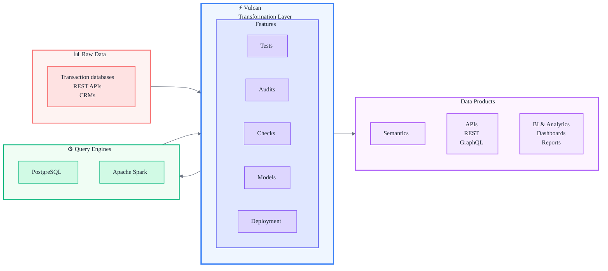

# About

Vulcan is a complete stack for building data products. Think of it as your all-in-one toolkit for transforming data—whether you're working with SQL or Python, small datasets or massive pipelines.

## What is Vulcan?

Vulcan is a next-generation data transformation framework that helps you ship data products quickly, efficiently, and reliably. It's designed for data teams who want to move fast without breaking things.

Here's what makes it special:

- **Write in SQL or Python**: Use whichever language you're comfortable with (or both!)
- **Visibility and control**: Know exactly what's happening in your pipelines, at any scale
- **Ship without errors**: Built-in validation and testing help catch problems before they reach production
- **Works at any size**: From small projects to enterprise-scale data platforms

<!-- ## How Vulcan works

Vulcan transforms raw data into production-ready data products. Here's how everything connects:

**The flow:**

1. **Raw Data** (left) — Data flows in from transaction databases, REST APIs, CRMs, and other sources

2. **Vulcan** (center) — The transformation layer that:
   - **Models** — Transforms data using SQL or Python
   - **Tests** — Validates logic before deployment
   - **Audits** — Ensures data quality and blocks bad data
   - **Checks** — Monitors data quality over time
   - **Deployment** — Safely deploys changes with impact analysis

3. **Query Engines** (below) — Vulcan works with PostgreSQL and Apache Spark to execute your transformations

4. **Data Products** (right) — Transformed data powers:
   - **Semantics** — Business metrics, dimensions, and measures for analysis
   - **APIs** — REST and GraphQL APIs for programmatic access
   - **BI & Analytics** — Dashboards and reports for business users

Vulcan sits at the heart of your data stack, transforming raw data into production-ready data products that your entire organization can use. -->

## Getting started

Ready to dive in? The [quickstart guide](guides/get-started/docker.md) will have you up and running in minutes. It walks you through setting up Vulcan and creating your first data transformation.

!!! note "Python version note"
    Depending on your system, you might need to use `python3` or `pip3` instead of `python` or `pip`. If you run into issues, try the `3` versions first.

Once you've got Vulcan running, you'll find guides and examples throughout this documentation to help you build exactly what you need. Welcome aboard!
