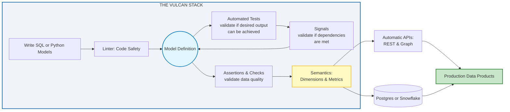

# About

Stop guessing why your production pipeline failed at 3 AM. Vulcan is a complete stack for building data products that gives you visibility into what's happening at every step, with built-in validation that blocks bad data before it hits production.

You write SQL or Python models in your Vulcan project. Most teams start with SQL for transformations, then add Python models when they hit logic that's painful to express in SQL: calling external APIs, running machine learning models, or handling complex business rules. Mix both in the same project. Vulcan handles CI/CD, testing, data quality, and API generation. Same stack whether you're processing thousands or billions of rows.

How to read this diagram

Read the diagram left to right. Here's what each part does:
     
- Write SQL or Python models in your `models/` directory. Most teams start with SQL, then add Python when they hit logic that's painful in SQL: API calls, machine learning, or complex business rules.
     
- Linter catches syntax errors before your code runs. This stops bad SQL or Python from hitting your warehouse.
     
- Model Definition is where your validated model becomes a defined entity. This is the central hub where the validation loop happens.
     
- Automated Tests run first to check if your model can produce the desired output. This happens before any data processing.
     
- Signals check if all dependencies are met. If a model depends on upstream data or external services, signals verify they're available. Only then does the loop feed back to Model Definition.
     
- Assertions and Checks validate data quality. Bad data gets blocked here, before it reaches your semantic layer or warehouse.
     
- Semantics layer only powers up after models pass validation. This is where you define business metrics and dimensions. It's your single source of truth, but only because everything feeding it has been validated.
     
- Automatic APIs generate from your semantic layer. REST, Python, and Graph APIs appear without manual code. Business users get self-service analytics, developers get programmatic access.
     
- Postgres or Snowflake receives error-free data. The validation loop ensures only clean data reaches production.
     
- Production Data Products are what business users and developers actually access. Everything flows here after passing through the validation gauntlet.

## What you get

**SQL or Python**: Write transformations in either language, or mix both in the same project. Use SQL for heavy-lifting transformations, switch to Python for complex logic. No new languages to learn.

**Visibility and control**: The linter catches syntax errors before deployment. CLI commands show you exactly what's running, what's queued, and what failed. You intercept errors in your Postgres or Snowflake environment before they trigger notifications. See what breaks before you break it.

**Ship without errors**: Assertions block bad data at the door. Tests run locally without touching your warehouse, so you get fast feedback without warehouse costs. CI/CD plans changes and shows you the full impact before deploying. Review what changed, approve when ready, roll back if something goes wrong.

Why bother with **Semantic Models**? Because it's the difference between a messy data warehouse and a single source of truth for your entire business metrics. Define metrics and dimensions once in your semantic layer. Vulcan generates REST, Python, and Graph APIs automatically. No manual API code needed. Business users get self-service analytics through the semantic layer, developers get programmatic access through the APIs.

## Getting started

The [quickstart guide](guides/get-started/docker.md) walks you through setting up Vulcan and creating your first project. By the end, you'll have implemented your first audit or data quality check. That's the difference between just installing Vulcan and actually getting value from it.

