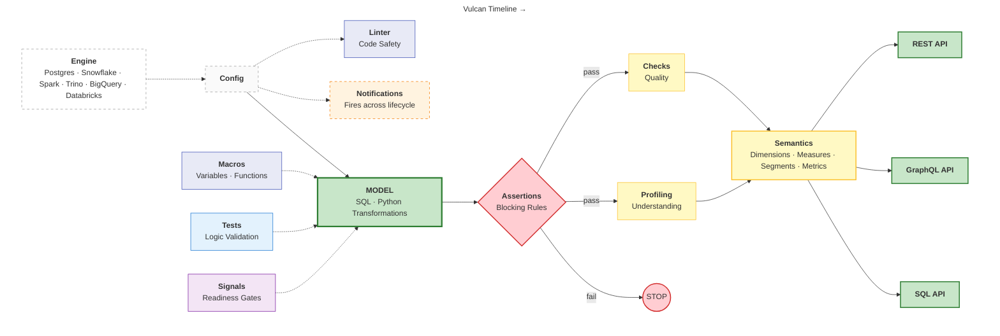

# About

Vulcan is a complete stack for building data products. You write SQL or Python models, Vulcan handles linting, testing, data quality, and semantic layer generation.
Pick your engine, bring your warehouse. Everything else is built in. If you're a data engineer or analytics engineer maintaining pipelines, Vulcan replaces all that patchwork with one stack.

```mermaid
graph LR
    subgraph VT ["Vulcan Timeline →"]
        direction LR

        Engine["<b>Engine</b><br/>Postgres · Snowflake · Spark · Trino · BigQuery · Databricks"] -.-> Config
        Config["<b>Config</b>"] -.-> Linter["<b>Linter</b><br/>Code Safety"]
        Config -.-> Notify["<b>Notifications</b><br/>Fires across lifecycle"]

        Macros["<b>Macros</b><br/>Variables · Functions"] -.-> Model
        Tests["<b>Tests</b><br/>Logic Validation"] -.-> Model
        Signals["<b>Signals</b><br/>Readiness Gates"] -.-> Model

        Config --> Model["<b>MODEL</b><br/>SQL · Python Transformations"]

        Model --> Audits

        Audits{"<b>Assertions</b> <br> Blocking Rules"} -->|pass| Checks
        Audits -->|pass| Profiles
        Audits -->|fail| Stop(("STOP"))

        Checks["<b>Checks</b><br/>Quality"] --> Sem
        Profiles["<b>Profiling</b><br/>Understanding"] --> Sem

        Sem["<b>Semantics</b><br/>Dimensions · Measures · Segments · Metrics"] --> REST["<b>REST API</b>"]
        Sem --> GraphQL["<b>GraphQL API</b>"]
        Sem --> MySQL["<b>SQL API</b>"]
    end

    style VT fill:none,stroke:none
    style Config fill:#fafafa,stroke:#9e9e9e,stroke-width:1px,stroke-dasharray: 5 5
    style Engine fill:#ffffff,stroke:#9e9e9e,stroke-width:1px,stroke-dasharray: 5 5
    style Linter fill:#e8eaf6,stroke:#3f51b5,stroke-width:1px
    style Macros fill:#e8eaf6,stroke:#3f51b5,stroke-width:1px
    style Tests fill:#e3f2fd,stroke:#1976d2,stroke-width:1px
    style Signals fill:#f3e5f5,stroke:#7b1fa2,stroke-width:1px
    style Model fill:#c8e6c9,stroke:#2e7d32,stroke-width:3px
    style Audits fill:#ffcdd2,stroke:#d32f2f,stroke-width:2px
    style Stop fill:#ffcdd2,stroke:#d32f2f,stroke-width:2px
    style Checks fill:#fff9c4,stroke:#fbc02d,stroke-width:1px
    style Profiles fill:#fff9c4,stroke:#fbc02d,stroke-width:1px
    style Sem fill:#fff9c4,stroke:#fbc02d,stroke-width:2px
    style Notify fill:#fff3e0,stroke:#f57c00,stroke-width:1px,stroke-dasharray: 5 5
    style REST fill:#c8e6c9,stroke:#2e7d32,stroke-width:2px
    style GraphQL fill:#c8e6c9,stroke:#2e7d32,stroke-width:2px
    style MySQL fill:#c8e6c9,stroke:#2e7d32,stroke-width:2px
```

<!-- ## What you get -->

- **SQL + Python models** - Write transformations in either language, or mix both in the same project. Most teams start with SQL for heavy-lifting transformations, then add Python when they hit logic that's painful in SQL: API calls, ML models, complex business rules.

- **CI/CD for data** - `vulcan plan` shows the full impact of every change before it touches your warehouse. Review what changed, approve when ready, roll back if something breaks.

- **Data quality built in** - Assertions block bad data at the door. Checks monitor trends without blocking. Tests validate your logic locally, no warehouse costs.

- **Semantic layer** - Define dimensions, measures, segments, and metrics once. Vulcan validates them and generates REST, GraphQL, and MySQL-wire APIs. No manual API code.

- **Multi-engine support** - Works with Postgres, Snowflake, Spark, Trino, BigQuery, Databricks, Redshift, and more.

## Get started

The [quickstart guide](guides/get-started/docker.md) walks you through setting up Vulcan and building your first project. By the end, you'll have your first assertion & data quality check running.
