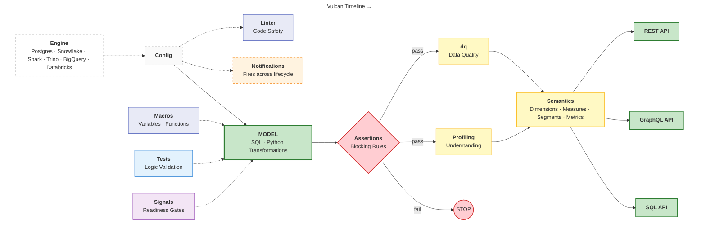

# About

## What is a data product?

A data product is context, packaged as a first-class asset. It bundles schema, semantics, ownership, lineage, quality, and freshness into one governed unit. You build it once. Dashboards, applications, and AI agents all consume the same definition, the same number, the same trust.

The alternative is what most teams have today: raw tables plus tribal knowledge. That works for an analyst who knows which `revenue` table is canonical. It breaks the moment an AI agent answers the same question, picks a stale table, and is confidently wrong.

## Why it lives above the engine

If the contract lives inside the warehouse, it's locked to the warehouse. Real enterprises run Snowflake for analytics, Postgres for operations, a lakehouse for ML. The data product has to sit above the bytes so the same contract reaches every consumer, regardless of where the data physically is.

## Where Vulcan fits

Vulcan builds data products above the engine. Bring Postgres, Snowflake, Spark, Trino, BigQuery, Databricks, or Redshift etc. Vulcan runs against the engine you already pay for. No data movement, until needed.

A data product moves through four phases: Input/Output, Transformation, Quality, Semantics. Vulcan is one stack for all four.

**Input/Output** is the engine you choose: point a single config file at it and Vulcan runs against it directly. 

**Transformation** is where you write models in SQL or Python, or mix both in the same project. `vulcan plan` shows the full impact of every change before it touches the warehouse, and `vulcan run` ships it on the cron you set. 

**Quality** is enforced in-house, not bolted on after the fact: the linter catches errors before the warehouse does, assertions block bad rows at write time, built-in data quality to watch for anomalies and drift, and tests validate your logic locally with no warehouse cost.

**Semantics** is where you define dimensions, measures, segments, and metrics once. Vulcan validates them against your models and generates REST, GraphQL, and SQL-wire APIs automatically, so the same definitions power your dashboards, notebooks, and application code.

```mermaid
graph LR
    subgraph VT ["Vulcan Timeline →"]
        direction LR

        Engine["<b>Engine</b><br/>Postgres · Snowflake · Spark · Trino · BigQuery · Databricks"] -.-> Config
        Config["<b>Config</b>"] -.-> Linter["<b>Linter</b><br/>Code Safety"]
        Config -.-> Notify["<b>Notifications</b><br/>Fires across lifecycle"]

        Macros["<b>Macros</b><br/>Variables · Functions"] -.-> Model
        Tests["<b>Tests</b><br/>Logic Validation"] -.-> Model
        Signals["<b>Signals</b><br/>Readiness Gates"] -.-> Model

        Config --> Model["<b>MODEL</b><br/>SQL · Python Transformations"]

        Model --> Audits

        Audits{"<b>Assertions</b> <br> Blocking Rules"} -->|pass| Checks
        Audits -->|pass| Profiles
        Audits -->|fail| Stop(("STOP"))

        Checks["<b>dq</b><br/>Data Quality"] --> Sem
        Profiles["<b>Profiling</b><br/>Understanding"] --> Sem

        Sem["<b>Semantics</b><br/>Dimensions · Measures · Segments · Metrics"] --> REST["<b>REST API</b>"]
        Sem --> GraphQL["<b>GraphQL API</b>"]
        Sem --> MySQL["<b>SQL API</b>"]
    end

    style VT fill:none,stroke:none
    style Config fill:#fafafa,stroke:#9e9e9e,stroke-width:1px,stroke-dasharray: 5 5
    style Engine fill:#ffffff,stroke:#9e9e9e,stroke-width:1px,stroke-dasharray: 5 5
    style Linter fill:#e8eaf6,stroke:#3f51b5,stroke-width:1px
    style Macros fill:#e8eaf6,stroke:#3f51b5,stroke-width:1px
    style Tests fill:#e3f2fd,stroke:#1976d2,stroke-width:1px
    style Signals fill:#f3e5f5,stroke:#7b1fa2,stroke-width:1px
    style Model fill:#c8e6c9,stroke:#2e7d32,stroke-width:3px
    style Audits fill:#ffcdd2,stroke:#d32f2f,stroke-width:2px
    style Stop fill:#ffcdd2,stroke:#d32f2f,stroke-width:2px
    style Checks fill:#fff9c4,stroke:#fbc02d,stroke-width:1px
    style Profiles fill:#fff9c4,stroke:#fbc02d,stroke-width:1px
    style Sem fill:#fff9c4,stroke:#fbc02d,stroke-width:2px
    style Notify fill:#fff3e0,stroke:#f57c00,stroke-width:1px,stroke-dasharray: 5 5
    style REST fill:#c8e6c9,stroke:#2e7d32,stroke-width:2px
    style GraphQL fill:#c8e6c9,stroke:#2e7d32,stroke-width:2px
    style MySQL fill:#c8e6c9,stroke:#2e7d32,stroke-width:2px
```

## Get started

The [quickstart guide](guides/get-started/docker.md) gets the Vulcan CLI running in Docker on your machine, connects it to your engine, and materializes your first models with `vulcan plan`. From there, the project scaffold gives you `audits/`, `models/dq/`, `tests/`, `models/semantics/`, and `models/metrics/` folders ready to fill in.
