# Plans

A plan summarizes the difference between your local project state and a target [environment](./environments.md). To apply model changes to a target environment, create and apply a plan.

## Plan Architecture Overview

The following diagram illustrates the complete plan lifecycle, from local changes to environment updates:

```mermaid
flowchart TD
    subgraph "1️⃣ Local Development"
        A[👨‍💻 Developer modifies model files<br/>📝 Edit SQL/Python models]
        B[📁 Local project state<br/>✨ Your changes ready]
    end

    subgraph "2️⃣ Plan Creation"
        C[⚡ vulcan plan<br/>🚀 Command execution]
        D[🔎 Compare local vs environment<br/>📊 State comparison]
        E{🔍 Changes detected?}
        F[📋 Generate plan summary<br/>✨ Plan ready for review]
        G[🏷️ Change categorization<br/>🔴 Breaking / 🟢 Non-breaking / 🟡 Forward-only]
    end

    subgraph "3️⃣ Plan Review"
        H[👀 Review plan output<br/>📊 Check changes & impacts]
        I{✅ Apply plan?}
        J[❌ Cancel<br/>🚫 No changes applied]
    end

    subgraph "4️⃣ Plan Application"
        K[🔷 Create model variants<br/>🔑 With unique fingerprints]
        L[🗄️ Create physical tables<br/>💾 In data warehouse]
        M[🔄 Backfill data<br/>📈 Process historical data]
        N[👁️ Update virtual layer<br/>🔍 Create/update views]
        O[🌍 Update environment references<br/>🔗 Point to new variants]
    end

    subgraph "5️⃣ Result"
        P[✅ Environment updated<br/>🎉 Changes deployed]
        Q[🔍 Models accessible via views<br/>📊 Ready for queries]
    end

    A -->|"📤"| B
    B -->|"➡️"| C
    C -->|"🔍"| D
    D -->|"🔎"| E
    E -->|"✅ Yes"| F
    E -->|"❌ No"| P
    F -->|"🏷️"| G
    G -->|"📋"| H
    H -->|"👀"| I
    I -->|"✅ Yes"| K
    I -->|"❌ No"| J
    K -->|"🔷"| L
    L -->|"💾"| M
    M -->|"🔄"| N
    N -->|"👁️"| O
    O -->|"🔗"| P
    P -->|"✨"| Q

    style A fill:#e3f2fd,stroke:#1976d2,stroke-width:3px,color:#000
    style C fill:#fff3e0,stroke:#f57c00,stroke-width:3px,color:#000
    style F fill:#f3e5f5,stroke:#7b1fa2,stroke-width:3px,color:#000
    style K fill:#e8f5e9,stroke:#388e3c,stroke-width:3px,color:#000
    style P fill:#c8e6c9,stroke:#2e7d32,stroke-width:3px,color:#000
    style E fill:#fff9c4,stroke:#fbc02d,stroke-width:2px,color:#000
    style I fill:#fff9c4,stroke:#fbc02d,stroke-width:2px,color:#000
    style J fill:#ffebee,stroke:#d32f2f,stroke-width:2px,color:#000
```



### Plan Components

```mermaid
graph LR
    subgraph "📋 Plan Contents"
        PC1[➕ Added Models<br/>✨ New models to create]
        PC2[➖ Removed Models<br/>🗑️ Models to delete]
        PC3[✏️ Modified Models<br/>📝 With diffs]
        PC4[🔗 Indirectly Affected<br/>📊 Downstream models]
        PC5[📅 Backfill Requirements<br/>📆 Date ranges]
    end

    subgraph "🏷️ Change Types"
        CT1[🔴 Breaking Change<br/>⚠️ Requires downstream backfill<br/>💥 Cascading impact]
        CT2[🟢 Non-Breaking Change<br/>✅ Only direct model backfill<br/>🎯 Isolated impact]
        CT3[🟡 Forward-Only<br/>♻️ Reuses existing tables<br/>💰 Cost-effective]
    end

    PC3 -->|"🔴"| CT1
    PC3 -->|"🟢"| CT2
    PC3 -->|"🟡"| CT3
    PC4 -->|"🔴"| CT1

    style PC1 fill:#e8f5e9,stroke:#388e3c,stroke-width:2px,color:#000
    style PC2 fill:#ffebee,stroke:#d32f2f,stroke-width:2px,color:#000
    style PC3 fill:#fff3e0,stroke:#f57c00,stroke-width:2px,color:#000
    style PC4 fill:#e1f5fe,stroke:#0277bd,stroke-width:2px,color:#000
    style PC5 fill:#f3e5f5,stroke:#7b1fa2,stroke-width:2px,color:#000
    style CT1 fill:#ffebee,stroke:#d32f2f,stroke-width:3px,color:#000
    style CT2 fill:#e8f5e9,stroke:#388e3c,stroke-width:3px,color:#000
    style CT3 fill:#fff9c4,stroke:#fbc02d,stroke-width:3px,color:#000
```



During plan creation:

* The local state of the Vulcan project is compared to the state of a target environment. The difference between the two and the actions needed to synchronize the environment with the local state are what constitutes a plan.
* You may be prompted to [categorize changes](#change-categories) for existing models so Vulcan can determine actions for indirectly affected models (downstream models that depend on updated models). By default, Vulcan categorizes changes automatically. Change this behavior through [configuration](./configuration.md#plan).
* Each plan requires a date range to which it will be applied. If not specified, the date range is derived automatically based on model definitions and the target environment.

The benefit of plans is that all changes can be reviewed and verified before they are applied to the data warehouse and any computations are performed. A typical plan contains a combination of the following:

* A list of added models
* A list of removed models
* A list of directly modified models and a text diff of changes that have been made
* A list of indirectly modified models
* Missing data intervals for affected models
* A date range that will be affected by the plan application

To create a new plan, run the following command:
```bash
vulcan plan [environment name]
```

If no environment name is specified, the plan is generated for the `prod` environment.

## Change categories
Categories only need to be provided for models that have been modified directly. The categorization of indirectly modified downstream models is inferred based on the types of changes to the directly modified models.

If more than one upstream dependency of an indirectly modified model has been modified and they have conflicting categories, the most conservative category (breaking) is assigned to this model.

### Change Propagation Flow

The following diagram illustrates how changes propagate through the dependency graph:

```mermaid
graph TD
    subgraph "📊 Model Dependencies"
        A[📥 raw.raw_orders<br/>⬆️ Upstream]
        B[📊 sales.daily_sales<br/>🔄 Midstream]
        C[📈 sales.weekly_sales<br/>⬇️ Downstream]
        D[📉 analytics.revenue_report<br/>⬇️ Downstream]
    end

    subgraph "🟢 Scenario 1: Non-Breaking Change"
        NB1[➕ Add column to daily_sales<br/>✨ New column added]
        NB2[✅ Only daily_sales backfilled<br/>🔄 Single model update]
        NB3[⏭️ weekly_sales NOT affected<br/>✅ No cascade]
        NB4[⏭️ revenue_report NOT affected<br/>✅ No cascade]
    end

    subgraph "🔴 Scenario 2: Breaking Change"
        BC1[🔍 Add WHERE clause to daily_sales<br/>⚠️ Filter logic changed]
        BC2[🔄 daily_sales backfilled<br/>📊 Data reprocessed]
        BC3[🔄 weekly_sales backfilled<br/>🔴 Indirect Breaking<br/>💥 Cascading impact]
        BC4[🔄 revenue_report backfilled<br/>🔴 Indirect Breaking<br/>💥 Cascading impact]
    end

    A -->|"📤"| B
    B -->|"📤"| C
    B -->|"📤"| D

    NB1 -->|"✏️"| B
    B -->|"✅"| NB2
    NB2 -.->|"⏭️ No cascade"| C
    NB2 -.->|"⏭️ No cascade"| D

    BC1 -->|"⚠️"| B
    B -->|"🔄"| BC2
    BC2 -->|"💥 Cascade"| BC3
    BC2 -->|"💥 Cascade"| BC4
    BC3 -->|"🔄"| C
    BC4 -->|"🔄"| D

    style A fill:#e3f2fd,stroke:#1976d2,stroke-width:2px,color:#000
    style B fill:#fff3e0,stroke:#f57c00,stroke-width:2px,color:#000
    style C fill:#e1f5fe,stroke:#0277bd,stroke-width:2px,color:#000
    style D fill:#e1f5fe,stroke:#0277bd,stroke-width:2px,color:#000
    style NB1 fill:#e8f5e9,stroke:#388e3c,stroke-width:3px,color:#000
    style NB2 fill:#c8e6c9,stroke:#2e7d32,stroke-width:2px,color:#000
    style NB3 fill:#f1f8e9,stroke:#558b2f,stroke-width:2px,color:#000
    style NB4 fill:#f1f8e9,stroke:#558b2f,stroke-width:2px,color:#000
    style BC1 fill:#ffebee,stroke:#d32f2f,stroke-width:3px,color:#000
    style BC2 fill:#ffcdd2,stroke:#c62828,stroke-width:2px,color:#000
    style BC3 fill:#ffcdd2,stroke:#c62828,stroke-width:2px,color:#000
    style BC4 fill:#ffcdd2,stroke:#c62828,stroke-width:2px,color:#000
```



### Breaking change
If a directly modified model change is categorized as breaking, it and its downstream dependencies will be backfilled.

In general, this is the safest option because it guarantees all downstream dependencies will reflect the change. However, it is a more expensive option because it involves additional data reprocessing, which has a runtime cost associated with it (refer to [backfilling](#backfilling)).

Choose this option when a change has been made to a model's logic that has a functional impact on its downstream dependencies. For example, adding or modifying a model's `WHERE` clause is a breaking change because downstream models contain rows that would now be filtered out.

### Non-breaking change
A directly-modified model that is classified as non-breaking will be backfilled, but its downstream dependencies will not.

This is a common choice in scenarios such as an addition of a new column, an action which doesn't affect downstream models, as new columns can't be used by downstream models without modifying them directly to select the column.

If any downstream models contain a `select *` from the model, Vulcan attempts to infer breaking status on a best-effort basis. We recommend explicitly specifying a query's columns to avoid unnecessary recomputation.

### Summary

| Change Category                      | Change Type                                                                                | Behaviour                                          |
|--------------------------------------|--------------------------------------------------------------------------------------------|----------------------------------------------------|
| [Breaking](#breaking-change)         | [Direct](./glossary.md#direct-modification) or [Indirect](./glossary.md#indirect-modification) | [Backfill](./glossary.md#backfill)                   |
| [Non-breaking](#non-breaking-change) | [Direct](./glossary.md#direct-modification)                                                  | [Backfill](./glossary.md#backfill)                   |
| [Non-breaking](#non-breaking-change) | [Indirect](./glossary.md#indirect-modification)                                              | [No Backfill](./glossary.md#backfill)                |

## Forward-only change
In addition to categorizing a change as breaking or non-breaking, it can also be classified as forward-only.

A model change classified as forward-only will continue to use the existing physical table once the change is deployed to production (the `prod` environment). This means that no backfill will take place.

While iterating on forward-only changes in the development environment, the model's output will be stored in either a temporary table or a shallow clone of the production table if supported by the engine.

In either case the data produced this way in the development environment can only be used for preview and will **not** be reused once the change is deployed to production. See [Forward-only Plans](#forward-only-plans) for more details.

This category is assigned by Vulcan automatically either when a user opts into using a [forward-only plan](#forward-only-plans) or when a model is explicitly configured to be forward-only.

## Plan application
Once a plan has been created and reviewed, it is then applied to the target [environment](environments.md) in order for its changes to take effect.

When a model changes as part of a plan, Vulcan creates a new model variant behind the scenes (a snapshot with a unique fingerprint). Each model variant's data is stored in a separate physical table. Data between different variants of the same model is never shared, except for [forward-only](#forward-only-plans) plans.

When a plan is applied to an environment, the environment gets associated with the set of model variants that are part of that plan. In other words, each environment is a collection of references to model variants and the physical tables associated with them.

### Model Versioning Architecture

The following diagram shows how model variants, physical tables, and environments relate:

```mermaid
graph TB
    subgraph "📝 Model Definitions"
        M1[📊 Model: sales.daily_sales<br/>🔢 Version 1<br/>✨ Original]
        M2[📊 Model: sales.daily_sales<br/>🔢 Version 2 - Modified<br/>✏️ Updated]
    end

    subgraph "🔷 Model Variants & Snapshots"
        V1[🔷 Variant 1<br/>🔑 Fingerprint: abc123<br/>📸 Unique snapshot]
        V2[🔷 Variant 2<br/>🔑 Fingerprint: def456<br/>📸 Unique snapshot]
        S1[📸 Snapshot 1<br/>🔐 Immutable state]
        S2[📸 Snapshot 2<br/>🔐 Immutable state]
    end

    subgraph "💾 Physical Tables"
        T1[🗄️ Physical Table 1<br/>📦 db.vulcan__sales.daily_sales__abc123<br/>💾 Actual data storage]
        T2[🗄️ Physical Table 2<br/>📦 db.vulcan__sales.daily_sales__def456<br/>💾 Actual data storage]
    end

    subgraph "👁️ Virtual Layer Views"
        VL1[🔍 View: sales.daily_sales<br/>👁️ Points to Variant 1<br/>🔗 Reference mapping]
        VL2[🔍 View: sales.daily_sales<br/>👁️ Points to Variant 2<br/>🔗 Reference mapping]
    end

    subgraph "🌍 Environments"
        PROD[🚀 Production Environment<br/>✅ References Variant 1<br/>🌐 Live production data]
        DEV[🧪 Dev Environment<br/>🔬 References Variant 2<br/>🧪 Testing environment]
    end

    M1 -->|"✨"| V1
    M2 -->|"✏️"| V2
    V1 -->|"📸"| S1
    V2 -->|"📸"| S2
    S1 -->|"💾"| T1
    S2 -->|"💾"| T2
    T1 -->|"👁️"| VL1
    T2 -->|"👁️"| VL2
    PROD -->|"🔗"| V1
    DEV -->|"🔗"| V2

    style M1 fill:#e3f2fd,stroke:#1976d2,stroke-width:3px,color:#000
    style M2 fill:#fff3e0,stroke:#f57c00,stroke-width:3px,color:#000
    style V1 fill:#e8f5e9,stroke:#388e3c,stroke-width:2px,color:#000
    style V2 fill:#fff9c4,stroke:#fbc02d,stroke-width:2px,color:#000
    style S1 fill:#f1f8e9,stroke:#558b2f,stroke-width:2px,color:#000
    style S2 fill:#f1f8e9,stroke:#558b2f,stroke-width:2px,color:#000
    style T1 fill:#e0f2f1,stroke:#00695c,stroke-width:2px,color:#000
    style T2 fill:#e0f2f1,stroke:#00695c,stroke-width:2px,color:#000
    style VL1 fill:#f3e5f5,stroke:#7b1fa2,stroke-width:2px,color:#000
    style VL2 fill:#f3e5f5,stroke:#7b1fa2,stroke-width:2px,color:#000
    style PROD fill:#c8e6c9,stroke:#2e7d32,stroke-width:3px,color:#000
    style DEV fill:#ffe082,stroke:#f9a825,stroke-width:3px,color:#000
```




*Each model variant gets its own physical table while environments only contain references to these tables.*

This unique approach to understanding and applying changes is what enables Vulcan's Virtual Environments. It allows Vulcan to ensure complete isolation between environments while allowing it to share physical data assets between environments when appropriate and safe to do so.

Additionally, since each model change is captured in a separate physical table, reverting to a previous version becomes a simple and quick operation (refer to [Virtual Update](#virtual-update)) as long as its physical table hasn't been garbage collected by the janitor process.

Vulcan makes it easy to be correct and really hard to accidentally and irreversibly break things.

### Backfilling
Despite all the benefits, the approach described above is not without trade-offs.

When a new model version is just created, a physical table assigned to it is empty. Therefore, Vulcan needs to re-apply the logic of the new model version to the entire date range of this model in order to populate the new version's physical table. This process is called backfilling.

We use the term backfilling broadly to describe any situation in which a model is updated. That includes these operations:

* When a VIEW model is created
* When a FULL model is built
* When an INCREMENTAL model is built for the first time
* When an INCREMENTAL model has recent data appended to it
* When an INCREMENTAL model has older data inserted (i.e., resolving a data gap or prepending historical data)

Note for incremental models: despite the fact that backfilling can happen incrementally (see `batch_size` parameter on models), there is an extra cost associated with this operation due to additional runtime involved. If the runtime cost is a concern, use a [forward-only plan](#forward-only-plans) instead.

### Virtual Update
A benefit of Vulcan's approach is that data for a new model version can be fully pre-built while still in a development environment. That way all changes and their downstream dependencies can be fully previewed before they are promoted to the production environment.

With this approach, the process of promoting a change to production is reduced to reference swapping.

If during plan creation no data gaps have been detected and only references to new model versions need to be updated, then the update is referred to as a Virtual Update. Virtual Updates impose no additional runtime overhead or cost.

### Start and end dates

The `plan` command provides two temporal options: `--start` and `--end`. These options are only applicable to plans for non-prod environments.

Every model has a start date. Specify it in [the model definition](../../components/model/overview.md#start), in the [project configuration's `model_defaults`](../../configurations/options/model_defaults.md), or use Vulcan's default value of yesterday.

Because the prod environment supports business operations, prod plans ensure every model is backfilled from its start date until the most recent completed time interval. Due to that restriction, the `plan` command's `--start` and `--end` options are not supported for regular plans against prod. The options are supported for [restatement plans](#restatement-plans) against prod to allow re-processing a subset of existing data.

Non-prod plans are typically used for development, so their models can optionally be backfilled for any date range with the `--start` and `--end` options. Limiting the date range makes backfills faster and development more efficient, especially for incremental models using large tables.

#### Model kind limitations

Some model kinds do not support backfilling a limited date range.

For context, Vulcan strives to make models _idempotent_, meaning that if we ran them multiple times we would get the same correct result every time.

However, some model kinds are inherently non-idempotent:

- [INCREMENTAL_BY_UNIQUE_KEY](../../components/model/model_kinds.md#incremental_by_unique_key)
- [INCREMENTAL_BY_PARTITION](../../components/model/model_kinds.md#incremental_by_partition)
- [SCD_TYPE_2_BY_TIME](../../components/model/model_kinds.md#scd-type-2-by-time-recommended)
- [SCD_TYPE_2_BY_COLUMN](../../components/model/model_kinds.md#scd-type-2-by-column)
- Any model whose query is self-referential (i.e., the contents of new data rows are affected by the data rows already present in the table)

Those model kinds will behave as follows in a non-prod plan that specifies a limited date range:

- If the `--start` option date is the same as or before the model's start date, the model is fully refreshed for all of time
- If the `--start` option date is after the model's start date, only a preview is computed for this model which can't be reused when deploying to production

#### Example

Consider a Vulcan project with a default start date of 2024-09-20.

It contains the following `INCREMENTAL_BY_UNIQUE_KEY` model that specifies an explicit start date of 2024-09-23:

```sql linenums="1" hl_lines="6"
MODEL (
  name vulcan_example.start_end_model,
  kind INCREMENTAL_BY_UNIQUE_KEY (
    unique_key item_id
  ),
  start '2024-09-23'
);

SELECT
  item_id,
  num_orders
FROM
  vulcan_example.full_model
```

When we run the project's first plan, we see that Vulcan correctly detected a different start date for our `start_end_model` than the other models (which have the project default start of 2024-09-20):

```bash linenums="1" hl_lines="17"
❯ vulcan plan
======================================================================
Successfully Ran 1 tests against duckdb
----------------------------------------------------------------------
`prod` environment will be initialized

Models:
└── Added:
    ├── vulcan_example.full_model
    ├── vulcan_example.incremental_model
    ├── vulcan_example.seed_model
    └── vulcan_example.start_end_model
Models needing backfill (missing dates):
├── vulcan_example.full_model: 2024-09-20 - 2024-09-26
├── vulcan_example.incremental_model: 2024-09-20 - 2024-09-26
├── vulcan_example.seed_model: 2024-09-20 - 2024-09-26
└── vulcan_example.start_end_model: 2024-09-23 - 2024-09-26
Apply - Backfill Tables [y/n]:
```

After executing that plan, we add columns to both the `incremental_model` and `start_end_model` queries.

We then execute `vulcan plan dev` to create the new `dev` environment:

```bash linenums="1" hl_lines="23-26"

❯ vulcan plan dev
======================================================================
Successfully Ran 1 tests against duckdb
----------------------------------------------------------------------
New environment `dev` will be created from `prod`

Differences from the `prod` environment:

Models:
├── Directly Modified:
│   ├── vulcan_example__dev.start_end_model
│   └── vulcan_example__dev.incremental_model
└── Indirectly Modified:
    └── vulcan_example__dev.full_model

[...model diff omitted...]

Directly Modified: vulcan_example__dev.incremental_model (Non-breaking)
└── Indirectly Modified Children:
    └── vulcan_example__dev.full_model (Indirect Non-breaking)

[...model diff omitted...]

Directly Modified: vulcan_example__dev.start_end_model (Non-breaking)
Models needing backfill (missing dates):
├── vulcan_example__dev.incremental_model: 2024-09-20 - 2024-09-26
└── vulcan_example__dev.start_end_model: 2024-09-23 - 2024-09-26
Enter the backfill start date (eg. '1 year', '2020-01-01') or blank to backfill from the beginning of history:
```

Note two things about the output:

1. As before, Vulcan displays the complete backfill time range for each model, using the project default start of 2024-09-20 for `incremental_model` and 2024-09-23 for `start_end_model`
2. Vulcan prompted us for a backfill start date because we didn't pass the `--start` option to the `vulcan plan dev` command

Let's cancel that plan and start a new one, passing a start date of 2024-09-24.

The `start_end_model` is of kind `INCREMENTAL_BY_UNIQUE_KEY`, which is non-idempotent and cannot be backfilled for a limited time range.

Because the command's `--start` of 2024-09-24 is after `start_end_model`'s start date 2024-09-23, `start_end_model` is marked as preview:

``` bash linenums="1" hl_lines="12-13 20-21"
❯ vulcan plan dev --start 2024-09-24
======================================================================
Successfully Ran 1 tests against duckdb
----------------------------------------------------------------------
New environment `dev` will be created from `prod`

Differences from the `prod` environment:

Models:
├── Directly Modified:
│   ├── vulcan_example__dev.start_end_model
│   └── vulcan_example__dev.incremental_model
└── Indirectly Modified:
    └── vulcan_example__dev.full_model

[...model diff omitted...]

Directly Modified: vulcan_example__dev.start_end_model (Non-breaking)
Models needing backfill (missing dates):
├── vulcan_example__dev.incremental_model: 2024-09-24 - 2024-09-26
└── vulcan_example__dev.start_end_model: 2024-09-24 - 2024-09-26 (preview)
Enter the backfill end date (eg. '1 month ago', '2020-01-01') or blank to backfill up until '2024-09-27 00:00:00':
```

#### Minimum intervals

When you run a plan with a fixed `--start` or `--end` date, you create a virtual data environment with a limited subset of data. However, if the time range specified is less than the size of an interval on one of your models, that model will be skipped by default.

For example, if you have a model like so:

```sql
MODEL(
    name vulcan_example.monthly_model,
    kind INCREMENTAL_BY_TIME_RANGE (
        time_column month
    ),
    cron '@monthly'
);

SELECT SUM(a) AS sum_a, MONTH(day) AS month
FROM vulcan_example.upstream_model
WHERE day BETWEEN @start_ds AND @end_ds
```

make a change to it and run the following:

```bash linenums="1" hl_lines="8"
$ vulcan plan dev --start '1 day ago' 

Models:
└── Added:
    └── vulcan_example__dev.monthly_model
Apply - Virtual Update [y/n]: y

SKIP: No model batches to execute
```

No data will be backfilled because `1 day ago` does not contain a complete month. However, you can use the `--min-intervals` option to override this behaviour like so:

```bash linenums="1" hl_lines="11"
$ vulcan plan dev --start '1 day ago' --min-intervals 1

Models:
└── Added:
    └── vulcan_example__dev.monthly_model
Apply - Virtual Update [y/n]: y

[1/1] vulcan_example__dev.monthly_model   [insert 2025-06-01 - 2025-06-30]   0.08s   
Executing model batches ━━━━━━━━━━━━━━━━━━━━━━━━━━━━━━━━━━━━━━━━ 100.0% • 1/1 • 0:00:00                                                             
                                                                                                                                                    
✔ Model batches executed
```

This will ensure that regardless of the plan `--start` date, all added or modified models will have at least `--min-intervals` intervals considered for backfill.

!!! info

    If you are running plans manually you can just adjust the `--start` date to be wide enough to cover the models in question.

    The `--min-intervals` option is primarily intended for automation scenarios where the plan is always run with a default relative start date and you always want (for example) "2 weeks worth of data" in the target environment.

### Data preview for forward-only changes
As mentioned earlier, the data output produced by [forward-only changes](#forward-only-change) in a development environment can only be used for preview and will not be reused in production.

The same holds true for any subsequent changes that depend on undeployed forward-only changes - data can be previewed but can't be reused in production.

Backfills that are exclusively for preview purposes and will not be reused upon deployment to production are explicitly labeled with `(preview)` in the plan summary:
```bash
Models needing backfill (missing dates):
├── sushi__dev.customers: 2023-12-22 - 2023-12-28 (preview)
├── sushi__dev.waiter_revenue_by_day: 2023-12-22 - 2023-12-28
├── sushi__dev.top_waiters: 2023-12-22 - 2023-12-28
└── sushi__dev.waiter_as_customer_by_day: 2023-12-22 - 2023-12-28 (preview)
```

## Forward-only plans
Sometimes the runtime cost associated with rebuilding an entire physical table is too high and outweighs the benefits a separate table provides. This is when a forward-only plan comes in handy.

When a forward-only plan is applied to the `prod` environment, none of the plan's changed models will have new physical tables created for them. Instead, physical tables from previous model versions are reused.

The benefit of this is that no backfilling is required, so there is no runtime overhead or cost. The drawback is that reverting to a previous version is no longer simple and requires a combination of additional forward-only changes and [restatements](#restatement-plans).

Note that once a forward-only change is applied to `prod`, all development environments that referred to the previous versions of the updated models will be impacted.

A core component of the development process is to execute code and verify its behavior. To enable this while preserving isolation between environments, `vulcan plan [environment name]` evaluates code in non-`prod` environments while targeting shallow (a.k.a. "zero-copy") clones of production tables for engines that support them or newly created temporary physical tables for engines that don't.

This means that only a limited preview of changes is available in the development environment before the change is promoted to `prod`. The date range of the preview is provided as part of plan creation command.

Engines for which table cloning is supported include:

* `BigQuery`
* `Databricks`
* `Snowflake`

Note that all changes made as part of a forward-only plan automatically get a **forward-only** category assigned to them. These types of changes can't be mixed together with [breaking and non-breaking changes](#change-categories) within the same plan.

To create a forward-only plan, add the `--forward-only` option to the `plan` command:
```bash
vulcan plan [environment name] --forward-only
```

!!! note
    The `--forward-only` flag isn't required when applying changes to models explicitly configured as [forward-only](../../components/model/overview.md#forward_only).

    Use it only if you need to provide a time range for the preview window or the [effective date](#effective-date).

### Destructive changes

Some model changes destroy existing data in a table. Vulcan automatically detects and optionally prevents destructive changes to [forward-only models](../../guides/incremental_by_time.md#forward-only-models). Learn more [here](../../guides/incremental_by_time.md#destructive-changes).

Forward-only plans treats all of the plan's model changes as forward-only. In these plans, Vulcan will check all modified incremental models for destructive schema changes, not just forward-only models.

Vulcan determines what to do for each model based on this setting hierarchy: 

- **For destructive changes**: the [model's `on_destructive_change` value](../../guides/incremental_by_time.md#schema-changes) (if present), the `on_destructive_change` [model defaults](./model_configuration.md#model-defaults) value (if present), and the Vulcan global default of `error`
- **For additive changes**: the [model's `on_additive_change` value](../../guides/incremental_by_time.md#schema-changes) (if present), the `on_additive_change` [model defaults](./model_configuration.md#model-defaults) value (if present), and the Vulcan global default of `allow`

If you want to temporarily allow destructive changes to models that don't allow them, use the `plan` command's `--allow-destructive-model` selector to specify which models. 
Similarly, if you want to temporarily allow additive changes to models configured with `on_additive_change=error`, use the `--allow-additive-model` selector. 

For example, to allow destructive changes to all models in the `analytics` schema:
```bash
vulcan plan --forward-only --allow-destructive-model "analytics.*"
```

Or to allow destructive changes to multiple specific models:
```bash
vulcan plan --forward-only --allow-destructive-model "sales.revenue_model" --allow-destructive-model "marketing.campaign_model"
```

Learn more about model selectors [here](../../guides/model_selection.md).

### Effective date
Changes that are part of the forward-only plan can also be applied retroactively to the production environment by specifying the effective date:

```bash
vulcan plan --forward-only --effective-from 2023-01-01
```

This way Vulcan will know to recompute data intervals starting from the specified date once forward-only changes are deployed to production.

## Restatement plans

Models sometimes need to be re-evaluated for a given time range, even though the model definition has not changed.

For example, these scenarios all require re-evaluating model data that already exists:

- Correcting an upstream data issue by reprocessing some of a model's existing data
- Retroactively applying a [forward-only plan](#forward-only-plans) change to some historical data
- Fully refreshing a model

In Vulcan, reprocessing existing data is called a "restatement."

Restate one or more models' data with the `plan` command's `--restate-model` selector. The [selector](../../guides/model_selection.md) lets you specify which models to restate by name, wildcard, or tag (syntax [below](#restatement-examples)).

!!! warning "No changes allowed"

    Unlike regular plans, restatement plans ignore changes to local files. They can only restate the model versions already in the target environment.

    You cannot restate a new model - it must already be present in the target environment. If it's not, add it first by running `vulcan plan` without the `--restate-model` option.

Applying a restatement plan will trigger a cascading backfill for all selected models, as well as all models downstream from them. Models with restatement disabled will be skipped and not backfilled.

You can restate external models. An [external model](../../components/model/types/external_models.md) is metadata about an external table, so the model doesn't reprocess anything. Instead, it triggers a cascading backfill of all downstream models.

The plan's `--start` and `--end` date options determine which data intervals will be reprocessed. Some model kinds cannot be backfilled for limited date ranges, though - learn more [below](#model-kind-limitations).

!!! info "Just catching up"

    Restatement plans "catch models up" to the latest time interval already processed in the environment. They cannot process additional intervals because the required data has not yet been processed upstream.

    If you pass an `--end` date later than the environment's most recent time interval, Vulcan will just catch up to the environment and will ignore any additional intervals.

To prevent models from being restated, set the [disable_restatement](../../components/model/overview.md#disable_restatement) attribute to `true`.

<a name="restatement-examples"></a>
These examples demonstrate how to select which models to restate based on model names or model tags.

=== "Names Only"

    ```bash
    vulcan plan --restate-model "db.model_a" --restate-model "tag:expensive"
    ```

=== "Upstream"

    ```bash
    # All selected models (including upstream models) will also include their downstream models
    vulcan plan --restate-model "+db.model_a" --restate-model "+tag:expensive"
    ```

=== "Wildcards"

    ```bash
    vulcan plan --restate-model "db*" --restate-model "tag:exp*"
    ```

=== "Upstream + Wildcards"

    ```bash
    vulcan plan --restate-model "+db*" --restate-model "+tag:exp*"
    ```

=== "Specific Date Range"

    ```bash
    vulcan plan --restate-model "db.model_a" --start "2024-01-01" --end "2024-01-10"
    ```

### Restating production vs development

Restatement plans behave differently depending on whether you're targeting the `prod` environment or a [development environment](./environments.md#how-to-use-environments).

If you target a development environment by including an environment name like `dev`:

```bash
vulcan plan dev --restate-model "db.model_a" --start "2024-01-01" --end "2024-01-10"
```

the restatement plan will restate the requested intervals for the specified model in the `dev` environment. In other environments, the model will be unaffected.

However, if you target the `prod` environment by omitting an environment name:

```bash
vulcan plan --restate-model "db.model_a" --start "2024-01-01" --end "2024-01-10"
```

the restatement plan will restate the intervals in the `prod` table *and clear the model's time intervals from state in every other environment*.

The next time you do a run in `dev`, the intervals already reprocessed in `prod` are reprocessed in `dev` as well. This is to prevent old data from getting promoted to `prod` in the future.

This behavior also clears the affected intervals for downstream tables that only exist in development environments. Consider the following example:

 - Table `A` exists in `prod`
 - A virtual environment `dev` is created with new tables `B` and `C` downstream of `A`
    - the DAG in `prod` looks like `A`
    - the DAG in `dev` looks like `A <- B <- C`
 - A restatement plan is executed against table `A` in `prod`
 - Vulcan will clear the affected intervals for `B` and `C` in `dev` even though those tables do not exist in `prod`

!!! info "Bringing development environments up to date"

    A restatement plan against `prod` clears time intervals from state for models in development environments, but it does not trigger a run to reprocess those intervals.

    Execute `vulcan run <environment name>` to trigger reprocessing in the development environment.

    This is necessary because a `prod` restatement plan only does work in the `prod` environment for speed and efficiency.