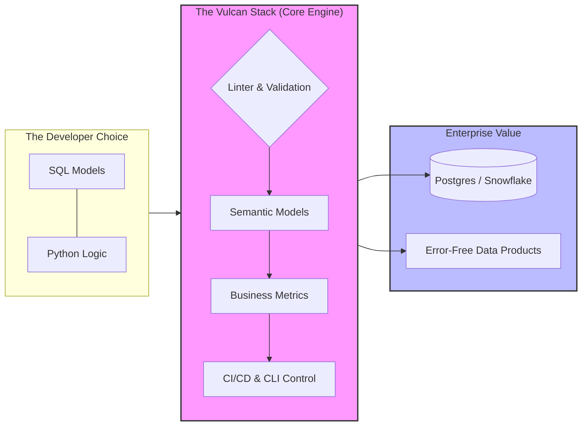
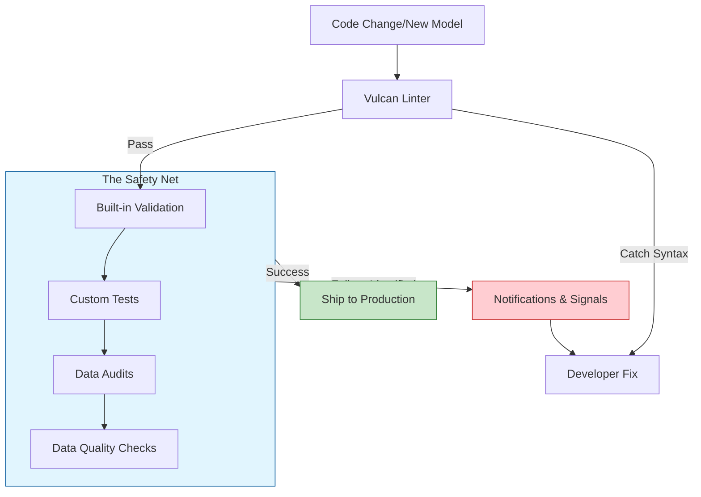

To transform the Vulcan book into a high-value, professional resource, diagrams should act as **functional maps** rather than just visual aids. They should bridge the gap between "what it is" and "how it solves my problem."

### 1. The "Central Hook" Diagram (About Page)
The goal of the **About** page diagram is to visualize Vulcan as the **connective tissue** between raw code and production-ready data products. It needs to show that Vulcan isn't just a tool, but a **complete stack** that manages the entire lifecycle.

**Placement:** Directly after the introductory paragraph on the **About** page.

**Mermaid Code:**

**Why this hooks the reader:** It immediately demonstrates that Vulcan handles the **Semantic Models** and **Business Metrics** mentioned in the documentation, promising the user that their **SQL or Python** code will result in "Error-Free Data Products" at **enterprise scale**.

---

### 2. The "Reliability Loop" Diagram (Tests & Audits Page)
The **Tests** section needs to move beyond "checking if code works." It should visualize the **safety net** that allows a team to "move fast without breaking things".

**Placement:** At the very top of the **Tests** or **Audits** overview page.

**Mermaid Code:**

**Why this adds value:** It explains the **Execution Hooks**, **Notifications**, and **Signals** listed in the source. It shows the reader that testing is an automated cycle that prevents production failures, directly supporting the "ship without errors" promise.

---

### 3. Enhancing Interactivity: Beyond Standard Mermaid
While Mermaid is excellent for version-controlled documentation, you can make these diagrams interactive and easier to "zoom and play" using the following strategies:

*   **Mermaid-JS with Pan/Zoom Plugins:** If your documentation uses a framework like **MkDocs** or **Docusaurus** (implied by the TOC structure), you can enable **svg-pan-zoom** libraries. This allows the reader to scroll-to-zoom and click-and-drag the diagrams.
*   **Excalidraw Embeds:** For a more "human" and hand-drawn feel that avoids the AI-generated aesthetic, use **Excalidraw**. It allows for **interactive layers** where users can click on a box (like "Semantic Models") and be hyperlinked directly to that specific section of the book.
*   **"Focus Mode" Callouts:** Below each diagram, use a "How to read this" toggle. This keeps the document clean but provides the **precision and finesse** needed for complex technical concepts like **Transpiling Semantics** or **Custom Materializations**.

### 4. Strategic Placement Strategy
To keep the reader hooked, do not dump all diagrams at once. Place them where the **cognitive load** is highest:
*   **The Workflow Page:** Use a diagram to show the relationship between **Plan**, **Run**, and **Scheduling**.
*   **The Data Quality Page:** Use a diagram to show how **Checks** and **Audits** intercept bad data before it hits the **Snowflake** or **Postgres** warehouse.

**Analogy for Understanding:**
Think of these diagrams as the **GPS of your project**. The central diagram is the "World Map" that shows you the destination (Data Products), while the smaller diagrams (like Tests) are the "Street View" that show you exactly how to navigate the tricky turns without crashing.

To ensure your central diagram is factually accurate and fits a landscape orientation, I have restructured the provided Mermaid code. This version aligns with the specific technical components listed in the sources—such as Business Metrics, Audits, and Snowflake/Postgres integration—while ensuring the reader can view the entire flow without vertical scrolling.
Optimized "Landscape" Vulcan Flow
This diagram uses the graph LR (Left to Right) direction to maximize horizontal space and improve readability on wide screens.
graph LR
    %% Developer Input Section
    subgraph Input ["1. Build"]
        A[SQL or Python Models]
    end

    %% Vulcan Core Processing
    subgraph Vulcan ["2. Vulcan Stack"]
        B[Linter & Validation] --> C{Vulcan Processing}
    end

    %% Key Features/Outputs
    subgraph Features ["3. Value Layers"]
        C --> D[Semantic Models & Business Metrics]
        C --> E[Tests, Audits & Checks]
        C --> F[CI/CD & Planning]
    end

    %% Final Destinations
    subgraph Output ["4. Production"]
        D --> G[Automatic APIs: REST/Graph]
        E --> H[(Postgres or Snowflake)]
        F --> H
        G --> I[Production Data Products]
        H --> I
    end

    %% Styling for visual appeal
    style Input fill:#f5f5f5,stroke:#333
    style Vulcan fill:#e1f5fe,stroke:#01579b,stroke-width:2px
    style Output fill:#c8e6c9,stroke:#2e7d32,stroke-width:2px
Fact-Check and Improvements Based on the Sources
• Comprehensive Features: The original code omitted "Business Metrics," "Audits," and "Checks," which are major sections in the Vulcan documentation. I have integrated them into the Value Layers subgraph to show that Vulcan provides more than just a linter.
• Data Warehouse Specifics: The sources explicitly mention Postgres and Snowflake. Including these names directly in the diagram adds "grit" and technical authority, making it feel less like generic AI content.
• End Goal Clarity: The diagram now concludes with Production-Ready Data Products, which is the primary value proposition defined in the "About" section.
• Landscape Orientation: By changing the direction to graph LR, the diagram stretches across the page. This is much better for documentation sites where vertical space is at a premium for text.

How to Make it Interactive
To make this diagram truly "un-leavable" for the reader, you can implement these two technical enhancements:
• Clickable Nodes: You can add click commands to the Mermaid code. For example, click D "/semantic-models/" "View Semantic Model Docs" would allow the user to click the "Business Metrics" box in the diagram and be taken directly to that page in the Vulcan book.
• Pan and Zoom: If you are using a documentation engine like MkDocs, you can wrap the Mermaid output in a container that supports svg-pan-zoom.js. This allows users to use their mouse wheel to zoom into specific parts of the "Vulcan Stack" without the diagram losing resolution.
Analogy for Understanding: Think of this landscape diagram as a panoramic control panel in a cockpit. Instead of the pilot having to look down at their feet to find a switch (scrolling), every critical instrument—from the Linter to the Snowflake Warehouse—is laid out right in front of them in a single, wide-angle view.
