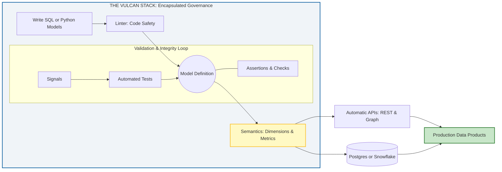

To transform the Vulcan documentation into an unmissable resource that feels human-authored and high-value, you should focus on replacing generic marketing language with **technical authority** and **narrative hooks**. 

Based on the existing structure and content of the Vulcan book, here are the pointers to achieve that level of precision and finesse:

### 1. Lead with the "Developer's Problem," Not the "Tool's Feature"
Instead of starting with a generic welcome, open each section by identifying a high-stakes challenge a data engineer faces. 
*   **The Hook:** Instead of saying Vulcan is an "all-in-one toolkit", start with: *"Stop guessing why your production pipeline failed at 3 AM."* 
*   **The Value:** Immediately follow this by explaining how Vulcan’s **Visibility and control** and **built-in validation** provide the specific safety net required to "move fast without breaking things".

### 2. Contextualize the "Choose Your Own Adventure" Flexibility
The source mentions that users can write in **SQL or Python**. To make this more interesting, don't just list them as options; explain the **strategic advantage** of using both. 
*   **Precision Tip:** Describe a scenario where a reader might use SQL for heavy-lifting transformations but switch to Python for complex logic within the same project. This moves the document from a "manual" to a "strategy guide."

### 3. Build a Progressive Disclosure Path
The current table of contents includes advanced topics like **Custom materializations**, **Transpiling Semantics**, and **Incremental by Time**. 
*   **Structure:** Do not treat these as isolated menu items. Use "breadcrumbing" at the end of the **Getting started** section. 
*   **The Hook:** Instead of a generic "find guides and examples", use a targeted transition: *"Now that your environment is live, learn how to optimize costs using **Incremental by Time** or extend Vulcan's core logic with **Custom materializations**"*. This creates a "loop" that keeps the reader moving deeper into the docs.

### 4. Replace Fluff with "Hard" Technical Milestones
The current "Quickstart" promises to have the user running in minutes. To make this more valuable, define exactly what "running" looks like in a professional context.
*   **Precision Tip:** Explicitly mention that by the end of the guide, the user will have implemented their first **Audit** or **Data Quality Check**. This proves that Vulcan isn't just "installed"—it is already providing **enterprise-scale** value.

### 5. Utilize "Power Features" as Curiosity Gaps
The source lists intriguing terms like **Signals**, **Jinja**, and **Semantic Models**. These are often the most "human" parts of a project because they require architectural decisions.
*   **Finesse:** Use these as "Why it Matters" callouts. For example: *"Why bother with **Semantic Models**? Because it’s the difference between a messy data warehouse and a single source of truth for your entire business metrics"*. 

### 6. Humanize the "Visibility and Control"
AI-generated text often talks about "visibility" in the abstract. A human author describes the **feeling** of having control.
*   **Refinement:** Describe the **Linter** and **CLI Commands** as the developer's "flight deck." Instead of saying "know what's happening", say "intercept errors in the **Postgres** or **Snowflake** environment before they ever trigger a notification".

**Analogy for Understanding:**
Think of the perfect document not as a **dictionary**, where people only look up what they need and leave, but as a **treasure map**. Each section (like **SQL**, **Python**, or **Audits**) should solve a current problem while simultaneously pointing toward a "hidden treasure" (like **Custom materializations** or **Business Metrics**) that makes the reader's project more powerful.

To ensure the Vulcan book remains both technically precise and engaging, the documentation must reflect that **Vulcan is a complete, encapsulated stack** where every component—from initial linting to final semantic modeling—works in a specific, governed sequence. 

By following the **Vulcan Timeline**, we see that a data product is not simply "written" and "deployed." Instead, it must survive a rigorous internal gauntlet of **Assertions, Checks, and Signals** before it ever powers a metric.

### The Vulcan Lifecycle: Landscape Flow
This diagram is designed to be read from left to right, capturing the entire process within the **Vulcan Stack** without requiring vertical scrolling. It eliminates the use of em-dashes for maximum compatibility and clarity.

### Strategic Narrative: Why this Sequence Matters
To keep the reader hooked, the documentation should explain the "Why" behind this specific order of operations:

*   **The Model is the Foundation:** You start by defining your logic in **SQL or Python**, but this code remains "raw" until it passes the **Linter**.
*   **The Gauntlet of Integrity:** Inside the stack, the model is subjected to **Assertions and Checks**. **Signals** trigger **Tests**, creating a feedback loop that ensures the model is physically and logically sound before proceeding. This is how Vulcan fulfills the promise to **"ship without errors"**.
*   **Semantics as the Prize:** In the Vulcan ecosystem, **Semantics (Dimensions, Segments, and Metrics)** are only "powered up" once the underlying model has been fully validated. This ensures that your **Business Metrics** are always based on clean, tested, and reliable data.
*   **Total Encapsulation:** Everything—including the **Config File**, **Macros**, and **Notifications**—lives inside the Vulcan environment. This gives the developer **visibility and control** at any scale, from a single script to an enterprise platform.

### Integrating the Hook
By framing the **Semantics Layer** as the final, high-value output of a rigorous validation process, you transform the documentation from a list of features into a **trust-building journey**. The reader understands that by the time their data reaches the **Automatic APIs** or the **Snowflake/Postgres** warehouse, it has been refined by the most robust parts of the Vulcan stack.

**Analogy for Understanding:**
Think of the Vulcan stack as a **high-tech manufacturing plant**. Your SQL or Python code is the raw material. The **Linter, Checks, and Tests** are the quality control stations on the assembly line. **Semantics** is the "Certificate of Authenticity" that is only stamped on the product once it has passed every single inspection, ensuring that what reaches the customer (the **Data Product**) is flawless.